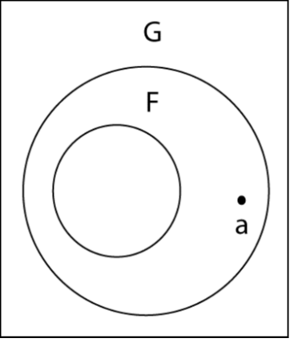
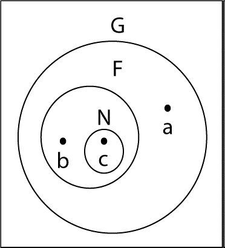
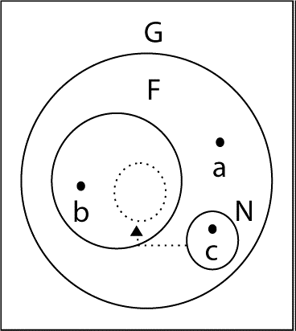

# 1. Wprowadzenie do języka JavaScript

JavaScript jest stosowany w ogromnej większości stron internetowych, a wszystkie nowoczesne przeglądarki posiadają
interpreter tego języka. Dzięki platformie Node.js może być stosowany także w aplikacjach serwerowych. Wszystko to
sprawia, że jest to w tej chwili najpopularniejszy język programowania.

JavaScript jest wysokopoziomowym, dynamicznym, interpretowanym językiem, przygotowanym do obiektowego i funkcjonalnego
kodowania. Typy zmiennych nie są w nim określone.

Każdy język, aby można było go używać, musi posiadać standardową bibliotekę, umożliwiającą kodowanie podstawowych
operacji, takich jak pobieranie i zwracanie danych.

Rdzeń języka JavaScript definiuje podstawowy interfejs API przeznaczony do wykonywania operacji na liczbach testach,
tablicach, zbiorach, mapach itp., ale nie obejmuje żadnych funkcjonalności związanych z pobieraniem i zwracaniem danych.
Za tego rodzaju operacje (jak również realizację bardziej zaawansowanych funkcjonalności, na przykład obsługę sieci,
dysków i grafiki) jest odpowiedzialne „środowisko gospodarza”, w którym stosowany jest JavaScript.

Od początku takim środowiskiem była przeglądarka, która do dziś jest najczęściej stosowanym środowiskiem uruchomieniowym
kodu napisanego w JavaScript.

Poprzez przeglądarkę kod odbiera dane od użytkownika przekazywane za pomocą myszy i klawiatury, a od serwera — za pomocą
zapytań HTTP. Zwracanie danych polega na wyświetlaniu informacji zakodowanych w językach HTML i CSS.

**JavaScript — nazwy, wersje i tryby**

> Język JavaScript powstał w firmie Netscape. Nazwa „JavaScript” jest zastrzeżonym przez Sun Microsystems
> (dzisiaj Oracle) znakiem handlowym, reprezentującym implementację stosowaną w przeglądarce Netscape (dzisiaj Mozilla).
>
> Autorzy przekazali specyfikację języka stowarzyszeniu ECMA (ang. _European Computer Manufacturers Association_,
> Europejskie Stowarzyszenie Producentów Komputerów) w celu jej standaryzacji, ale z powodu problemów ze
> znakiem handlowym otrzymał nazwę ECMAScript (nieoficjalnie JavaScript).
>
> W tym opracowaniu nazwa ECMAScript lub skrót ES oznacza standard języka i jego wersje.
>
> W drugiej dekadzie XXI wieku wszystkie przeglądarki obsługiwały głównie wersję nr 5 języka ECMAScript. W tym
> opracowaniu stanowi ona wzorzec kompatybilności. W 2015 r. pojawiła się wersja ES6 zawierająca ważne nowe
> funkcjonalności, m.in. klasy i moduły, dzięki którym JavaScript przekształcił się ze zwykłego języka skryptowego w
> poważny język programowania, przeznaczony do wszelkich zastosowań na szeroką skalę. Kadencja wersji ES6
> trwała niecały rok, a kolejne wersje są oznaczane rokiem wydania, tj. ES2016, ES2017, ES2018, ES2019 i ES2020.
>
> Ze względu na konieczność zachowania wstecznej kompatybilności, nie można usunąć przestarzałych
> funkcjonalności, również tych obarczonych błędami. Począwszy od wersji ES5, kod można pisać w tzw. **ścisłym
> trybie** JavaScript, wolnym od wielu wcześniejszych błędów. Wymagane jest w tym celu użycie dyrektywy
> `use strict` opisanej w specyfikacji w sekcji §5.6.3.
>
> W wersjach ES6 i nowszych samo użycie nowych funkcjonalności powoduje niejawne zastosowanie trybu ścisłego.
> Na przykład wpisanie słowa kluczowego `class` lub zdefiniowanie modułu sprawia, że kod jest automatycznie
> przełączany w tryb ścisły i nie można w nim stosować starych, wadliwych funkcjonalności. W niniejszym
> opracowaniu te funkcjonalności są opisane z wyraźnym zaznaczeniem, że nie są dostępne w trybie ścisłym.

W 2010 r. pojawiło się nowe środowisko gospodarza — **platforma Node**. Od tamtego czasu JavaScript nie jest już
ograniczony do interfejsów API oferowanych przez przeglądarkę, ponieważ nowa platforma daje mu dostęp do całeg systemu
operacyjnego, umożliwiając zapisywanie i odczytywanie plików, wysyłanie i odbieranie danych przez sieć, jak również
wysyłanie i obieranie zapytań HTTP. **Node** jest popularną platformą wykorzystywaną do implementowania serwerów WWW,
jak również wygodnego tworzenia prostych skryptów narzędziowych stanowiących alternatywę dla skryptów powłoki.

**Nauka nowego języka programowania nie jest procesem liniowym, więc jego opis też taki nie jest**.

## Czym jest JavaScript?

Z technicznego punktu widzenia JavaScript jest obiektowym językiem skryptowym o luźnej kontroli typów.

JavaScript jest językiem **obiektowym**, a nie proceduralnym. Większość zmiennych, z którymi mamy do czynienia, to tak
naprawdę obiekty.

> Obiekt to specjalna zmienna mająca w swym wnętrzu inne zmienne nazywane **właściwościami**, a także
> funkcje nazywane **metodami**. Właściwości i metody nazywa się ogólnie **elementami składowymi**.

Poniższy kod definiuje w języku JavaScript ciąg znaków, czyli dowolny tekst ujęty w apostrofy:

```javascript
let name = 'Zenon Marek Raubuć';
```

Zmienna `name` jest w istocie obiektem typu `String` i jako taka ma właściwości (np. `length`) i metody
(np. `substring(), toUpperCase()`), do których odwołujemy się za pomocą **notacji kropkowej**.

Aby wykorzystać funkcję dla zmiennej w kodzie proceduralnym, trzeba tę zmienną przekazać do funkcji w momencie jej
wywołania.

Ponieważ name to obiekt typu String, automatycznie ma właściwość o nazwie length, która odpowiada liczbie znaków tekstu.

```javascript
let name = 'Zenon Marek Raubuć';

const spaces = [];

for (let i = 0; i < name.length; i++) {
  if (name[i] === ' ') {
    spaces.push(true);
  }
}

console.log(`Twoje nazwisko ma ${name.length - spaces.length} liter`);
```

Z notacją kropkową można tworzyć **łańcuch wywołań**, zapewniając dostęp do zagnieżdżonych właściwości i metod:

```
pewienObiekt.pewnaWłaściwość.pewnaMetoda()
```

W języku JavaScript nawet funkcje i tablice są obiektami! Z drugiej strony JavaScript to język obiektowy inny od
wszystkich, bo bazujący na **prototypach** a nie na klasach, mimo iż od wersji E6 możemy posługiwać się klasami. To
rzadko spotykany rodzaj systemu obiektowego.

> **UWAGA:** W wielu językach obiektowych, w tym również w języku JavaScript przyjęto, że każdy wyraz w nazwach
> zmiennych i funkcji jest pisany od wielkiej litery (poza pierwszym), czyli: `pewienObiekt` i `pewnaMetoda()`, a nie
> `pewien_obiekt` i `pewna_metoda()`.

**Luźna kontrola typów** oznacza, że zmienne i dane mogą być łatwo konwertowane z jednego formatu na drugi. Na przykład
można zdefiniować liczbę, a następnie skonwertować ją na ciąg znaków.

```javascript
let balance = 5432.98;
balance += ' zł'; // => '5432.98 zł'
```

W językach z **silną kontrolą typów** utworzenie zmiennej typu `balance` musiałoby zostać poprzedzone określeniem jej
typu:

```c
double balance = 5432.98;
```

Próba zamiany liczby na ciąg znaków (jak w przedstawionym wcześniej kodzie) spowoduje zgłoszenie błędu.

JavaScript to język o **dynamicznej obsłudze typów**, gdyż konwersja następuje w nim w sposób zautomatyzowany, jak w
powyższym kodzie.

Określenie język skryptowy oznacza, że kod JavaScript jest wykonywany przez inny program komputerowy. Instrukcje
zapisane w **języku C** są najpierw kompilowane, a następnie uruchamia się sam wynikowy kod (bez użycia dodatkowych
programów). Kod JavaScript może być np. uruchamiany w przeglądarce internetowej z wbudowanym interpreterem języka
wykonującego wszystkie wskazane instrukcje.

## 1.1. Poznawanie JavaScript

Aby testować kod JavaScript, potrzebny jest interpreter. Kilka wierszy kodu najprościej przetestujemy:

1. W narzędziach programistycznych zawartych w każdej nowoczesnej przeglądarce
   (F12, Ctrl+Shift+I, zakładka Konsola,konsolę można wydzielić jako osobne okno). To tzw. narzędzia deweloperskie
   (DevTools). Każdorazowe wciśnięcie klawisza `Enter` zatwierdza wprowadzone polecenie. Kod wielolinijkowy wprowadzimy,
   przechodząc do następnych linii, np. za pomocą kombinacji klawiszy Shift+Enter.

2. W środowisku Node. W terminalu wpisujemy polecenie **node**, aby rozpocząć interaktywną sesję.

## 1.2. Hello, world!

Konsola deweloperska jest stosowana do sprawdzania prostych funkcjonalności, debugowania kodu aplikacji itp.

Często poleca się edytor kodu taki jak Visual Studio Code. Jako ciekawostkę można przytoczyć fakt, że aplikacja **Visual
Studio Code** została napisana właśnie w JavaScript jako aplikacja desktopowa, wykorzystująca narzędzie `Electron.js`.
Edytor ten jest często wybierany przez programistów JavaScript również do tworzenia aplikacji komercyjnych. Istnieje do
niego wiele dodatków wspomagających pracę z tak popularnymi frameworkami jak **Angular**, **React** itp.

Napisany kod w edytorze kodu można kopiować i wklejać do konsoli przeglądarki lub terminala z otwartą sesją Node. Można
też zapisywać kod w pliku (któremu nadaje się rozszerzenie `.js`) i uruchamiać w środowisku `Node`:

```
$ node plik.js
```

`Node.js` jest środowiskiem umożliwiającym uruchamianie skryptów napisanych w JavaScript; może być ono zainstalowane np.
na serwerze (pozwalając na wykonanie tzw. _back-endu_).

Wraz ze środowiskiem `Node.js` otrzymujemy również aplikację konsolową `npm`. Jest to tzw. menadżer pakietów, czyli
skryptów napisanych w JavaScript (choć nie tylko), które mogą być opublikowane jako oprogramowanie _open-source_
i jako takie są dostępne dla każdego.

Możesz również wskazywać konkretne ścieżki dostępowe, np.:

```
node ./scripts/destruct.js
```

W celu uruchomienia skryptu znajdującego się w folderze scripts, który jest podkatalogiem bieżącego folderu aplikacji.

# 2. Struktura leksykalna

Struktura leksykalna języka programowania to zestaw podstawowych zasad pisania kodu w tym języku. Jest to niskopoziomowa
składnia specyfikująca nazwy zmiennych, znaki komentarza, sposób oddzielania instrukcji od tekstu itp.

## 2.1. Tekst programu

JavaScript jest językiem, w którym istotna jest wielkość liter.

W JavaScript spacje umieszczane pomiędzy tokenami kodu są pomijane. W większości przypadków pomijane są również podziały
wierszy. Dzięki swobodzie stosowania spacji, wcięć i podziałów wierszy można formatować kod w czytelny i spójny sposób.

Białymi znakami, oprócz zwykłej spacji (\u0020), są również tabulator oraz niektóre znaki kontrolne ASCII i Unicode.
Podziałem wiersza może być znak nowego wiersza, powrót karetki (ang. carriage return) oraz para znaków powrót
karetki/przejście do następnego wiersza (ang. line feed).

## 2.2. Komentarze

Stosowane są dwa rodzaje komentarzy:

1. Tekst znajdujący się od znaków `//` do końca wiersza jest traktowany jako komentarz i pomijany.
2. Komentarzem jest tekst umieszczony pomiędzy parami znaków /_ i _/.

Komentarzy nie zagnieżdżać się w kodzie.

```javascript
// Jednowierszowy komentarz.
/* To również jest komentarz. */ // A to jest inny komentarz.
/*
 * To jest komentarz wielowierszowy. Dodatkowy znak * na początku
 * nie jest wymagany, ale dzięki niemu komentarz ładnie wygląda.
 */
```

## 2.3. Literały

Literał to dane umieszczone bezpośrednio w programie.

```javascript
12; // Liczba dwanaście.
1.2; // Liczba jeden i dwie dziesiąte.
('Witaj, świecie!'); // Ciąg znaków.
('Cześć'); // Inny ciąg znaków.
true; // Wartość logiczna.
false; // Druga wartość logiczna.
null; // Brak obiektu.
```

## 2.4. Identyfikatory i zarezerwowane słowa

**Identyfikator** to po prostu nazwa.

W języku JavaScript identyfikatorami są:

- nazwy stałych,
- zmiennych,
- właściwości,
- funkcji,
- klas
- etykiet w pewnego rodzaju pętlach.

Zasady nadawania nazw:

1. Pierwszym znakiem identyfikatora musi być litera, symbol podkreślenia (\_) lub dolara ($).
2. Po nim mogą następować litery, cyfry, symbole podkreślenia i dolara.
3. Pierwszym znakiem nie może być cyfra. Dzięki temu ograniczeniu można łatwo odróżniać identyfikatory od liczb.

Poniższe przykłady są poprawnymi identyfikatorami:

```javascript
i;
nazwa_mojej_zmiennej;
v13;
_dummy;
$str;
```

### 2.4.1 Zarezerwowane słowa

Najlepiej jest unikać stosowania wszelkich zarezerwowanych słów w charakterze identyfikatorów, z wyjątkiem `from`, `set`
i `target`, które są bezpieczne i powszechnie używane.

```
as  const  export  get  null  target  void
async  continue  extends  if  of  this  while
await  debugger  false  import  return  throw  with
break  efault  finally  in  set  true  yield
case  delete  for  instanceof  static  try
catch  do  from  let  super  typeof
class  else  function  new  switch  var
```

Te słowa też są zarezerwowane, gdyż mogą się pojawić w przyszłych wersjach standardu:

```
enum  implements  interface  package  private  protected  public
```

Ze względów historycznych nie można w pewnych przypadkach stosować jako identyfikatorów słów
`arguments` i `eval`. Dlatego najlepiej w ogóle ich nie używać.

## 2.5 Unicode

Kod JavaScript składa się ze znaków Unicode. W identyfikatorach można stosować litery, cyfry i ideogramy Unicode
(ale nie symbole emoji). Nazwami stałych i zmiennych mogą być symbole matematyczne i słowa z innych języków niż
angielski. Jednak aby kod był przenośny i łatwy w edytowaniu przyjęto programistyczną konwencję stosowania w
identyfikatorach nazw angielski lub stosowania tylko i wyłącznie znaków ASCII.

### 2.5.1 Sekwencje ucieczki Unicode

**Sekwencje ucieczki** (ang. _escape sequence_) umożliwiające kodowanie znaków Unicode wyłącznie za pomocą znaków ASCII.
Sekwencja ucieczki składa się ze znaków `\u`:

- oraz następujących po nich dokładnie czterech cyfr szesnastkowych (dopuszczalne są małe i wielkie litery A – F).
- lub od jednej do sześciu cyfr szesnastkowych zamkniętych w nawiasach klamrowych.

Sekwencje ucieczki można stosować:

- w literałach znakowych,
- literałach wyrażeń regularnych
- identyfikatorach

Znakowi é opowiada sekwencja ucieczki `\u00E`. Sposoby użycia nazwy zmiennej zawierającej ten znak:

```javascript
let café = 12; // nazwa zmiennej ze znakiem Unicode
café; // odwołanie do zmiennej
café; // inna postać tej samej sekwencji ucieczki
```

Zapis z nawiasami klamrowymi został wprowadzony w wersji ES6, aby można było stosować znaki Unicode zakodowane za pomocą
więcej niż 16 bitów, na przykład emoji:

```javascript
console.log('\u{1f600}');
```

Sekwencje ucieczki można również stosować w komentarzach. Ponieważ komentarze są pomijane, są one interpretowane jak
znaki ASCII, a nie Unicode.

### 2.5.2. Normalizacja Unicode

<!--TODO -->

## 2.6. Opcjonalne średniki

W JS można nie stosować średników, jednakże zalecam dla poprawy czytelności kodu stosowanie średników, aby oznaczać
koniec instrukcji. Poza tym nie stosując średników, należy uwzględnić kilka niuansów z tym związanych.

<!-- TODO -->

W JavaScript nie trzeba stosować średnika, jeżeli poszczególne instrukcje są umieszczone w osobnych wierszach. Nie
trzeba go również umieszczać na końcu programu ani w miejscu, w którym następnym tokenem jest zamykający nawias
klamrowy `(})`.

W JavaScript można przyjąć dwa style odnośnie do średników:

1. Umieszczamy średniki, aby oznaczyć koniec instrukcji.
2. Pomijanie średników wszędzie, gdzie jest to dopuszczalne, i stosowaniu ich tylko w sytuacjach, w których są wymagane.

# 3. Typy, wartości i zmienne

Programy komputerowe wykonują operacje na wartościach, np. na liczbie 3,14 lub ciągu znakowym „Witaj świecie!". Jeśli w
programie trzeba przechować wartość w celu jej późniejszego wykorzystania, przypisuje się ją do zmiennej.

Do fundamentalnych cech każdego języka programowania należą:

1. Zestaw dostępnych typów danych, czyli rodzaje reprezentowanych i przetwarzanych wartości.
2. Funkcjonowanie zmiennych.

## 3.1. Informację ogólne i definicje

W JS istnieją dwie kategorie typów danych:

1. Prymitywne, które obejmują:

- liczby
- teksty (inaczej ciągi znaków)
- wartości logiczne
- wartości specjalne:
  - null
  - undefined

2. Obiektowe
3. Typ specjalny:

- Symbol — umożliwiający definiowanie rozszerzeń języka bez naruszania wstecznej kompatybilności ze starszymi wersjami.

W języku JS każda wartość inna niż liczba, ciąg znaków, wartość logiczna, symbol, null i undefined jest **obiektem**
Obiekt jest nieuporządkowaną kolekcją **właściwości** posiadających nazwy i wartości (prymitywne lub obiektowe).
Natomiast uporządkowaną kolekcję ponumerowanych wartości nazywamy **tablicą**, która jest obiektem zawierającym
specjalne, wbudowane funkcjonalności.

<!--TODO-->

## 3.2. Liczby

<!--TODO-->

Podstawowy typ `Number` służy do reprezentowania liczb całkowitych i przybliżania liczb rzeczywistych. Liczby w
JavaScript są zapisywane w 64-bitowym formacie zdefiniowanym w normie IEEE 754. Za jego pomocą można wyrażać liczby od
najmniejszych ±5×10<sup>−324</sup> do największych ±1,7976931348623157×10<sup>308</sup>.

Liczba umieszczona bezpośrednio w kodzie JavaScript nosi nazwę **literału liczbowego**.

Typ liczbowy służy do reprezentacji liczb, przy czym nie ma występującego w klasycznych językach programowania
rozróżnienia na typy całkowitoliczbowe i rzeczywiste (zmiennopozycyjne).

Liczby zapisywane są za pomocą literałów (stałych napisowych, z ang. _string constant_, _literal constant_) liczbowych,
czyli ciągów znaków składających się na liczbę, np. 24 (umieszczony w kodzie skryptu tekst 24 to dwa znaki, dwójka i
czwórka, które razem stanowią literał — stałą napisową — interpretowany jako liczba 24).

Obowiązują przy tym następujące zasady.

- Jeżeli ciąg cyfr nie jest poprzedzony żadnym znakiem lub jest poprzedzony znakiem +, reprezentuje wartość dodatnią,
  jeżeli natomiast jest poprzedzony znakiem –, reprezentuje wartość ujemną.
- Jeżeli literał rozpoczyna się od cyfry 0, jest traktowany jako wartość ósemkowa.
- Jeżeli literał rozpoczyna się od ciągu znaków 0x, jest traktowany jako wartość szesnastkowa (heksadecymalna). W
  zapisie wartości szesnastkowych mogą być wykorzystywane zarówno małe, jak i wielkie litery alfabetu, od A do F.
- Literały mogą być zapisywane w notacji wykładniczej, w postaci X.YeZ, gdzie X to część całkowita, Y — część
  dziesiętna, natomiast Z to wykładnik potęgi liczby 10. Zapis taki oznacza to samo, co X.Y \* 10<sup>Z</sup>.

Przykłady literałów:

```javascript
123 - // dodatnia całkowita wartość dziesiętna 123
123; // ujemna całkowita wartość dziesiętna -123
012 - // dodatnia całkowita wartość ósemkowa równa 10 w systemie dziesiętnym
-024; // ujemna całkowita wartość ósemkowa równa -20 w systemie dziesiętnym
0xff - // dodatnia całkowita wartość szesnastkowa = 255
-0x0f; //ujemna całkowita wartość szesnastkowa. = -15
2.12 - //  dodatnia wartość rzeczywista = 2.12
-3.14; // ujemna wartość rzeczywista = -3.14
4.3e3; // dodatnia wartość rzeczywista = 4300
2.3e-3; // dodatnia wartość rzeczywista = 0.0023
```

Liczby całkowite i zmiennoprzecinkowe w JS są typu „number".

Z typem „number” jest skojarzona wartość NaN (Not a Number), która reprezentuje wartość, która nie ma sensu.

Jeśli zastosujemy operator `typeof` na wartości lub zmiennej przechowującej liczbę całkowitą, lub zmiennoprzecinkową to
zwróci nam wartość „number".

W języku JS do przechowywania pojedynczych wartości liczbowych używana jest stała liczba 64 bitów, czyli możemy
reprezentować 2 do 64 różnych liczb, czyli 18 kwintylionów (18 z osiemnastoma zerami). Przepełnienie, czyli próba
zapisania liczby przekraczającej rozmiarem możliwości określonej ilości bitów jest mało prawdopodobne. Za pomocą tych
bitów musimy też reprezentować liczby ujemne oraz liczby niecałkowite. Toteż jeden bit musi wskazywać znak liczby, a
niektóre bity muszą przechowywać informację o położeniu punktu dziesiętnego. Z tego powodu największa liczba całkowita,
jaką można zapisać, należy do przedziału 9 kwadrylionów (15 zer).

Obliczenia na liczbach całkowitych są dokładne, a na liczbach zmiennoprzecinkowych są obarczone błędami.

### 3.2.1 Literały całkowite

W języku JavaScript liczby dziesiętne zapisuje się w postaci sekwencji cyfr, na przykład:

```javascript
0;
3;
100000;
```

#### Liczby ósemkowe i szesnastkowe

Jeśli liczba zaczyna się cyfrą 0o, jest uznawana za ósemkową, jeśli od 0x za szesnastkową. ES6 zapewnia prefiks `0o` (
lub 0O) do reprezentowania liczb ósemkowych.

```javascript
console.log(0o776); // 510
```

Literał w postaci liczby szesnastkowej składa się ze znaków 0x lub 0X i następujących po nich cyfr szesnastkowych. Cyfra
szesnastkowa jest zwykłą cyfrą z zakresu od 0 do 9 lub literą z zakresu od a (lub A) do f (F) reprezentującą liczbę z
zakresu od 10 do 15. Poniżej są przedstawione przykładowe literały szesnastkowe:

```javascript
0xff; // => 255 = 15*16 + 15
```

#### Literały binarne

Z binarną reprezentacji liczby całkowitej możemy skorzystać na dwa sposoby:

```javascript
parseInt('111', 2); // 7
0b111; // 7 (es6) dostępny jest też prefiks OB
```

### 3.2.2. Literały zmiennoprzecinkowe

Do zapisywania literałów zmiennoprzecinkowych wykorzystuje się tradycyjną składnię liczb rzeczywistych, obejmującą część
całkowitą, następujący po niej symbol dziesiętny i część ułamkową.

#### Literały wykładnicze

Zapis 2e+3 oznacza, że należy przesunąć kropkę dziesiętną (w tradycyjnym zapisie w języku polskim jest to przecinek)
przy liczbie 2 w prawo o 3 pozycje. Zapis 2e - 3 oznaczałby, że należy przesunąć kropkę w lewo.

```javascript
typeof 2.7e-5; // 'number'
```

> **Separatory w literałach liczbowych**
>
> Aby poprawić czytelność długiego literału liczbowego, można umieścić w nim znaki podkreślenia
> rozdzielające grupy cyfr, na przykład:

```javascript
let bilion = 1_000_000_000; // separator tysięcy
let bytes = 0x89_ab_cd_ef; // separator bajtów
let bits = 0b0001_1101_0111; // półbajtów
let fraction = 0.123_456_789; // zastosowanie  separatora w części ułamkowej
```

### 3.2.3. Działania arytmetyczne

Oprócz podstawowych operatorów arytmetycznych dostępne są bardziej zaawansowane operatory matematyczne. Są to funkcje i
stałe zdefiniowane jako właściwości obiektu Math:

```javascript
Math.pow(2, 53); // => 9007199254740992: liczba 2 podniesiona do potęgi 53.
Math.round(0.6); // => 1.0: zaokrąglenie do najbliższej liczby całkowitej.
Math.ceil(0.6); // => 1.0: zaokrąglenie w górę do najbliższej liczby całkowitej.
Math.floor(0.6); // => 0.0: zaokrąglenie w dół do najbliższej liczby całkowitej.
Math.abs(-5); // => 5: wartość bezwzględna.
Math.max(x, y, z); // Wybranie największej wartości.
Math.min(x, y, z); // Wybranie najmniejszej wartości.
Math.random(); // Liczba pseudolosowa z zakresu 0 <= x < 1.0.
Math.PI; // π: stosunek obwodu do średnicy koła.
Math.E; // e: podstawa logarytmu naturalnego.
Math.sqrt(3); // => 3**0.5: pierwiastek kwadratowy liczby 3.
Math.pow(3, 1 / 3); // => 3**(1/3): pierwiastek sześcienny liczby 3.
Math.sin(0); // Funkcja trygonometryczna (są również Math.cos, Math.atan i inne funkcje).
Math.log(10); // Logarytm naturalny z 10.
Math.log(100) / Math.LN10; // Logarytm liczby 100 przy podstawie 10.
Math.log(512) / Math.LN2; // Logarytm liczby 512 przy podstawie 2.
Math.exp(3); // Sześcian stałej e.
```

Począwszy od wersji ES6 obiekt Math, zawiera jeszcze więcej funkcji:

```javascript
Math.cbrt(27); // => 3: pierwiastek sześcienny.
Math.hypot(3, 4); // => 5: pierwiastek kwadratowy sumy kwadratów argumentów.
Math.log10(100); // => 2: logarytm przy podstawie 10.
Math.log2(1024); // => 10: logarytm przy podstawie 2.
Math.log1p(x); // Logarytm naturalny (1+x); dokładny w przypadku bardzo małych wartości x.
Math.expm1(x); // Math.exp(x)–1; odwrotność Math.log1p().
Math.sign(x); // –1, 0 lub 1, jeżeli argument jest, odpowiednio, mniejszy, równy lub większy od zera.
Math.imul(2, 3); // => 6: zoptymalizowane mnożenie 32-bitowych liczb całkowitych.
Math.clz32(0xf); // => 28: liczba wiodących zerowych bitów liczby całkowitej 32-bitowej.
Math.trunc(3.9); // => 3: zamiana na liczbę całkowitą poprzez usunięcie części ułamkowej.
Math.fround(x); // Zaokrąglenie do najbliższej 32-bitowej liczby zmiennoprzecinkowej.
Math.sinh(x); // Sinus hiperboliczny (są również Math.cosh(), Math.tanh() i inne funkcje).
Math.asinh(x); // Arcus sinus hiperboliczny (są również Math.acosh(), Math.atanh() i inne funkcje).
```

W języku JavaScript przepełnienie, niedomiar i dzielenie przez zero nie powodują zgłoszenia błędu. Jeżeli wynik operacji
jest większy niż największa dopuszczalna wartość (przepełnienie), zwracana jest specjalna wartość `Infinity`
(nieskończoność) lub `-Infinity`.

Wartości nieskończone funkcjonują zgodnie z oczekiwaniami, tj. wynikiem dodawania, odejmowania, mnożenia i dzielenia z
użyciem jakiejkolwiek innej wartości jest również nieskończoność (z ewentualnie zmienionym znakiem).

Dzielenie przez zero nie skutkuje zgłoszeniem błędu. Wynikiem jest po prostu wartość Infinity lub -Infinity. Wynikiem
dzielenia zera przez zero jest specjalna wartość `NaN` (ang. _not-a-number_ — nie liczba). Reprezentuje ona również
wynik dzielenia wartości `Infinity` przez `Infinity`, pierwiastek kwadratowy z liczby ujemnej oraz wynik operacji
arytmetycznej z użyciem operandów, których nie można przekształcić na liczby.

Warto pamiętać, wykonując operacje arytmetyczne, że język JavaScript w przypadku niedozwolonej operacji zwróci jedną z
dwóch wartości specjalnych:

- `NaN` (skrót od _Not a Number_, czyli to nie liczba)
- `Infinity`.

Przykładami sytuacji, w których wystąpią tego rodzaju wartości, są między innymi próba pomnożenia liczby przez tekst lub
próba dzielenia przez zero, która, co zadziwiające, nie informuje o błędzie.

W języku JavaScript są zdefiniowane globalne stałe `Infinity` i `NaN`, oznaczające, odpowiednio, nieskończoność i
wartość nieliczbową. Analogiczne wartości są również właściwościami obiektu `Number`:

```javascript
Infinity; // Liczba dodatnia, zbyt duża, aby można ją było wyrazić.
Number.POSITIVE_INFINITY; // Jak wyżej.
1 / 0; // => Infinity

Number.MAX_VALUE * 2 - // => Infinity; przepełnienie
Infinity; // Liczba ujemna, zbyt duża, aby można ją było wyrazić.
Number.NEGATIVE_INFINITY - // Jak wyżej.
1 / 0 - // => –Infinity
Number.MAX_VALUE * 2; // => –Infinity
NaN; // Wartość nieliczbowa.
Number.NaN; // Wartość nieliczbowa zapisana w inny sposób.
0 / 0; // => NaN
Infinity / Infinity; // => NaN
Number.MIN_VALUE / 2 - // => 0: niedomiar.
Number.MIN_VALUE / 2 - // => –0: "ujemne zero".
1 / Infinity - // -> –0: również "ujemne zero".
0;

// Właściwości i metody obiektu Number zdefiniowane w wersji ES6:
Number.parseInt(); // Odpowiednik globalnej funkcji parseInt().
Number.parseFloat(); // Odpowiednik globalnej funkcji parseFloat().
Number.isNaN(x); // Czy x ma wartość NaN?
Number.isFinite(x); // Czy x jest liczbą skończoną?
Number.isInteger(x); // Czy x jest liczbą całkowitą?
Number.isSafeInteger(x); // Czy x jest liczbą całkowitą z zakresu –(2**53) < x < 2**53?
Number.MIN_SAFE_INTEGER; // => –(2**53–1)
Number.MAX_SAFE_INTEGER; // => 2**53–1
Number.EPSILON; // => 2**–52: najmniejsza różnica między liczbami.
```

Wartość nieliczbowa `NaN` ma pewną nietypową cechę, mianowicie nie można jej porównywać z żadną inną wartością, nawet z
nią samą. Porównanie jej z samą sobą daje wynik negatywny:

```javascript
NaN === NaN; // => false
```

Niezależnie od wartości, jaką przyjmie zmienna, przyrównanie jej do `NaN` daje wartość `false`.

```javascript
let myVariable; // => undefined
console.log(myVariable === NaN); // => false

myVariable = NaN;
console.log(myVariable === NaN); // => false

myVariable = 'To jest moja zmienna';
console.log(myVariable === NaN); // => false
```

Oznacza to, że stosując zapis `x === NaN`, nie można sprawdzić, czy zmienna x ma wartość `NaN`. Zamiast tego należy użyć
wyrażenia `x !== x` lub `Number.isNaN(x)`. Każde z nich ma wartość `true` tylko wtedy, gdy `x` ma taką samą wartość jak
globalna stała `NaN`.

Globalna funkcja `isNaN()` zwraca true, jeśli jej argument ma wartość `NaN` lub nie można go przekształcić w liczbę.

```javascript
console.log('Różne wyniki');
let message = 'JavaScript is the best';

console.log(isNaN('123')); // => false
console.log(isNaN(message)); // => true

console.log(Number.isNaN(message)); // => false
console.log(Number.isNaN('123')); // => false
```

Funkcja `Number.isFinite()` zwraca wartość `true`, jeżeli jej argument ma wartość inną niż `NaN`, `Infinity`
i `-Infinity`.

Globalna funkcja `isFinite()` zwraca `true`, jeżeli jej argument jest lub może być przekształcony w skończoną liczbę.

„Ujemne” zero jest także nietypową wartością, równą „dodatniemu” zeru (nawet jeżeli użyje się operatora ścisłego
porównania). Wyjątkiem jest wynik dzielenia:

```javascript
let zero = 0; // "Zwykłe" zero.
let negz = -0; // "Ujemne" zero.
zero === negz; // => true: "zwykłe" zero jest równe "ujemnemu" zeru.
1 / zero === 1 / negz; // => false: Infinity i –Infinity nie są sobie równe.
```

### 3.2.4. `NaN`

Globalna właściwość `NaN` to wartość reprezentująca `Not-A-Number`. Wbrew swojej nazwie „nie-liczba” `NaN` jest
specjalną wartością, która także jest liczbą.

```javascript
typeof NaN; // "number"
```

`NaN` Otrzymasz, jeśli spróbujesz wykonać działanie, które powinno dawać liczbę, i to działanie nie powiedzie się. Jeśli
spróbujesz na przykład pomnożyć 10 przez znak „f”, wynikiem będzie `NaN`, ponieważ w oczywisty sposób „f” nie jest
prawidłowym argumentem dla mnożenia.
`NaN` Jest jak wirus: nawet jeśli tylko jeden z argumentów działania ma wartość `NaN`, cały wynik można wyrzucić do
kosza.

```javascript
0 / 0; // NaN
Infinity / Infinity; // NaN
```

Globalna właściwość `NaN` jest wartością reprezentującą Not-A-Number.

`NaN`jest właściwością obiektu globalnego. Innymi słowy, jest to zmienna o zasięgu globalnym. Początkowa wartość `NaN`
to `Not-A-Number` - taka sama jak wartość `Number.NaN`. W nowoczesnych przeglądarkach `NaN` nie jest konfigurowalną
właściwością, której nie można zapisywać. Nawet jeśli tak nie jest, unikaj jego zastępowania. Użycie `NaN` w programie
jest raczej rzadkie.

Istnieje pięć różnych typów operacji, które zwracają NaN:

1. Nie można przeanalizować liczby (np. `ParseInt("blabla")` lub `Number(undefined)`)
2. Operacja matematyczna, w której wynik nie jest liczbą rzeczywistą (np. `Math.sqrt (-1)`)
3. Operand argumentu to `NaN` (np. `7 ** NaN`)
4. Forma nieokreślona (np. `0 * Infinity` lub `undefined + undefined`)
5. Dowolna operacja, która obejmuje ciąg znaków i nie jest operacją dodawania (np. `"foo" / 3`)

`NaN` porównuje nierówną wartość (za pośrednictwem `==`,`!=`, `===` i `!==`) z dowolną inną wartością — w tym z inną
wartością `NaN`. Użyj `Number.isNaN()` lub `isNaN()`, aby najdokładniej określić, czy dana wartość to NaN. Lub wykonaj
samo-porównanie: NaN i tylko NaN, porówna się nierówno.

```javascript
NaN === NaN; // false
Number.NaN === NaN; // false
isNaN(NaN); // true
isNaN(Number.NaN); // true
Number.isNaN(NaN); // true

function valueIsNaN(v) {
  return v !== v;
}

valueIsNaN(1); // false
valueIsNaN(NaN); // true
valueIsNaN(Number.NaN); // true
```

Jednak zwróć uwagę na różnicę między `isNaN()` i `Number.isNaN()`: pierwsza zwróci true, jeśli wartość jest
obecnie `NaN` lub jeśli będzie to `NaN` po przekształceniu w liczbę, podczas gdy druga zwróci prawda tylko wtedy, gdy
wartość jest obecnie NaN:

```javascript
isNaN('hello world'); // true
Number.isNaN('hello world'); // false
```

Ponadto niektóre metody tablicowe nie mogą znaleźć `NaN`, podczas gdy inne mogą.

```javascript
let arr = [2, 4, NaN, 12];
arr.indexOf(NaN); // -1 (false)
arr.includes(NaN); // true
arr.findIndex((n) => Number.isNaN(n)); // 2
```

### 3.2.5. `isNaN()`

Funkcja `isNaN()` określa, czy wartość jest `NaN`, czy nie. Ponieważ przymus wewnątrz funkcji `isNaN` może być
zaskakujący, możesz alternatywnie użyć `Number.isNaN()`.

**Demo JavaScript: standardowe obiekty wbudowane — `isNaN()`**

```javascript
function milliseconds(x) {
  if (isNaN(x)) {
    return 'Nie liczba!';
  }
  return x * 1000;
}

console.log(milliseconds('100A')); // oczekiwany wynik: "Nie liczba!"
console.log(milliseconds('0.0314E+2')); // oczekiwany wynik: 3140
```

#### Składnia

```javascript
isNaN(value); // value -  Wartość do przetestowania
// return value - true, jeśli podana wartość to NaN; w przeciwnym razie false.
```

#### Opis

W przeciwieństwie do wszystkich innych możliwych wartości w JavaScript nie można użyć operatorów równości (== i ===) do
porównania wartości z `NaN` w celu określenia, czy wartość to `NaN`, czy nie, ponieważ zarówno `NaN == NaN`, jak
i `NaN === NaN` daje fałsz. Funkcja `isNaN()` zapewnia wygodne sprawdzanie równości względem `NaN`.

#### Pochodzenie wartości NaN

Wartości `NaN` są generowane, gdy operacje arytmetyczne prowadzą do niezdefiniowanych lub niemożliwych do przedstawienia
wartości. Takie wartości niekoniecznie reprezentują warunki przepełnienia. `NaN` wynika również z próby wymuszenia
wartości liczbowych wartości nienumerycznych, dla których nie jest dostępna żadna pierwotna wartość liczbowa.

Na przykład dzielenie zera przez zero daje `NaN` — ale dzielenie innych liczb przez zero nie.

#### Mylące zachowanie w szczególnych przypadkach

Od najwcześniejszych wersji specyfikacji funkcji `isNaN()` jej zachowanie w przypadku argumentów nieliczbowych było
mylące. Gdy argument funkcji `isNaN()` nie jest typu `Number`, wartość jest najpierw przekształcana w wartość `Number`.
Otrzymana wartość jest następnie testowana w celu określenia, czy jest to `NaN`. Tak więc w przypadku liczb
nieliczbowych, które po wymuszonym typie liczbowym dają poprawną wartość liczbową inną niż NaN (zwłaszcza pusty ciąg i
prymitywy logiczne, które po wymuszenie dają wartości liczbowe zero lub jeden), zwracana wartość `false` może być
nieoczekiwana; na przykład pusty ciąg to z pewnością „nie jest liczba".

Zamieszanie wynika z faktu, że termin „nie liczba” ma specyficzne znaczenie dla liczb reprezentowanych jako wartości
zmiennoprzecinkowe IEEE-754. Funkcję należy interpretować jako odpowiedź na pytanie, „czy ta wartość, po skojarzeniu z
wartością liczbową, jest wartością IEEE-754 „Nie jest liczba”?”

ECMAScript 2015 zawiera funkcję `Number.isNaN()`. `Number.isNaN(x)` to niezawodny sposób sprawdzenia, czy `x` to `NaN`,
czy nie. Jednak nawet w przypadku `Number.isNaN` znaczenie `NaN` pozostaje dokładnym znaczeniem liczbowym, a nie „nie
liczbą”.

Alternatywnie, w przypadku braku `Number.isNaN`, wyrażenie `(x != x)` jest bardziej niezawodnym sposobem sprawdzenia,
czy zmienna `x` jest `NaN`, czy nie, ponieważ wynik nie podlega fałszywym alarmom, które sprawiają, że `isNaN` jest
niewiarygodne.

Wypełnienie dla `isNaN` (polifill wykorzystuje unikalną, nierówną sobie charakterystykę `NaN`):

```javascript
const isNaN = function(value) {
  const n = Number(value);
  return n !== n;
};
```

#### Przykłady

```javascript
isNaN(NaN); // true
isNaN(undefined); // true
isNaN({}); // true

isNaN(true); // false
isNaN(null); // false
isNaN(37); // false

// strings
isNaN('37'); // false: "37" is converted to the number 37 which is not NaN
isNaN('37.37'); // false: "37.37" is converted to the number 37.37 which is not NaN
isNaN('37,5'); // true
isNaN('123ABC'); // true:  parseInt("123ABC") is 123 but Number("123ABC") is NaN
isNaN(''); // false: the empty string is converted to 0 which is not NaN
isNaN(' '); // false: a string with spaces is converted to 0 which is not NaN

// dates
isNaN(new Date()); // false
isNaN(new Date().toString()); // true

// This is a false positive and the reason why isNaN is not entirely reliable
isNaN('blabla'); // true: "blabla" is converted to a number.
// Parsing this as a number fails and returns NaN
```

#### Przydatne zachowanie w szczególnych przypadkach

Istnieje bardziej zorientowany na użycie sposób myślenia o `isNaN()`: jeśli `isNaN(x)` zwraca wartość false, możesz
użyć `x` w wyrażeniu arytmetycznym, nie powodując, że wyrażenie zwraca `NaN`. Jeśli zwróci `true`, `x` spowoduje, że
każde wyrażenie arytmetyczne zwróci `NaN`. Oznacza to, że w JavaScript `isNaN(x) == true` jest równoważne x-0
zwracającemu NaN (chociaż w JavaScript x-0 == NaN zawsze zwraca false, więc nie możesz tego przetestować). Właściwie
isNaN(x), isNaN(x - 0), isNaN(Number(x)), Number.isNaN(x - 0) i Number.isNaN(Number(x)) zawsze zwracają to samo, a w
JavaScript isNaN( x) jest najkrótszą możliwą formą wyrażenia każdego z tych terminów.

Możesz tego użyć, na przykład, aby sprawdzić, czy argument funkcji jest przetwarzalny arytmetycznie (można go używać
„jak liczba”), czy też nie i musisz podać wartość domyślną lub coś innego. W ten sposób możesz mieć funkcję, która
wykorzystuje pełną wszechstronność zapewnianą przez JavaScript przez niejawną konwersję wartości w zależności od
kontekstu.

### 3.2.6. `Number.isNaN()`

Metoda `Number.isNaN()` określa, czy przekazana wartość to `NaN`, a jej typ to `Number`. Jest to bardziej solidna wersja
oryginalnej, globalnej `isNaN()`.

**JavaScript Demo: `Number.isNaN()`**

```javascript
function typeOfNaN(x) {
  if (Number.isNaN(x)) {
    return 'Number NaN';
  }
  if (isNaN(x)) {
    return 'NaN';
  }
}

console.log(typeOfNaN('100F'));
// expected output: "NaN"

console.log(typeOfNaN(NaN));
// expected output: "Number NaN"
```

#### Składnia

```javascript
Number.isNaN(value);
```

#### Parametry

`value` Wartość, którą będziemy testować, czy jest wartością `NaN`.

#### Zwracana wartość

`true`, jeśli podana wartość jest `NaN`, a jej typem jest `Number`; w przeciwnym razie, `false`.

#### Opis

Ze względu na oba operatory równości, == i ===, które przy sprawdzaniu, czy `NaN` to `NaN`, mają wartość `false`,
funkcja `Number.isNaN()` stała się konieczna. Ta sytuacja różni się od wszystkich innych możliwych porównań wartości w
JavaScript.

W porównaniu z globalną funkcją `isNaN()`, `Number.isNaN()` nie ma problemu z wymuszoną konwersją parametru na liczbę.
Oznacza to, że można teraz bezpiecznie przekazywać wartości, które normalnie byłyby konwertowane na `NaN`, ale w
rzeczywistości nie są taką samą wartością jak `NaN`. Oznacza to również, że tylko wartości typu `number`, które są
również `NaN`, zwracają `true`.

#### Przykłady

```javascript
Number.isNaN(NaN); // true
Number.isNaN(Number.NaN); // true
Number.isNaN(0 / 0); // true

// Gdybyśmy użyli funkcji isNaN(), te przykłady zwróciłby true
Number.isNaN('NaN'); // false
Number.isNaN(undefined); // false
Number.isNaN({}); // false
Number.isNaN('blabla'); // false

// Wszystkie zwracają false
Number.isNaN(true);
Number.isNaN(null);
Number.isNaN(37);
Number.isNaN('37');
Number.isNaN('37.37');
Number.isNaN('');
Number.isNaN(' ');
```

#### Polyfill

Poniższe działanie działa, ponieważ NaN jest jedyną wartością w JavaScript, która nie jest sobie równa.

```javascript
Number.isNaN =
  Number.isNaN ||
  function isNaN(input) {
    return typeof input === 'number' && input !== input;
  };
```

### 3.2.7. Format zmiennoprzecinkowy i błędy zaokrąglenia

Liczb rzeczywistych jest nieskończenie wiele, ale w języku JavaScript można w formacie zmiennoprzecinkowym wyrazić ich
skończoną liczbę. Oznacza to, że w kodzie liczby rzeczywiste są często przybliżeniami faktycznych wartości.

Powszechnie, szczególnie w operacjach finansowych, stosowane są ułamki dziesiętne, takie jak 1/10, 1/100 itp., których
nie można dokładnie wyrazić za pomocą zmiennoprzecinkowego formatu binarnego.

```javascript
let x = 0.3 - 0.2; // Trzydzieści groszy minus dwadzieścia groszy.
let y = 0.2 - 0.1; // Dwadzieścia groszy minus dziesięć groszy.
x === y; // => false: obie wartości są różne!
x === 0.1; // => false: .3–.2 nie jest równe .1
y === 0.1; // => true: .2–.1 jest równe .1
```

Z powodu błędów zaokrąglenia różnica między przybliżeniami liczb 0,3 i 0,2 nie jest dokładnie taka sama jak między
przybliżeniami 0,2 i 0,1.

Jeżeli przybliżenie zmiennoprzecinkowe jest źródłem problemów w kodzie, należy stosować skalowalne liczby całkowite. Na
przykład wartości monetarne należy wyrażać w groszach, a nie w ułamkach złotego.

### 3.2.8. Typ BigInt — dowolnie duże liczby całkowite

Typ liczbowy `BigInt` wprowadzono w wersji ES2020. Jest typem liczb całkowitych. Został wprowadzony do języka JavaScript
głównie po to, aby można było wyrażać całkowite liczby 64-bitowe, niezbędne do uzyskania kompatybilności z innymi
językami i interfejsami API.

BigInt nie nadaje się do zastosowań kryptograficznych, ponieważ nie można za jego pomocą zapobiegać atakom czasowym.

Literał typu `BigInt` jest ciągiem cyfr zakończonym małą literą `n`. Domyślnie stosowany jest system dziesiętny, ale
można używać prefiksów 0b, 0o i 0x oznaczających, odpowiednio, systemy binarny, ósemkowy i szesnastkowy:

```javascript
1234n; // Nie taki znów ogromny literał BigInt.
0b111111n; // Binarny literał BigInt.
0o7777n; // Ósemkowy literał BigInt.
0x8000000000000000n; // => 2n**63n: 64-bitowy literał BigInt.
```

Zapis `BigInt()` można traktować jako funkcję przekształcającą zwykłe liczby lub ciągi znaków na wartości typu `BigInt`:

```javascript
BigInt(Number.MAX_SAFE_INTEGER); // => 9007199254740991n
let string = '1' + '0'.repeat(100); // Jedynka i 100 zer.
BigInt(string); // => 10n**100n: jeden googol.
```

Działania arytmetyczna na liczbach `BigInt` wykonywane są tak samo, jak na zwykłych, z wyjątkiem dzielenia, w którym
część ułamkowa jest odrzucana, tj. wynik jest zaokrąglany w dół.

```javascript
1000n + 2000n; // => 3000n
3000n - 2000n; // => 1000n
2000n * 3000n; // => 6000000n
3000n / 997n; // => 3n: iloraz jest równy 3.
// prettier-ignore
3000n % 997n // => 9n: reszta jest równa 9.

  (2n ** 131071n) - 1n // Liczba Mersenne'a składająca się z 39457 cyfr.
```

Standardowe operatory +, -, \*, /, % i \*\* można stosować z liczbami `BigInt`, jednak nie można mieszać operandów
typu `BigInt` i zwykłych typów liczbowych

Natomiast operatory porównania można stosować z różnymi typami liczbowymi.

```javascript
1 < 2n; // => true
2 > 1n; // => true
0 == 0n; // => true
0 === 0n; // => false: operator == sprawdza również zgodność typów.
```

Operatory bitowe zazwyczaj poprawnie działają z operandami typu `BigInt`. Jednak żadnej funkcji obiektu `Math` nie można
stosować z liczbami typu `BigInt`.

### 3.2.9. Daty i czas

Klasa `Date`, służy do wyrażania i wykonywania działań na liczbach reprezentujących datę i czas. Wartość typu `Date`
jest obiektem posiadającym liczbową reprezentację wyrażającą liczbę milisekund, jakie upłynęły od 1 stycznia 1970 r.:

```javascript
let timestamp = Date.now(); // Aktualny czas jako znacznik (liczba).
let now = new Date(); // Aktualny czas jako obiekt typu Date.
let ms = now.getTime(); // Przekształcenie daty w znacznik czasu.
let iso = now.toISOString(); // Przekształcenie daty w ciąg znaków w standardowym formacie.

// Wyniki z dnia 18.11.2021
console.log(timestamp); // 1637207038048
console.log(now); // 2021-11-18T03:43:58.048Z

console.log(ms); //1637207038048
console.log(iso); // 2021-11-18T03:43:58.048Z

console.log(now.getDate()); // 4
console.log(now.getMonth()); // 10
console.log(now.getFullYear()); // 2021

if (now.getDay() === 4) {
  console.log('Czwartek');
}
```

## 3.3. Tekst

<!--TODO-->

> **Unicode**

> Unicode opracowano w celu pozbycia się ograniczeń tradycyjnych systemów kodowania. Przed powstaniem
> systemu Unicode istniało wiele różnych standardów: ASCII w USA, ISO 8859-1 dla języków
> krajów Europy Zachodniej, ISO-8859-2 dla języków środkowo- i wschodnioeuropejskich
> (w tym polskiego), KOI-8 dla języka rosyjskiego, GB18030 i BIG-5 dla języka chińskiego
> itd. Powoduje to dwa problemy: jeden kod może oznaczać różne znaki w różnych systemach
> kodowania, a poza tym kody znaków w językach o dużej liczbie znaków mają różne rozmiary
> — niektóre często używane znaki zajmują jeden bajt, a inne potrzebują dwóch bajtów.
> Unicode ma za zadanie rozwiązać te problemy. Kiedy w latach osiemdziesiątych XX wieku
> podjęto próby unifikacji, wydawało się, że dwubajtowy stały kod był więcej niż wystarczający
> do zakodowania znaków używanych we wszystkich językach świata. W 1991 roku światło
> dzienne ujrzał Unicode 1.0. Wykorzystywana w nim była prawie połowa wszystkich dostępnych
> 65 536 kodów. Java od samego początku używała znaków 16-bitowego systemu Unicode,
> co dawało jej dużą przewagę nad innymi językami programowania, które stosowały znaki
> ośmiobitowe.
> Niestety z czasem nastąpiło to, co było nieuchronne. Unicode przekroczył liczbę 65 536
> znaków, głównie z powodu dodania bardzo dużych zbiorów ideogramów używanych w językach
> chińskim, japońskim i koreańskim. Obecnie 16-bitowy typ char nie wystarcza do opisu
> wszystkich znaków Unicode.
> Współrzędna kodowa znaku (ang. code point) to wartość związana ze znakiem w systemie kodowania. W standardzie Unicode współrzędne
> kodowe znaków są zapisywane w notacji szesnastkowej i są poprzedzane łańcuchem U+, np.
> współrzędna kodowa litery A to U+0041. Współrzędne kodowe znaków systemu Unicode są
> pogrupowane w 17 przestrzeniach numeracyjnych (ang. code planes). Pierwsza z nich, nazywana
> podstawową przestrzenią wielojęzyczną (ang. Basic Multilingual Plane — BMP),
> zawiera klasyczne znaki Unicode o współrzędnych kodowych z przedziału od U+0000 do
> U+FFFF. Pozostałe szesnaście przestrzeni o współrzędnych kodowych znaków z przedziału
> od U+10000 do U+10FFFF zawiera znaki dodatkowe (ang. supplementary characters).
> Kodowanie UTF-16 to sposób reprezentacji wszystkich współrzędnych kodowych znaków
> za pomocą kodów o różnej długości. Znaki w podstawowej przestrzeni są 16-bitowymi
> wartościami o nazwie jednostek kodowych (ang. code units). Znaki dodatkowe są kodowane
> jako kolejne pary jednostek kodowych. Każda z wartości należących do takiej pary należy do
> zakresu 2048 nieużywanych wartości BMP, zwanych obszarem surogatów (ang. surrogates
> area) — zakres pierwszej jednostki kodowej to U+D800 – U+DBFF, a drugiej U+DC00 – U+DFFF.
> Jest to bardzo sprytne rozwiązanie, ponieważ od razu wiadomo, czy jednostka kodowa reprezentuje
> jeden znak, czy jest pierwszą lub drugą częścią znaku dodatkowego. Na przykład
> matematyczny symbol oznaczający zbiór liczb całkowitych ma współrzędną kodową
> U+1D56B i jest kodowany przez dwie jednostki kodowe U+D835 oraz U+DD6B (opis algorytmu kodowania
> UTF-16 można znaleźć na stronie https://tools.ietf.org/html/rfc2781).

Typem reprezentującym tekst jest **ciąg znaków**. Jest to niemutowalna sekwencja 16-bitowych wartości wyrażających
zazwyczaj znaki Unicode. Długość ciągu jest liczbą składających się na niego 16-bitowych wartości. Ciągi, podobnie jak
tablice, są indeksowane od zera. Pusty ciąg ma długość równą 0. W języku JavaScript nie ma specjalnej wartości
reprezentującej pojedynczy element ciągu. Jest nim po prostu ciąg o długości 1.

> **Znaki, kody i ciągi w JavaScript**
>
> Stosowany jest zestaw znaków Unicode kodowanych w standardzie UTF-16, a ciągi znaków są
> sekwencjami 16-bitowych liczb bez znaku.
>
> Kody najczęściej stosowanych znaków Unicode (tworzących tzw. podstawową płaszczyznę
> wielojęzykową) zapisuje się za pomocą 16 bitów i można je reprezentować w postaci pojedynczych
> elementów ciągu. Inne znaki Unicode koduje się w
> postaci sekwencji par 16-bitowych (tzw. par zastępczych — ang. surrogate pair).
> Oznacza to, że pojedynczy znak Unicode może być reprezentowany przez ciąg znaków o długości
> 2 (dwie wartości 16-bitowe):

```javascript
let euro = '€';
let love = '💙';
euro.length; // => 1: ten znak składa się z jednego 16-bitowego elementu.
love.length; // => 2: kod UTF-16 znaku 💙 to "\ud83d\udc99".
```

Począwszy od wersji ES6, ciągi znaków są iterowalne. Za pomocą pętli for/of lub operatora ... można iterować
poszczególne znaki ciągu, ale nie 16-bitowe wartości.

### 3.3.1. Literały znakowe

Aby umieścić ciąg znaków w kodzie JavaScript, należy ująć go w apostrofy, cudzysłowy lub grawisy.

```javascript
''; // Pusty ciąg (o zerowej liczbie znaków).
'test';
'3.14';
'name="my form"';
'Lubisz książki wydawnictwa Helion?';
'\u03a0 oznacza stosunek obwodu koła do jego średnicy';
'&Pi; oznacza stosunek obwodu koła do jego średnicy'`Powiedział: "powiedziała mi 'cześć'".`;
```

W starszych wersjach języka JavaScript literał znakowy musiał być umieszczany w jednym wierszu. Stosowano konkatenację
ciągów, aby uzyskać jeden długi.

Literał znakowy może zajmować kilka wierszy — na końcu wiersza należy umieścić lewy ukośnik (\). Znaki umieszczone po
ukośnikach, jak również podziały wierszy nie stanowią literału znakowego. Aby w literale ujętym w apostrofy lub
cudzysłowy umieścić podział wiersza, należy użyć sekwencji `\n`.

W przypadku użycia grawisów podziały wierszy wchodzą w skład literału:

```javascript
// Ciąg reprezentujący dwa wiersze zapisane w jednym wierszu:
'Dwa\nwiersze.';
// Jednowierszowy ciąg zapisany w trzech wierszach:
'Jeden\
długi\
wiersz.' // Dwuwierszowy ciąg zapisany w dwóch wierszach:
  `Znak podziału umieszczony na końcu tego wiersza
jest częścią tego ciągu znaków.`;
```

Podczas łączenia kodów HTML i JavaScript dobrą praktyką jest stosowanie w JavaScript jednego stylu, a w HTML innego.

```html

<button onclick="alert('Dziękuję')">Kliknij tutaj</button>
```

### 3.3.2. Sekwencje ucieczki w literałach znakowych

Lewy ukośnik `(\)` w połączeniu z następującym po nim znakiem reprezentuje znak, którego nie można wyrazić w inny
sposób. Na przykład `\n` jest sekwencją ucieczki reprezentującą podział wiersza.

Innym przykładem jest sekwencja `\'` reprezentująca apostrof. Stosuje się ją wtedy, gdy w literale ujętym w apostrofy
trzeba umieścić inny apostrof.

_Tabela. Sekwencje ucieczki w JavaScript_

| Sekwencja | Reprezentowany znak                                                                                                                     |
| --------- | --------------------------------------------------------------------------------------------------------------------------------------- |
| \0        | Znak null (\u0000)                                                                                                                      |
| \b        | Usunięcie znaku (\u0008)                                                                                                                |
| \t        | Tabulator poziomy (\u0009)                                                                                                              |
| \n        | Nowy wiersz (\u000A)                                                                                                                    |
| \v        | Tabulator pionowy (\u000B)                                                                                                              |
| \f        | Wysunięcie arkusza papieru (\u000C)                                                                                                     |
| \r        | Powrót karetki (\u000D)                                                                                                                 |
| \\"       | Cudzysłów (\u0022)                                                                                                                      |
| \\'       | Apostrof (\u0027)                                                                                                                       |
| \\\       | Lewy ukośnik (\u005C)                                                                                                                   |
| \xnn      | Znak Unicode zapisany za pomocą dwóch cyfr szesnastkowych nn                                                                            |
| \unnnn    | Znak Unicode zapisany za pomocą czterech cyfr szesnastkowych nn                                                                         |
| \u{n}     | Znak Unicode zapisany za pomocą od jednej do sześciu cyfr szesnastkowych nn <br>(z zakresu od `0` do `10FFFF` w wersji ES6 lub nowszej) |

Trzy ostatnie sekwencje to sekwencje generyczne, które w połączeniu z liczbą szesnastkową umożliwiają kodowanie
dowolnych znaków Unicode.

Na przykład:

1. sekwencja `\xA9` reprezentuje symbol praw autorskich, oznaczony w standardzie Unicode liczbą szesnastkową A9.
2. sekwencja `\u` wraz z czterema cyframi szesnastkowymi lub z jedną do sześciu cyfr szesnastkowych ujętych w nawiasy
   klamrowe służy do wyrażania dowolnego znaku Unicode. Na przykład zapis `\u03c0` reprezentuje znak `π`, a `\u{1f600}`
   znak emoji uśmiechniętej buźki.

Lewy ukośnik, użyty przed znakiem innym niż jeden z wymienionych w tabeli, jest po prostu pomijany.

### 3.3.3. Operacje na ciągach znaków

1. Łączenie ciągów za pomocą operatora `+`.
2. Porównywanie ciągów za pomocą operatorów `===` i `!==`. Dwa ciągi są sobie równe, jeżeli tworzą dokładnie takie same
   sekwencje 16-bitowych wartości.
3. Porównywanie ciągów za pomocą operatorów: `<`, `<=`, `>` i `>=`.

Aby określić długość ciągu, tj. liczbę 16-bitowych wartości, z których się składa, należy użyć właściwości length:

```javascript
let message = 'JavaScript is the best';
message.length; // => 22
```

Język JavaScript oferuje bogaty interfejs API do wykonywania różnych operacji na ciągach znaków:

```javascript
let s = 'Witaj, świecie!'; // Początkowy tekst.

// Wyodrębnianie fragmentów ciągu.
s.substring(1, 4); // => "ita": znaki 2., 3. i 4.
s.slice(1, 4); // => "ita": ten sam wynik.
s.slice(-3); // => "ie!": trzy ostatnie znaki
s.split(', '); // => [ 'Witaj', 'świecie!' ]: podział ciągu według zadanego ciągu.

// Przeszukiwanie ciągu.
s.indexOf('i'); // => 1: pozycja pierwszej litery "i".
s.indexOf('i', 3); // => 9: pozycja pierwszej litery "i", większa niż 3.
s.indexOf('zz'); // => –1: ciąg s nie zawiera ciągu "zz".
s.lastIndexOf('i'); // => 12: pozycja ostatniej litery "i".
// Logiczne metody przeszukujące, dostępne w wersjach ES6 i nowszych.
s.startsWith('Wit'); // => true: ciąg s zaczyna się od zadanego ciągu.
s.endsWith('.'); // => false: ciąg s nie kończy się zadanym ciągiem.
s.includes('aj'); // => true: ciąg s zawiera ciąg "aj".
// Tworzenie zmienionej wersji zadanego ciągu.
s.replace('j', 'my'); // => "Witamy, świecie!"
s.toLowerCase(); // => "Witamy, świecie!"
s.toUpperCase(); // => "WITAMY, ŚWIECIE!"
s.normalize(); // Normalizacja Unicode NFC: dostępna w wersji ES6.
s.normalize('NFD'); // Normalizacja NFD. Inne rodzaje: "NFKC" i "NFKD".

// Odczytywanie pojedynczych (16-bitowych) znaków ciągu.
s.charAt(0); // => "W": pierwszy znak ciągu.
s.charAt(s.length - 1); // => "!": ostatni znak ciągu.
s.charCodeAt(0); // => 87: 16-bitowy kod znaku na zadanej pozycji.
s.codePointAt(0); // => 87: metoda dostępna w wersji ES6, działa z kodami większymi niż 16 bitów.

// Dopełnianie ciągu w wersjach ES2017 i nowszych.
'x'.padStart(3); // => " x": dodanie spacji z lewej strony w celu uzyskania ciągu o długości
// 3 znaków.
'x'.padEnd(3); // => "x ": dodanie spacji z prawej strony w celu uzyskania ciągu o długości
// 3 znaków.
'x'.padStart(3, '*'); // => "**x": dodanie gwiazdek z lewej strony w celu uzyskania ciągu
// o długości 3 znaków.
'x'.padEnd(3, '-'); // => "x--": dodanie myślników z prawej strony w celu uzyskania ciągu
// o długości 3 znaków.

// Usuwanie spacji w wersjach ES5 i nowszych (nazwy metod zmienione w wersjach ES2019 i nowszych).
' test '.trim(); // => "test": usunięcie spacji z początku i końca ciągu.
' test '.trimStart(); // => "test ": usunięcie spacji z początku ciągu (również trimLeft()).
' test '.trimEnd(); // => " test": usunięcie spacji z końca ciągu (również trimRight ()).

// Różne metody tekstowe.
s.concat('!!'); // => "Witaj, świecie!!!": zamiast tego można użyć operatora +.
'<>'.repeat(5); // => "<><><><><>": powielenie ciągu (od wersji ES5).
```

Ciągi znaków są niemutowalne. Metody takie jak replace() i toUpperCase() nie modyfikują oryginalnych ciągów, tylko
zwracają ich nowe wersje.

Ciągi można również traktować jako tablice przeznaczone wyłącznie do odczytu. Do poszczególnych znaków (16-bitowych
wartości) można się odwoływać za pomocą nawiasów kwadratowych zamiast za pomocą metody charAt():

```javascript
let s = 'Witaj, świecie!';
s[0]; // => "W"
s[s.length - 1]; // => "!"
let s = 'Witaj, świecie!';
s[0]; // => "W"
s[s.length - 1]; // => "!"
```

### 3.3.4. Literały szablonowe

Począwszy od wersji ES6 literały znakowe można definiować za pomocą grawisów:

```javascript
let s = `Witaj, świecie!`;
```

W zdefiniowanym w ten sposób **literale szablonowym** można umieszczać dowolne wyrażenia.

```javascript
let name = 'Andrzej';
let greeting = `Cześć, ${name}.`; // greeting == "Cześć, Andrzej."
```

Wszystko, co znajduje się między znakami `${ i }`, jest interpretowane jako wyrażenie JavaScript, a wszystko poza
nawiasami klamrowymi jako zwykły tekst. Interpreter wylicza wynik wyrażenia zawartego w nawiasach, przekształca go w
ciąg znaków i umieszcza w szablonie. Znak dolara, nawiasy i wszystko, co się wewnątrz nich znajduje, jest usuwane.

Szablon może zawierać dowolną liczbę wyrażeń, może zawierać sekwencje ucieczki, podobnie jak zwykły ciąg, jak również
można go zapisywać w wielu wierszach bez stosowania specjalnych znaków. Poniższy literał szablonowy zawiera cztery
wyrażenia, sekwencję ucieczki Unicode i przynajmniej cztery podziały wiersza (wyrażenia również mogą zawierać tego
rodzaju znaki):

```javascript
let errorMessage = `\
\u2718 Test pliku ${filename}:${linenumber}:
${exception.message}
Ślad stosu:
${exception.stack}
`;
```

Lewy ukośnik znajdujący się na końcu pierwszego wiersza powoduje pominięcie podziału wiersza.

#### Oznakowane literały szablonowe

Przydatną funkcjonalnością literału szablonowego, jest możliwość umieszczania przed otwierającym grawisem funkcji (czyli
„znacznika”), której jest przekazywany tekst wraz z zawartymi w nim wyrażeniami. Zawartością takiego „oznakowanego”
literału szablonowego jest wynik zwrócony przez daną funkcję. Funkcjonalność tę wykorzystuje się na przykład w celu
zastosowania sekwencji ucieczki HTML i SQL przed umieszczeniem wartości w tekście.

Wbudowany znacznik: funkcja `String.raw()` zwraca tekst umieszczony wewnątrz grawisów, zawierający nieprzetworzone
sekwencje ucieczki:

```javascript
`\n`.length; // => 1: ten ciąg składa się z jednego znaku podziału wiersza.
String.raw`\n`.length; // => 2: ciąg składający się z lewego ukośnika i litery n.
```

W tym szczególnym przypadku grawisy zastępują parę nawiasów.

Funkcje znacznikowe nie muszą zwracać ciągów znaków i można je stosować w charakterze konstruktorów definiujących nową
składnię języka.

### 3.3.5. Porównywanie ciągu znaków ze wzorcem

Typ danych zwany **wyrażeniem regularnym** służy do definiowania wzorca i porównywania z nim ciągów znaków. Ze względu
na podobieństwo jego składni do liczb i tekstów jest traktowany jako typ podstawowy mimo iż nim nie jest.

Tekst umieszczony pomiędzy ukośnikami definiuje **literał wyrażenia regularnego**. Po drugim ukośniku można umieścić
jeden lub więcej znaków modyfikujących znaczenie wyrażenia, na przykład:

```javascript
//Wyrażenia sprawdzające

/^HTML/; //czy pierwszym znakiem ciągu jest litera H, T, M lub L.
/[1-9][0-9]*/; //czy ciąg zawiera podciąg składający się z przynajmniej jednej cyfry.
/\bjavascript\b/i; //czy ciąg zawiera podciąg "javascript". Wielkość liter nie ma znaczenia.
```

Obiekt wyrażenia regularnego ma swoje metody. Oprócz tego obiekt ciągu zawiera metody stosujące wyrażenia regularne jako
argumenty:

```javascript
let text = 'test: 1, 2, 3'; //Przykładowy tekst.
let pattern = /\d+/g; //Sprawdzenie, czy ciąg zawiera przynajmniej jedną cyfrę.
pattern.test(text); //=> true: ciąg jest zgodny ze wzorcem.
text.search(pattern); //=> 6: pozycja pierwszego zgodnego podciągu.
text.match(pattern); //=> ["1", "2", "3"]: tablica zawierająca wszystkie zgodne podciągi.
text.replace(pattern, '#'); //=> "test: #, #, #"
text.split(/\D+/); //=> ["","1","2","3"]: podział ciągu wg znaków innych niż cyfry.
```

## 3.4. Wartości logiczne

Typ logiczny reprezentuje prawdę lub fałsz i zawiera dwie wartości reprezentowane za pomocą zarezerwowanych słów `true`
i `false`.

Wartość logiczna jest zazwyczaj wynikiem operacji porównania, na przykład:

```JavaScript
a === 4;
```

Powyższy kod sprawdza, czy wartość zmiennej `a` jest równa liczbie `4`. Jeżeli jest, wynikiem porównania jest logiczna
wartość `true`. Jeżeli wartość jest inna niż `4`, wynikiem porównania jest wartość `false`.

Drugi przykład:

```javascript
console.log(3 > 2); // => true
console.log(3 < 2); // => false
```

Znaki `>` i `<` to odpowiednio symbole większości i mniejszości. Są to operatory binarne. Zwracają wartość logiczną
oznaczającą, czy dane wyrażenie jest prawdziwe. Podobnie można porównywać łańcuchy:

```javascript
console.log('Aardvark' < 'Zoroaster'); // => true
```

Interpreter przegląda po kolei znaki od lewej i porównuje ich kody Unicode.

W języku JavaScript istnieje też jedna wartość, która nie jest równa nawet samej sobie — to `NaN` (nieliczba).

```javascript
console.log(NaN == NaN); // => false
```

Wartość `NaN` służy do oznaczania wyników bezsensownych działań, więc wynik jednego bezsensownego działania nie jest
równy wynikowi żadnego innego bezsensownego działania.

Każdą wartość w JavaScript można przekształcić w wartość logiczną. Poniższe wartości są przekształcane i traktowane jak
wartość logiczna false:

```javascript
undefined;
null;
0 - 0;
NaN;
(''); // Pusty ciąg znaków.
```

Wszystkie inne wartości, włącznie z obiektami i tablicami, można przekształcić i traktować jak wartość logiczną `true`.
Wartość `false` i sześć powyższych jest nazywanych wartościami **fałszywymi**, a wszystkie pozostałe
**prawdziwymi**. Wszędzie w kodzie, gdzie spodziewana jest wartość logiczna, wartość fałszywa jest traktowana jako
`false`, a prawdziwa jako `true`.

Załóżmy, że zmienna `o` może zawierać obiekt lub wartość null. Tak jednoznacznie sprawdzimy, czy zmienna ta zawiera
wartość inną niż null:

```javascript
if (o !== null) {
}
```

Operator można pominąć i wykorzystać fakt, że null jest wartością fałszywą, a obiekt prawdziwą:

```javascript
if (o) {
}
```

W pierwszym przypadku ciało instrukcji `if` zostanie wykonane tylko wtedy, gdy zmienna `o` będzie miała wartość inną niż
null. Drugi przypadek jest mniej ścisły: ciało instrukcji zostanie wykonane wtedy, gdy wartość zmiennej `o` nie będzie
fałszywa, tj. będzie różna od `null` i `undefined`.

## 3.5. Wartości null i undefined - wartości puste

Dwie specjalne wartości `null` i `undefined` służą do oznaczania braku sensownej wartości. Same też są wartościami, ale
nie przekazują żadnej informacji. Wiele operacji, które nie wytwarzają żadnej przydatnej wartości, zwraca właśnie
wartość `undefined` tylko dlatego, że muszą coś zwracać.

Różnica między wartościami `undefined` i `null` wynika tylko z przypadku podczas projektowania języka JavaScript i
zazwyczaj nie ma znaczenia. Dlatego, jeśli musisz gdzieś ich użyć, możesz traktować je jako zasadniczo zamienne.

### null

Słowo kluczowe `null` jest zazwyczaj wykorzystywane do sygnalizowania braku wartości.

```javascript
typeof null; // => 'object' czyli specjalny obiekt oznaczający brak obiektu
```

W praktyce null jest traktowana jako <u>jedyna wartość osobnego typu</u>, oznaczająca brak liczby, ciągu znaków i
obiektu.

### undefined

Słowo `undefined` też oznacza brak wartości:

1. Tę wartość przyjmuje zmienna, która nie została zainicjowana.
2. Zwraca ją zapytanie o nieistniejącą właściwość obiektu lub nieistniejący element tablicy.
3. Jest wynik funkcji, która nie zwraca żadnej określonej wartości.
4. Wartość nieokreślonego parametru funkcji.

Wartość `undefined` jest globalną stałą (a nie słowem kluczowym, jak `null`, choć w praktyce różnica ta nie jest
istotna), przypisywaną niezainicjowanej zmiennej. Operator `typeof` użyty z wartością `undefined` zwraca ciąg
„undefined” oznaczający, że jest to wartość osobnego typu.

Wartości `null` i `undefined` oznaczają brak wartości i są często stosowane wymiennie. Operator `==` traktuje je jako
równe wartości, operator `===` już nie. Obie wartości są fałszywe i są traktowane jako wartość false. Żadna z nich nie
ma właściwości ani metod.

Wartość `undefined` można rozumieć jako systemowy, nieoczekiwany lub świadczący o błędzie brak wartości, natomiast null
— programowy, normalny lub oczekiwany brak wartości.

Programiści raczej unikają stosowania tych wartości.

<!--TODO-->

## 3.6. Symbole <!--TODO-->

Symbole zostały wprowadzone w wersji ES6, aby można było stosować nietekstowe nazwy właściwości. Fundamentalny typ
`Object` jest nieuporządkowaną kolekcją właściwości, z których każda ma nazwę i wartość. Nazwami właściwości są ciągi
znaków. Począwszy od wersji ES6 nazwami, mogą być również symbole jak niżej:

```javascript
const strName = 'string name'; // Ciąg pełniący rolę nazwy właściwości.
const symName = Symbol('propName'); // Symbol pełniący rolę nazwy właściwości.
typeof strName; // => "string": jest ciągiem znaków.
typeof symName; // => "symbol": symName jest symbolem.

const object = {}; // Utworzenie nowego obiektu.

object[strName] = 1; // Zdefiniowanie właściwości o nazwie określonej za pomocą ciągu znaków.
object[symName] = 2; // Zdefiniowanie właściwości o nazwie określonej za pomocą symbolu.
object[strName]; // => 1: odwołanie do właściwości o nazwie określonej za pomocą ciągu znaków.
object[symName]; // => 2: odwołanie do właściwości o nazwie określonej za pomocą symbolu.
```

Typ `Symbol` nie ma składni literału. Aby uzyskać wartość typu Symbol, należy wywołać funkcję
`Symbol()`. Funkcja ta nigdy nie zwraca dwa razy tej samej wartości, nawet jeżeli zostanie wywołana z tym samym
argumentem. Oznacza to, że wartość typu `Symbol` uzyskaną za pomocą funkcji
`Symbol()` można bezpiecznie traktować jako nazwę właściwości, bez obawy, że zostanie nadpisana.

W praktyce symbole traktuje się jako mechanizm rozszerzający język. Gdy w wersji ES6 została wprowadzona pętla `for/of`
i obiekty iterowalne, pojawiła się potrzeba definiowania standardowych metod, które można byłoby implementować w
klasach, aby były iterowalne. `Symbol.iterator` jest wartością typu Symbol, której używa się jako nazwy metody, aby
obiekt był iterowalny.

Funkcja `Symbol()` ma opcjonalny argument tekstowy i zwraca unikatową wartość typu `Symbol`. Jeżeli argument ten
zostanie określony, jego wartość zostanie umieszczona w wyniku zwracanym przez metodę `toString()` symbolu.

```javascript
let s = Symbol('sym_x');
s.toString(); // => "Symbol(sym_x)"
```

Czasami jednak zdefiniowana wartość typu Symbol musi być szeroko dostępna w kodzie. Tak jest na przykład w sytuacji, gdy
w definiowanym rozszerzeniu powinien być uwzględniony inny kod niż w opisanym wcześniej iteratorze `Symbol.iterator`.

Na wypadki takie jak powyższy zdefiniowany jest globalny rejestr symboli. Jest dostępna metoda
`Symbol.for()`, której argumentem jest ciąg znaków, a zwracanym wynikiem skojarzona z nim wartość typu `Symbol`.

```javascript
let s = Symbol.for('shared');
let t = Symbol.for('shared');
s === t; // => true
s.toString(); // => "Symbol(shared)"
Symbol.keyFor(t); // => "shared"
```

## 3.6A Symbole wg mdn

`Symbol` to wbudowany obiekt, którego konstruktor zwraca prymityw symbolu — zwany również wartością `Symbol` lub po
prostu symbolem — który na pewno jest unikalny. Symbole są często używane do dodawania unikalnych kluczy właściwości do
obiektu, które nie będą kolidować z kluczami, które jakikolwiek inny kod może dodać do obiektu i które są ukryte przed
jakimikolwiek mechanizmami, których zwykle używa inny kod, aby uzyskać dostęp do obiektu. Umożliwia to formę słabej
enkapsulacji lub słabą formę ukrywania informacji.

Każde wywołanie `Symbol()` gwarantuje zwrócenie unikalnego symbolu. Każde wywołanie `Symbol.for ("key")` zawsze zwróci
ten sam Symbol dla danej wartości `"key"`. Gdy `Symbol.for ("klucz"`) jest wywoływany, jeśli `Symbol` z podanym kluczem
można znaleźć w globalnym rejestrze Symboli, zwracany jest ten `Symbol`. W przeciwnym razie tworzony jest nowy `Symbol`,
dodawany do globalnego rejestru Symboli pod danym kluczem i zwracany.

Aby utworzyć nowy prymitywny `Symbol`, piszesz `Symbol()` z opcjonalnym ciągiem jako jego opisem:

```javascript
let sym1 = Symbol();
let sym2 = Symbol('foo');
let sym3 = Symbol('foo');
```

Powyższy kod tworzy trzy nowe Symbole. Zauważ, że `Symbol ("foo")` nie zmienia ciągu `"foo"` na Symbol. Za każdym razem
tworzy nowy Symbol:

```javascript
Symbol('foo') === Symbol('foo'); // false
```

Poniższa składnia z operatorem `new` zwróci TypeError:

```javascript
let sym = new Symbol(); // TypeError
```

Uniemożliwia to autorom tworzenie jawnego obiektu opakowującego Symbol zamiast nowej wartości Symbol i może być
zaskakujące, ponieważ ogólnie możliwe jest tworzenie jawnych obiektów opakowujących wokół pierwotnych typów danych (na
przykład `new Boolean`, `new String` i `new Number`).

Jeśli naprawdę chcesz utworzyć obiekt opakowujący symbol, możesz użyć funkcji `Object()`:

```javascript
let sym = Symbol('foo');
typeof sym; // "symbol"
let symObj = Object(sym);
typeof symObj; // "object"
```

### 3.6.1. Symbole współdzielone w globalnym rejestrze symboli

Powyższa składnia przy użyciu funkcji `Symbol()` nie utworzy globalnego symbolu, który jest dostępny w całej bazie kodu.
Aby utworzyć symbole dostępne w plikach, a nawet w różnych dziedzinach (z których każda ma swój własny zasięg globalny),
użyj metod `Symbol.for()` i `Symbol.keyFor()` do ustawiania i pobierania symboli z globalnego rejestru symboli

### 3.6.2. Znajdowanie właściwości symbolu na obiektach

Metoda `Object.getOwnPropertySymbols()` zwraca tablicę symboli i pozwala znaleźć właściwości `Symbol` na danym obiekcie.
Zauważ, że każdy obiekt jest inicjowany bez własnych właściwości Symbol, więc ta tablica będzie pusta, chyba że ustawisz
właściwości Symbol na obiekcie.

### 3.6.3. Konstruktor `Symbol()`

Tworzy nowy obiekt Symbol. Jest niekompletny jako konstruktor, ponieważ nie obsługuje składni `new Symbol()`.

Konstruktor `Symbol()` tworzy nowy obiekt `Symbol` (zwraca wartość typu symbol), ale jest niekompletny jako konstruktor,
ponieważ nie obsługuje składni
`new Symbol()` i nie jest przeznaczony do tworzenia podklas. Może być używany jako wartość klauzuli extends definicji
klasy, ale super wywołanie spowoduje wyjątek.

### 3.6.4. Składnia

```javascript
Symbol();
Symbol(description); // description - A string. Opis symbolu, którego można użyć do debugowania, ale
// nie do uzyskania dostępu do samego symbolu
```

## 3.7. Obiekt globalny

Obiekt globalny jest to zwykły obiekt, którego właściwości są globalnymi identyfikatorami. Interpreter JavaScript zaraz
po uruchomieniu (lub przeglądarka po załadowaniu strony) tworzy nowy obiekt globalny z początkowym zestawem właściwości
definiujących:

- globalne stałe, m.in. undefined, Infinity i NaN;
- globalne funkcje, m.in. isNaN(), parseInt() i eval();
- funkcje konstruktorów klas, m.in. Date(), RegExp(), String(), Object() i Array();
- globalne obiekty, m.in. Math i JSON.

Właściwości obiektu globalnego nie są zarezerwowanymi słowami, ale zasługują na to, aby je jako takie traktować.

W środowisku `Node` obiekt globalny ma właściwość o nazwie `global`, którego właściwością jest sam obiekt globalny.
Dzięki temu w środowisku można odwoływać się do obiektu globalnego za pomocą tej nazwy.

W przeglądarkach rolę obiektu globalnego dla całego kodu zawartego w oknie pełni obiekt `Window`. Posiada on
właściwość `window` zawierającą odwołanie do samego siebie, jak również kilka innych podstawowych właściwości
charakterystycznych dla danej przeglądarki i klienckiego skryptu JavaScript. Z wątkami roboczymi skojarzony jest inny
niż `Window`
globalny obiekt, do którego można odwoływać się za pomocą nazwy `self`.

W wersji ES2020 została zdefiniowana uniwersalna nazwa `globalThis` oznaczająca globalny obiekt w każdym kontekście. Na
początku roku 2020 nazwa ta była już zaimplementowana we wszystkich nowoczesnych przeglądarkach i w środowisku `Node`.

## 3.8. Niemutowalne prymitywne wartości i mutowalne odwołania do obiektów

<!--TODO-->

## 3.9. Konwersje typów <!--TODO-->

W miejscu, gdzie spodziewana jest wartość typu logicznego, można umieścić wartość dowolnego innego typu, która zostanie
odpowiednio przekształcona. Niektóre wartości („prawdziwe”) są przekształcane na `true`, a inne („fałszywe”) na `false`.
Ta sama zasada dotyczy innych typów. Jeżeli oczekiwany jest ciąg znaków, dowolna zadana wartość zostanie przekształcona
w ciąg. Jeżeli oczekiwana jest liczba, wartość zostanie przekształcona w liczbę lub — jeżeli nie będzie to możliwe — w
`NaN`.

Poniżej przedstawionych jest kilka przykładów:

```javascript
10 + ' obiektów'; // => "10 obiektów": liczba 10 jest przekształcana w ciąg znaków.
'7' * '4'; // => 28: oba ciągi są przekształcane w liczby.
let n = 1 - 'x'; // n == NaN; ciągu "x" nie można przekształcić w liczbę.
n + ' obiektów'; // => "NaN obiektów": wartość NaN jest przekształcana w ciąg "NaN".
```

### 3.9.a. Automatyczna konwersja

Interpreter JavaScript stara się wykonać prawie każdy podany mu program, nawet taki, który robi dziwne rzeczy. Np.:

```javascript
console.log(8 * null); // => 0
console.log('5' - 1); // => 4
console.log('5' + 1); // => 51
console.log('five' * 2); // => NaN
console.log(false == 0); // => true
```

Gdy operator zostanie zastosowany do wartości „niewłaściwego” typu, JavaScript przekonwertuje tę wartość na odpowiedni
typ na podstawie reguł, które często nie są zgodne z zamiarem programisty. Nazywa się to **konwersją typów**. Dlatego
wartość `null` w pierwszym wyrażeniu zostanie zamieniona na `0`, a `"5"` w drugim wyrażeniu na `5` (zamiana łańcucha na
liczbę). Natomiast w trzecim wyrażeniu operator `+` da pierwszeństwo konkatenacji przed dodawaniem liczb, więc
liczba `1` zostanie zamieniona na łańcuch `"1"`.

Jeśli przekonwertuje się na liczbę coś nieoczywistego (np. `"pięć"` albo `undefined`), zostanie zwrócona wartość `NaN`.
Dalsze operacje arytmetyczne na tej wartości też będą zwracały `NaN`.

Przy porównywaniu wartości tego samego typu za pomocą operatora `==` otrzyma się wartość `true`, gdy wartości są takie
same, (nie dla `NaN`). Gdy typy są różne, JavaScript w większości przypadków próbuje zamienić jeden typ wartości na
drugi. Jeśli jednakże po jednej ze stron operatora znajduje się wartość `null` lub `undefined`, wartość
`true` można uzyskać tylko wtedy, gdy po drugiej również znajduje się jedna z tych dwóch wartości.

```javascript
console.log(null == undefined); // = true
console.log(null == 0); // => false
```

Jeśli trzeba sprawdzić, czy coś jest prawdziwą wartością, a nie `null` lub `undefined`, można napisać prosty test przy
użyciu operatora `==` (albo `!=`).

A co zrobić, gdy trzeba sprawdzić, czy coś jest dokładnie wartością false? Takie wyrażenia jak `0 == false`
i `"" == false` mają wartość `true`.

Aby nie była stosowana konwersja automatyczna, można użyć jednego z dwóch operatorów:

1. `===` sprawdza, czy jedna wartość jest identyczna z drugą.

2. `!==` sprawdza, czy jedna wartość jest dokładnie różna od drugiej.

Zatem wartością wyrażenia `"" === false` jest zgodnie z oczekiwaniami `false`. Zaleca się posługiwanie trójznakowymi
operatorami porównywania, aby zapobiec automatycznym konwersjom, które mogą spowodować awarię programu. Jeśli,
natomiast, jest oczywiste, że po obu stronach operatora znajdą się wartości tego samego typu, można używać krótszych
operatorów dwuznakowych.

1. W miejscu, gdzie spodziewana jest wartość typu logicznego, można umieścić wartość dowolnego innego typu, która
   zostanie odpowiednio przekształcona. Niektóre wartości („prawdziwe”) są przekształcane na `true`, a inne („fałszywe”)
   na `false`.
2. Jeżeli oczekiwany jest ciąg znaków, dowolna zadana wartość zostanie przekształcona w ciąg.
3. Jeżeli oczekiwana jest liczba, wartość zostanie przekształcona w liczbę lub — jeżeli nie będzie to możliwe — w NaN.

| Wartość                                     | Konwersja na ciąg          | Konwersja na liczbę | Konwersja na <br>wartość logiczną |
| ------------------------------------------- | -------------------------- | ------------------- | --------------------------------- |
| undefined                                   | "undefined"                | NaN                 | false                             |
| null                                        | "null"                     | 0                   | false                             |
| true                                        | "true"                     | 1                   |                                   |
| false                                       | "false"                    | 0                   |                                   |
| " " (pusty ciąg znaków)                     |                            | 0                   | false                             |
| "1.2" (ciąg znaków zawierający liczbę)      |                            | 1.2                 | true                              |
| "jeden" (ciąg znaków niezawierający liczby) |                            | NaN                 | true                              |
| 0                                           | "0"                        |                     | false                             |
| -0                                          | "0"                        |                     | false                             |
| 1 (wartość skończona, różna od zera)        | "1"                        |                     | true                              |
| Infinity                                    | "Infinity"                 |                     | true                              |
| -Infinity                                   | "-Infinity"                |                     | true                              |
| NaN                                         | "NaN"                      |                     | false                             |
| {} (dowolny obiekt)                         | Patrz punkt ...            | Patrz punkt ...     | true                              |
| [] (pusta tablica)                          | ""                         | 0                   | true                              |
| [9] (jeden element zawierający liczbę)      | "9"                        | 9                   | true                              |
| ['a'] (element zawierający inną wartość)    | Należy użyć metody join(). | NaN                 | true                              |
| funkcja() {} (dowolna funkcja)              | Patrz punkt ...            | NaN                 | true                              |

Ciągi znaków, które można interpretować jako liczby, są przekształcane w liczby. Dopuszczalne jest stosowanie
przodujących i końcowych spacji, ale w przypadku użycia innych znaków niż cyfry wynikiem konwersji jest wartość NaN.

### 3.9.1. Konwersje i równość wartości

W JS są dwa operatory sprawdzające równość wartości.

1. Operator „ścisłej równości” `===`. Operandy nie są równe, jeżeli są różnych typów. W większości przypadków jest to
   właściwy operator, który należy stosować.
2. Operator równości `==`.

Poniższe porównania zwracają wartość true:

```javascript
null == undefined; // => true: te dwie wartości są traktowane jako równe.
'0' == 0; // => true: ciąg znaków przed porównaniem jest przekształcany w liczbę.
0 == false; // => true: wartość logiczna przed porównaniem jest przekształcana w liczbę.
'0' == false; // => true: oba operandy przed porównaniem są przekształcane w liczby
```

Możliwość przekształcenia jednej wartości w inną nie oznacza ich równości. Na przykład wartość `undefined` użyta w
miejscu, w którym oczekiwana jest wartość logiczna, jest przekształcana w `false`, co nie oznacza,
że `undefined == false`. Z operatorami i instrukcjami można stosować wartości różnych typów, które są odpowiednio
przekształcane. Instrukcja `if` przekształca wartość `undefined` w `false`, ale operator `==` nigdy nie przekształca
operandów w wartości logiczne.

### 3.9.2. Jawna konwersja

Choć w wielu przypadkach konwersja typu odbywa się automatycznie, czasami trzeba ją wykonywać jawnie, choćby po to, aby
kod był bardziej czytelny.

Przeważnie konwersja odbywa się automatycznie, lecz, czasem, dla jasności kodu trzeba ją wykonać jawnie.

Najprościej jawną konwersję wykonuje się za pomocą funkcji:

```javascript
Number('3'); // => 3
String(false); // => "false": można również użyć false.toString().
Boolean([]); // => true
```

Kiedyś opakowywało się wartości prymitywne w obiekt za pomocą operatora `new`.

Niektóre operatory dokonujące niejawnej konwersji czasem stosuje się do jawnej:

1. Jeżeli jeden z operandów operatora `+` jest ciągiem znaków, drugi operand jest przekształcany w ciąg.
2. Jednoargumentowy operator `+` przekształca operand w liczbę.
3. Jednoargumentowy operator ! przekształca operand w wartość logiczną i neguje ją.

```javascript
x +
'' + // => String(x)
x; // => Number(x)
x - 0; // => Number(x)
!!x; // => Boolean(x): zwróć uwagę na podwójny znak !
```

Często wykonywanymi operacjami jest formatowanie i parsowanie liczb.

```javascript
let n = 17;
let binary = '0b' + n.toString(2); // Liczba dwójkowa == "0b10001".
let octal = '0o' + n.toString(8); // Liczba ósemkowa == "0o21".
Let;
hex = '0x' + n.toString(16); // Liczba szesnastkowa == "0x11".
```

```javascript
let n = 123456.789;
n.toFixed(0); // => "123457"
n.toFixed(2); // => "123456.79"
n.toFixed(5); // => "123456.78900"
n.toExponential(1); // => "1.2e+5"
n.toExponential(3); // => "1.235e+5"
n.toPrecision(4); // => "1.235e+5"
n.toPrecision(7); // => "123456.8"
n.toPrecision(10); // => "123456.7890"
```

Bardziej elastyczne są globalne funkcje `parseInt()` i `parseFloat()` (nie są to metody żadnej klasy).

```javascript
parseInt('3 blind mice'); // => 3
parseFloat(' 3.14 meters'); // => 3.14
parseInt('-12.34'); // => –12

parseInt('0xFF'); // => 255
parseInt('0xff'); // => 255
parseInt('-0XFF'); // => –255
parseFloat('.1'); // => 0.1
parseInt('0.1'); // => 0
parseInt('.1'); // => NaN: liczba całkowita nie może rozpoczynać się znakiem ".".
parseFloat('$72.47'); // => NaN: liczba nie może rozpoczynać się znakiem "$".

parseInt('11', 2); // => 3: (1*2+1)
parseInt('ff', 16); // => 255: (15*16+15)
parseInt('zz', 36); // => 1295: (35*36+35)
parseInt('077', 8); // => 63: (7*8+7)
parseInt('077', 10); // => 77: (7*10+7)
```

### 3.9.3. Konwersja obiektu na wartość prymitywną.

<!-- TODO -->

## 3.10. Deklarowanie zmiennych i przypisywanie wartości.

**Identyfikatory** reprezentują wartości. Wiążąc nazwę z wartością, co nazywamy przypisaniem wartości **zmiennej**,
możemy ją wielokrotnie wykorzystać w kodzie. W trakcie działania programy, jak sugeruje termin „zmienna”, jej zawartość
może się zmieniać. Nazwie można przypisać wartość na stałe, wtedy mówimy o **stałej**.

Zmienne i stałe przed użyciem trzeba zadeklarować. Od wersji ES6 służą do tego celu słowa kluczowe`let` i `const`. W
starszych wersjach zmienne deklarowało się za pomocą słowa `var`.

### 3.10.a. Podstawy działania zmiennych

Sposób działania zmiennych najprościej przedstawić, wykorzystując proste (prymitywne) typy zmiennych. Przez prostą
zmienną określamy zmienną, która przechowuje tylko i wyłącznie jedną wartość. Przykładowo zmienna liczbowa przechowuje
jedną liczbę, natomiast zmienna tekstowa od zera od większej liczby znaków — rozumiany jako jeden ciąg znaków ujmowany w
cudzysłów lub apostrofy albo w grawisy.

W języku JavaScript to **wartości**, a nie zmienne mają określony typ. Co więcej, wiele wartości można przedstawić w
postaci **literału** lub **obiektu**.

```javascript
let myVariable = 'JavaScript jest bardzo prosty';
```

Powyższy kod deklaruje zmienną o nazwie `myVariable` przypisując jej wartość 'JavaScript jest prosty'.

### Deklaracja zmiennych

<u>Deklaracja zmiennej oznacza formalne poinformowanie o jej istnieniu</u>. W wielu językach, na przykład w C i Javie,
deklaracja zmiennej musi nastąpić przed próbą jej użycia. JavaScript nie wymaga deklaracji zmiennej; można od razu
zacząć korzystać z referencji:

```javascript
value = 144;
```

Średnik na końcu wiersza oznacza koniec polecenia. Nie jest wymagany, ale warto go stosować. Choć deklaracja zmiennych w
języku JavaScript nie jest wymagana, tak naprawdę powinno się ją wykonać w każdej sytuacji. Do tego celu służą słowa
kluczowe let, const i var (obecnie niezalecane):

```javascript
let name; // deklaracja zmiennej => undefined
name = 'Larry Ullman'; // inicjacja wcześniej zadeklarowanej zmiennej
let myName = 'Zenon Marek Raubuć'; // definicja zmiennej = deklaracja + inicjacja
```

Niezadeklarowane zmienne, czyli takie, których pierwsza referencja nie zawiera słowa kluczowego `let`, `const` lub
`var`, znajdą się w przestrzeni globalnej, której tak naprawdę należy unikać.

JavaScript jest językiem o **słabej kontroli typów**, co między innymi oznacza, iż zmienna nie ma jednego, ściśle
określonego typu. Żaden z przykładów nie deklarował zmiennej `name` jako zmiennej typu tekstowego. Dodanie poniższego
wiersza za powyższymi nie spowoduje zgłoszenia żadnego błędu:

```javascript
name = 23;
```

Wiersz ten najprawdopodobniej doprowadzi do powstania błędu logicznego lub błędu wykonania, ponieważ pozostały kod
będzie zakładał, że `name` jest tekstem. Zmienne w JavaScript nie zawierają informacji o typie, bo ten jest związany z
wartością. Jeżeli zmienna `name` zawiera zero lub więcej znaków, jest traktowana jako zmienna tekstowa; jeśli zawiera
wartość `23`, jest uważana za zmienną liczbową.

Słowa `let` można wykorzystać do jednoczesnej deklaracji wielu zmiennych:

```javascript
let firstName, lastName;
let name = 'Larry',
  surname = 'Ullman';
```

> **ZMIENNE GLOBALNE**
> Wszystkie zmienne mają zdefiniowany **zasięg**, czyli przestrzeń, w której są zdefiniowane i dostępne dla programisty.
> Zmienne zdefiniowane w funkcji mają zasięg ograniczony do tej funkcji, czyli istnieją tylko wewnątrz funkcji.
> Istnieje jeszcze zasięg na poziomie bloku kodu, w którym to zmienna istnieje tylko wewnątrz pary nawiasów klamrowych,
> między którymi została zdefiniowana. Zmienne zadeklarowane poza funkcjami lub bez użycia słowa kluczowego
> mają zasięg **globalny**. Istnieje kilka powodów, dla których warto unikać zmiennych globalnych.
>
> Jeśli zmienna nie musi być zmienną globalną, nie powinna nią być. Ponadto zmienne globalne mają negatywny wpływ na
> wydajność, bo muszą istnieć przez cały czas działania aplikacji, niezależnie od tego, czy są wykorzystywane, czy też
> nie. Zmienne z funkcji istnieją tylko w trakcie wykonywania funkcji (po ich wywołaniu). Poza tym zmienne globalne
> są źródłem trudnych do znalezienia błędów logicznych lub błędów wykonania, bo mogą wchodzić w konflikt z innymi
> zmiennymi globalnymi. Doskonałym przykładem jest użycie zmiennej globalnej, a następnie dołączenie marnie napisanej
> biblioteki zewnętrznej, która również tworzy zmienną globalną o takiej samej nazwie.

Kiedy w JavaScript do deklarowania zmiennych używało się tylko słowa kluczowego `var`, ze względu na hoisting stosowano
zasady, które — mimo iż mamy teraz do dyspozycji słowa `let` i `const` niepodlegające hoistingowi — są nadal aktualne:

1. Zawsze deklaruj zmienne najszybciej, jak to możliwe, w zasięgu, w którym powinny być widoczne.
2. Zmienne deklarowane poza funkcjami powinny pojawić się na początku kodu.
3. Zmienne deklarowane w funkcjach powinny znaleźć się na pierwszym miejscu w kodzie tychże funkcji.

### Nazwy zmiennych

Aby utworzyć zmienną, trzeba jej nadać nazwę, czyli tak zwany **identyfikator**. Zasady dotyczące nazw zmiennych w są
następujące:

- nazwa musi zaczynać się od litery, znaku podkreślenia lub znaku dolara.
- pozostała część nazwy może zawierać dowolną kombinację liter, podkreśleń i cyfr (a także kilku innych, mniej typowych
  znaków).
- słowa zarezerwowane nie mogą być nazwami zmiennych.
- w nazwach zmiennych jest uwzględniana wielkość liter.

W kodzie warto unikać stosowania nazw istniejących już zmiennych. Kod JavaScript uruchamiany w przeglądarce internetowej
ma automatycznie zdefiniowane niektóre zmienne, na przykład `window` lub `document`. Obie są ważne, więc nie należy ich
nadpisywać własnymi nazwami. Jeżeli naprawdę konieczne jest użycie podobnej nazwy, dodaj do niej dodatkowe znaki, na
przykład theWindow.

### Przypisywanie wartości

Pojedynczy znak równości jest operatorem przypisania, czyli służy do przypisania wartości z prawej strony do zmiennej
wskazanej po jego lewej stronie. Oto przykład deklaracji i przypisania zmiennej liczbowej:

```javascript
let amount;
amount = 56.98;
```

Przypisania można również dokonać w jednym wierszu:

```javascript
let bigValue = 1234567.98;
```

W tym przypadku następuje nie tylko deklaracja zmiennej, ale również jej **inicjalizacja**, czyli określenie wartości
początkowej. Nie trzeba inicjować zmiennych w momencie deklaracji, ale czasem jest to najsensowniejsze rozwiązanie.

### 3.10.1. Deklaracje z użyciem słów let i const.

Przykłady deklaracji:

```javascript
let number; // => undefined
let message; // => undefined

// Deklarowanie kilku zmiennych za pomocą jednej instrukcji
let sum, product;

// Dobrą praktyką jest przypisywanie wartości w deklaracji zmiennej.
let caption = 'JavaScript is the best';
let balance = 5234.78;
```

Przykłady deklaracji stałych:

```javascript
const MILES_TO_KM = 0.625;
const KM_TO_MILES = 1.6;
```

Stałą trzeba zainicjować w miejscu jej zadeklarowania. Przy próbie modyfikacji stałej jest zgłaszany błąd TypeError.

Powszechnie stosowaną (ale nie uniwersalną) konwencją jest używanie w nazwach stałych wyłącznie wielkich liter.

> **Kiedy stosować słowo kluczowe const?**
>
> Są dwie szkoły:
>
> 1. Tylko z wartościami, które nie mogą się zmieniać np. stałe fizyczne itp.
> 2. Ze wszystkimi wartościami, które nie będą się zmieniać (wiele tzw. zmiennych nie jest modyfikowanych przez
     > cały czas działania programu). Jeżeli okaże się, że jakaś wartość będzie się zmieniać, należy w
     > deklaracji zmienić słowo na let. W ten sposób zapobiega się błędom wynikającym z niezamierzonych modyfikacji
     > zmiennych.

W pętli `for/in` i `for/of` dozwolone jest stosowanie instrukcji `const`, jeżeli tylko w ciele pętli takiej „zmiennej”
nie jest przypisywana nowa wartość. W takim przypadku deklaracja stałej oznacza jedynie, że wartość pozostaje niezmienna
na czas jednej iteracji pętli.

#### Zasięgi zmiennych i stałych

Zasięg zmiennej jest obszarem kodu źródłowego, w którym zmienna jest zdefiniowana (dostępna). Zmienne i stałe
zadeklarowane za pomocą słów `let` i `const` mają zasięg blokowy, czyli poza blokiem są niedostępne.

W JS blokami są m.in.:

- klasy
- funkcje
- ciała instrukcji if/else
- ciała pętli while i for

Jeżeli deklaracja zostanie użyta ponad wszystkimi blokami, to zmienna lub stała jest **globalna**.

W środowisku Node i modułach klienckich języka JavaScript zasięgiem zmiennej globalnej jest plik, w którym zmienna jest
zadeklarowana, a w tradycyjnym skrypcie klienckim jest to dokument HTML.

#### Wielokrotne deklaracje

Użycie więcej niż jednej deklaracji let lub const z tą samą nazwą jest błędem składniowym. Poprawne za to jest (choć
należy tego unikać) deklarowanie zmiennych o takich samych nazwach w zagnieżdżonych blokach:

```javascript
const variable = 22; // Deklaracja globalna zmiennej variable

if (variable % 2 === 0) {
  let variable = true;
  console.log(variable);
} else {
  let variable = false;
  console.log(variable);
}

// let variable = "Nie uważasz, że składnia JS jest dziwna ?";
// => SyntaxError: Identifier 'variable' has already been declared
```

#### Deklaracje i typy

W językach statycznie typowanych (np. C++, Java) celem deklaracji zmiennej jest określenie typu wartości, jakie można
tej zmiennej przypisać.

W języku JavaScript nie ma związku pomiędzy deklaracją zmiennej a jej typem. Poprawne jest na przykład przypisanie
zmiennej najpierw liczby, a później ciągu znaków (co jest jednak złą praktyką).

### 3.10.2. Deklarowanie zmiennych za pomocą instrukcji var

W starszych wersjach języka niż ES6 zmienne można było deklarować wyłącznie za pomocą słowa kluczowego `var`, a stałych
nie można było deklarować w ogóle. Składnia słowa `var` jest taka sama jak `let`:

```javascript
var x;
var data = [],
  count = data.length;

for (var i = 0; i < count; i++) {
  console.log(data[i]);
}
```

Zasady deklarowania zmiennej za pomocą słowa kluczowego `var`:

1. Zasięgiem zmiennej zadeklarowanej za pomocą słowa `var` jest ciało funkcji, w której jest zadeklarowana, niezależnie
   od tego, jak głęboko.
2. Instrukcja var użyta poza ciałem funkcji deklaruje zmienną globalną i staje się właściwością obiektu globalnego, do
   którego można się odwołać za pomocą identyfikatora `globalThis`. Takiej właściwości nie można usunąć za pomocą
   operatora `delete`.

3. Za pomocą słowa `var` można wielokrotnie deklarować tę samą zmienną.
   <!--Ponieważ zasięgiem zmiennej zadeklarowanej za
   pomocą `var` jest funkcja. Zmiennej `i` często używa się do przechowywania liczb całkowitych, w szczególności
   indeksów w pętlach. Jeżeli funkcja zawiera kilka pętli, zazwyczaj każda z nich rozpoczyna się
   od `for(var i = 0; ....`. Ponieważ słowo `var` nie ogranicza zasięgu zmiennej do ciała pętli, w każdej z nich można
   bezproblemowo ponownie deklarować i inicjować tę samą zmienną.  TODO do wyjaśnienia !!! -->

4. Zmienna może być zainicjowana w środku funkcji, ale jej definicja jest przenoszona na początek funkcji, ale zanim
   zostanie wykonany kod inicjujący, ma wartość `undefined`. Użycie takiej zmiennej przed jej zainicjowaniem nie
   powoduje zgłoszenia błędu. Jest to jednak wadliwa funkcjonalność, będąca przyczyną wielu błędów, którą koryguje
   instrukcja `let`. Odwołanie się do zadeklarowanej w ten sposób zmiennej przed jej zainicjowaniem skutkuje zgłoszeniem
   błędu, a nie uzyskaniem wartości `undefined`.

5. Deklaracja zmiennej jest przenoszona automatycznie przez interpreter na początek jej zakresu. Może być użyta przed
   miejscem deklaracji, ale otrzyma wtedy wartość `undefined`.

Poniżej próbki kodu to testowania trybu ścisłego i deklarowania zmiennej za pomocą `var`:

```javascript
// 'use strict';
var x;
var data = [],
  count = data.length;

var message = 'Js is the best';

for (var i = 0; i < count; i++) {
  console.log(data[i]);
}

console.log(message);

var message = 'JavaScript to bardzo dziwny język';

console.log(message);
balance = 5329.99;
balance += ' zł';

//var balance;

console.log(`Saldo konta wynosi ${balance}`);
```

> **Stosowanie niezadeklarowanych zmiennych**
> Jeżeli w trybie ścisłym nastąpi próba użycia niezadeklarowanej zmiennej, zostanie zgłoszony błąd referencji.
> Natomiast poza trybem ścisłym przypisanie wartości do nazwy, która nie została zadeklarowana za pomocą słów
> `let`, `cons`t lub `var`, spowoduje utworzenie nowej zmiennej globalnej, niezależnie od głębokości zagnieżdżenia się funkcji
> lub bloku kodu. Niemal zawsze jest to niepożądany efekt, który może być przyczyną błędów. Jest to jeden z głównym
> powodów, dla którego należy stosować tryb ścisły. Utworzona w taki przypadkowy sposób zmienna globalna funkcjonuje tak,
> jakby została zadeklarowana za pomocą słowa kluczowego `var`, tj. jest to właściwość globalnego obiektu. Jednak w
> odróżnieniu od zmiennej zadeklarowanej jawnie przy użyciu `var` można ją usunąć za pomocą operatora `delete`.

### 3.10.3. Przypisania destrukturyzujące

Składnia **przypisania destrukturyzującego** umożliwia deklarowanie wielu zmiennych i przypisywanie im wartości. Po
prawej stronie znaku równości umieszcza się tablicę obiektów (wartość „strukturalną”), a po lewej jedną lub kilka nazw
zmiennych. Wykorzystuje się przy tym składnię przypominającą literał tablicowy lub obiektowy. Z wartości po prawej
stronie są wyodrębniane („destrukturyzowane”) składowe wartości, przypisywane następnie zmiennym umieszczonym po lewej
stronie.

Przypisanie destrukturyzujące jest najczęściej wykorzystywane do inicjowania zmiennych w deklaracjach `let`, `const` i
`var`, ale stosuje się je też w zwykłych wyrażeniach przypisujących (ze zmiennymi zadeklarowanymi wcześniej).

```javascript
let [x, y] = [2, 4]; // <=> let x = 2, y = 4;

[x, y] = [x + 1, y + 1]; // <=> x = x + 1 ; y = y + 1;
// x => 3, y => 5
[x, y] = [x++, y++]; // <=> x = x++; y = y++;
// x => 3, y => 5
[x, y] = [++x, ++y]; // <=> x = ++x; y = ++y;
// x => 4, y => 5
```

Przypisania destrukturyzujące ułatwiają korzystanie z funkcji zwracających tablice wartości:

```javascript
// Konwersja współrzędnych kartezjańskich [x, y] na biegunowe [r, theta].
function toPolar(x, y) {
  return [Math.sqrt(x * x + y * y), Math.atan2(y, x)];
}

// Konwersja współrzędnych biegunowych na kartezjańskie.
function toCartesian(r, theta) {
  return [r * Math.cos(theta), r * Math.sin(theta)];
}

let [r, theta] = toPolar(1.0, 1.0);  // r == Math.sqrt(2); theta == Math.PI/4
let [x, y] = toCartesian(r, theta);   // [x, y] == [1.0, 1.0]
```

Zmienne złożone mozemy stosować w pętlach:

```javascript
let o = { x: 1, y: 2 }; // Iterowany obiekt.
for (const [name, value] of Object.entries(o)) {
  // taka kontstrukcja, aby można było iterować obiekt
  // bez tego opakowania: TypeError: o is not iterable
  console.log(name, value); // Wyświetlany wynik: "x 1" i "y 2".
}
```

Liczba zmiennych umieszczonych po lewej stronie przypisania destrukturyzującego nie musi być zgodna z liczbą elementów
tablicy po stronie prawej:

```javascript
let [x, y] = [1]; // x == 1; y == undefined
[x, y] = [1, 2, 3]; // x == 1; y == 2
[, x, , y] = [1, 2, 3, 4]; // x == 2; y == 4

let [x, ...y] = [1, 2, 3, 4]; // y == [2,3,4]
```

Przypisanie destrukturyzujące można stosować z zagnieżdżonymi tablicami:

```javascript
let [a, [b, c]] = [1, [2, 2.5], 3]; // a == 1; b == 2; c == 2.5
```

Po prawej stronie można umieścić dowolny iterowalny obiekt, jak również każdy obiekt, który można wykorzystać w pętli
for/of:

```javascript
let [first, ...rest] = 'Cześć!'; // first == "C"; rest == [ "z", "e", "ś", "ć", "!" ]
```

W przypisaniu destrukturyzującym po prawej stronie można również umieścić wartość obiektową. W takim przypadku zapis po
lewej stronie powinien wyglądać jak literał obiektowy:

```javascript
let transparent = { r: 0.0, g: 0.0, b: 0.0, a: 1.0 }; // Kolor zapisany w formacie RGBA.
let { r, g, b } = transparent; // r == 0.0; g == 0.0; b == 0.0
```

Można uprościć kod, w którym wykorzystywanych jest dużo funkcji trygonometrycznych i innych:

```javascript
// To samo co const sin = Math.sin, cos = Math.cos, tan = Math.tan, sqrt = Math.sqrt, pow = Math.pow
const { sin, cos, tan, sqrt, pow } = Math;
```

Każdy identyfikator umieszczony po lewej stronie znaku równości może być parą innych identyfikatorów oddzielonych
dwukropkiem. Pierwszy identyfikator określa wtedy nazwę właściwości, której wartość ma być odczytana, a drugi
identyfikator określa zmienną, której ta wartość ma zostać przypisana:

```javascript
// To samo co const cosine = Math.cos, tangent = Math.tan;
const { cos: cosine, tan: tangent } = Math;
```

Przypisanie destrukturyzujące, gdy stosowane są zagnieżdżone obiekty lub tablice obiektów:

```javascript
let points = [
  { x: 1, y: 2 },
  { x: 3, y: 4 }
]; // Tablica złożona z dwóch obiektów
let [{ x: x1, y: y1 }, { x: x2, y: y2 }] = points; // destrukturyzowana w cztery zmienne.
x1 === 1 && y1 === 2 && x2 === 3 && y2 === 4; // => true
```

Zamiast tablicy obiektów można destrukturyzować obiekt zawierający tablice:

```javascript
let points = { p1: [1, 2], p2: [3, 4] }; // Obiekt, którego właściwościami są tablice
let {
  p1: [x1, y1],
  p2: [x2, y2]
} = points; // destrukturyzowany w cztery zmienne.
x1 === 1 && y1 === 2 && x2 === 3 && y2 === 4; // => true
```

```javascript
// Najpierw zapisz strukturę danych i złożone przypisanie destrukturyzujące.
let points = [
  { x: 1, y: 2 },
  { x: 3, y: 4 }
];
let [{ x: x1, y: y1 }, { x: x2, y: y2 }] = points;
// Sprawdź poprawność zapisu, zamieniając strony miejscami.
let points2 = [
  { x: x1, y: y1 },
  { x: x2, y: y2 }
]; // points2 == points
```

# 4. Wyrażenia i operatory

**Wyrażenie** to fraza, którą można wyliczyć i uzyskać wartość. Najprostszym wyrażeniem jest **stała**. Innym przykładem
wyrażenia jest **zmienna**, którego wynikiem jest przypisana do zmiennej wartość.

Wyrażenie wywołujące funkcję składa się z wyrażenia, którego wynikiem jest obiekt reprezentujący daną funkcję, oraz
kilku ewentualnych dodatkowych wyrażeń będących jej argumentami.

Złożone wyrażenia najczęściej tworzy się za pomocą prostszych wyrażeń i **operatorów**. Operator łączy w określony
sposób wartości operandów i tworzy nową wartość. Czasami mówi się, upraszczając, że operator zwraca wartość.

## 4.1. Wyrażenia podstawowe

**Wyrażenia podstawowe**, to takie, które nie składają się z jeszcze prostszych wyrażeń. Wyrażeniami podstawowymi w JS
są stałe, **literały** wartości, niektóre słowa kluczowe i odwołania do zmiennych.

Literały to stałe wartości wpisane bezpośrednio w kodzie programu, na przykład:

```javascript
1.23 // Literał liczbowy.
"cześć" // Literał tekstowy.
/ szablon / // Literał wyrażenia regularnego.
```

Wyrażeniami podstawowymi są również niektóre zarezerwowane słowa:

```javascript
true; // Logiczna wartość "prawda".
false; // Logiczna wartość "fałsz".
null; // "Pusta" wartość.
this; // Wartość oznaczająca "bieżący" obiekt.
```

Trzecim rodzajem wyrażenia podstawowego jest odwołanie do zmiennej, stałej lub do właściwości obiektu globalnego:

```javascript
i; // Wynikiem jest wartość zmiennej i.
sum; // Wynikiem jest wartość zmiennej sum.
undefined; // Wynikiem jest wartość właściwości "undefined" obiektu globalnego.
```

Interpreter JavaScript traktuje każdy użyty w kodzie identyfikator jako zmienną, stałą lub właściwość obiektu globalnego
i stara się uzyskać jego wartość. Jeżeli z identyfikatorem nie jest skojarzona żadna wartość, próba jej uzyskania
powoduje zgłoszenie wyjątku `ReferenceError`.

## 4.2. Inicjatory obiektów i tablic

**Inicjator obiektu** lub **tablicy** jest wyrażeniem, którego wartością jest nowo utworzony obiekt lub tablica i które
jest nazywane **literałem obiektowym**, lub **tablicowym**. Nie jest to jednak wyrażenie podstawowe, jako że zawiera w
sobie podwyrażenie określające wartość właściwości obiektu lub elementu tablicy.

Inicjator tablicy jest listą wyrażeń oddzielonych przecinkami, umieszczoną wewnątrz nawiasów kwadratowych. Wynikiem
inicjatora jest nowa tablica elementów zainicjowanych wynikami oddzielonych przecinkami wyrażeń.

```javascript
[]; // Pusta tablica. Brak wyrażeń wewnątrz nawiasów oznacza, że tablica nie ma elementów.
[1 + 2, 3 + 4]; // Tablica dwuelementowa. Pierwszy element ma wartość 3, a drugi 7.
```

Poszczególne wyrażenia inicjatora tablicy mogą być inicjatorami innych tablic:

```javascript
let matrix = [
  [1, 2, 3],
  [4, 5, 6],
  [7, 8, 9]
];
```

Jeżeli w literale tablicowym pominie się wartości rozdzielone przecinkami, wówczas elementy te nie zostaną zdefiniowane:

```javascript
let sparseArray = [1, , , , 5];
```

Inicjator obiektu stosuje nawiasy klamrowe, a każde podwyrażenie jest poprzedzone nazwą właściwości i dwukropkiem:

```javascript
let p = { x: 2.3, y: -1.2 }; // Obiekt posiadający dwie właściwości.
let q = {}; // Obiekt bez właściwości.
q.x = 2.3;
q.y = -1.2; // Obiekt q ma teraz te same właściwości co obiekt p.
```

## 4.3. Wyrażenia definiujące funkcje

Wynikiem **wyrażenia definiującego funkcję** jest nowa funkcja. Wyrażenie takie jest literałem funkcyjnym, podobnie jak
inicjator obiektu jest literałem obiektowym:

```javascript
// Funkcja zwracająca kwadrat argumentu.
const square = function(x) {
  return x * x;
};
```

Wyrażenie definiujące funkcję może również zawierać jej nazwę.

## 4.4. Wyrażenia dostępu do właściwości

<!--TODO-->

Wynikiem **wyrażenia dostępu do właściwości** jest wartość właściwości obiektu lub elementu tablicy. Język JavaScript
definiuje dwie składnie dostępu do właściwości:

```javascript
wyrażenie.identyfikator;
wyrażenie[wyrażenie];
```

Wyrażenie określa obiekt, a identyfikator nazwę żądanej właściwości. Druga składnia to wyrażenie (obiekt lub tablica) z
następującym po nim drugim wyrażeniem umieszczonym wewnątrz nawiasów kwadratowych. Wyrażenie to określa nazwę żądanej
właściwości lub indeks żądanego elementu tablicy.

```javascript
let object = { x: 1, y: { z: 3 } }; // Przykładowy obiekt.
let a = [object, 4, [5, 6]]; // Przykładowa tablica zawierająca obiekt.
object.x; // => 1: właściwość x wyrażenia object.
object.y.z; // => 3: właściwość z wyrażenia object.y.
object['x']; // => 1: właściwość x obiektu object.
a[1]; // => 4: element o indeksie 1 wyrażenia a.
a[2]['1']; // => 6: element o indeksie 1 wyrażenia a[2].
a[0].x; // => 1: właściwość x wyrażenia a[0].
```

W obu składniach najpierw wyliczany jest wynik wyrażenia umieszczonego przed kropką lub otwierającym nawiasem
kwadratowym. Jeżeli wynikiem jest wartość null lub undefined, zgłaszany jest wyjątek TypeError, ponieważ żadna z tych
wartości nie ma właściwości.

1. Jeżeli po wyrażeniu obiektu znajduje się kropka i identyfikator, odczytywana jest wartość właściwości o nazwie takiej
   jak identyfikator, która staje się wynikiem całego wyrażenia.
2. Jeżeli po wyrażeniu obiektu znajduje się inne wyrażenie umieszczone wewnątrz nawiasów kwadratowych, wyliczany jest
   jego wynik, przekształcany następnie w ciąg znaków. Ostatecznym wynikiem wyrażenia jest wartość właściwości o nazwie
   takiej jak uzyskany ciąg.

W obu składniach, w przypadku braku właściwości o zadanej nazwie, wynikiem wyrażenia dostępu do właściwości jest
undefined.

### 4.4.1. Warunkowy dostęp do właściwości

W wersji ES2020 zostały wprowadzone dwa nowe rodzaje wyrażeń dostępu do właściwości:

```javascript
wyrażenie?.identyfikator;
wyrażenie?.[wyrażenie];
```

Wartości null i undefined są jedynymi wartościami w języku JavaScript, które nie mają właściwości. W ich przypadku próba
odwołania się do właściwości za pomocą kropki lub nawiasów [] skutkuje zgłoszeniem wyjątku TypeError. Aby uchronić się
przed takimi sytuacjami, można użyć notacji ?. lub ?.[].

Przeanalizujmy wyrażenie `a?.b`. Jeżeli zmienna `a` ma wartość `null` lub `undefined`, wynikiem całego wyrażenia jest
`undefined`. Nie trzeba przy tym odwoływać się do właściwości b. Jeżeli zmienna `a` ma inną wartość, wynikiem całego
wyrażenia jest wartość właściwości `a.b` (jeżeli `a`, nie ma właściwości o nazwie `b`, wynikiem wyrażenia również jest
undefined).

Tego rodzaju wyrażenie dostępu do właściwości jest niekiedy nazywane „opcjonalnym łańcuchowaniem”, ponieważ może składać
się z większej liczby połączonych wyrażeń, na przykład:

```javascript
let a = { b: null };
a.b?.c.d(
  // => undefined (cecha opcjonalnego  łań. - "krótkie zwarcie"); a.b.c => TypeError
  a.b?.c
).d; // => TypeError
```

W wyrażeniu warunkowego dostępu do właściwości można również stosować zapis ?.[] zamiast [].

```javascript
let a; // Ups, zapomnieliśmy zainicjować tę zmienną!
let index = 0;
try {
  a[index++]; // Zgłoszenie wyjątku TypeError.
} catch (e) {
  index; // => 1: zmienna jest powiększana przed zgłoszeniem wyjątku TypeError.
}
a?.[index++]; // => undefined: ponieważ zmienna a ma wartość undefined.
index; // => 1: zmienna nie jest powiększana, ponieważ zapis ?.[] powoduje krótkie zwarcie.
a[index++]; // TypeError: nie można indeksować niezdefiniowanej zmiennej.
```

## 4.5. Wyrażenia wywołujące

**Wyrażenie wywołujące** jest frazą powodującą wywołanie (uruchomienie) funkcji lub metody. Obejmuje ona wyrażenie
identyfikujące funkcję, która ma być wywołana, z następującymi po niej nawiasami zwykłymi, wewnątrz których może
znajdować się lista rozdzielonych przecinkami wyrażeń argumentów.

```javascript
f(0); // f jest wyrażeniem funkcyjnym, a 0 wyrażeniem argumentu.
Math.max(x, y, z); // Math.max jest funkcją, a x, y, i z są argumentami.
a.sort(); // a.sort jest funkcją bez argumentów.
```

Podczas wyliczania **wyrażenia wywołującego** najpierw wyliczany jest wynik **wyrażenia funkcyjnego**. Następnie
wyliczane są wyniki wyrażeń argumentów i tworzona lista wartości. Jeżeli wynikiem wyrażenia funkcyjnego nie jest
funkcja, zgłaszany jest wyjątek **TypeError**. W przeciwnym razie parametrom określonym w definicji funkcji są
przypisywane wartości **argumentów** i na koniec wykonywany jest kod funkcji. Jeżeli w kodzie użyta jest instrukcja
`return`, zwracana przez nią wartość staje się wynikiem całego **wyrażenia wywołującego**.

Każde **wyrażenie wywołujące** zawiera parę nawiasów i podwyrażenie umieszczone przed nawiasem otwierającym. Jeżeli jest
to wyrażenie dostępu do właściwości, wówczas mamy do czynienia z wywołaniem **metody**. W takim przypadku obiekt lub
tablica, której dotyczy odwołanie, po uruchomianiu kodu funkcji staje się wartością słowa kluczowego `this`.

### 4.5.1. Wywołania warunkowe

W wersji języka ES2020 można wywoływać funkcje, stosując notację `?.()` zamiast `()`. Jeżeli funkcja jest wywoływana w
zwykły sposób, a wyrażenie znajdujące się przed nawiasami ma wartość `null`, `undefined` lub nie jest funkcją, jest
zgłaszany wyjątek `TypeError`. Jeżeli natomiast użyje się nowej notacji `?.()` i wyrażenie po lewej stronie znaku
zapytania będzie miało wartość `null` lub `undefined`, to wynikiem całego wyrażenia wywołującego będzie wartość
`undefined`, a wyjątek nie zostanie zgłoszony.

<!-- TO DO -->

## 4.6. Wyrażenia tworzące obiekty

<!-- TODO -->

## 4.7. Przegląd operatorów

Operatory są stosowane w wyrażeniach arytmetycznych, porównujących, logicznych, przypisujących i innych.

**Tabela** zawiera podsumowanie operatorów.

| Operator                                                  | Operacja                                            | W   | L   | Typy                                                  |
| --------------------------------------------------------- | --------------------------------------------------- | --- | --- | ----------------------------------------------------- |
| ++                                                        | Pre- i postinkrementacja                            | P   | 1   | l-wartość → liczba                                    |
| --                                                        | Pre- i postdekrementacja                            | P   | 1   | l-wartość → liczba                                    |
| -                                                         | Zmiana znaku liczby                                 | P   | 1   | liczba → liczba                                       |
| +                                                         | Konwersja na liczbę                                 | P   | 1   | dowolny → liczba                                      |
| ~                                                         | Odwrócenie bitów                                    | P   | 1   | liczba całkowita → liczba całkowita                   |
| !                                                         | Negacja wartości logicznej                          | P   | 1   | wart. logiczna → wart. logiczna                       |
| delete                                                    | Usunięcie właściwości                               | P   | 1   | l-wartość → wart. logiczna                            |
| typeof                                                    | Określenie typu operandu                            | P   | 1   | dowolny → ciąg znaków                                 |
| void                                                      | Zwrócenie pustej wartości                           | P   | 1   | dowolny → undefined                                   |
| \*\*                                                      | Potęgowanie                                         | P   | 2   | liczba, liczba → liczba                               |
| \*, /, %                                                  | Mnożenie, dzielenie, reszta                         | L   | 2   | liczba, liczba → liczba                               |
| +, -                                                      | Dodawanie, odejmowanie                              | L   | 2   | liczba, liczba → liczba                               |
| +                                                         | Łączenie ciągów znaków                              | L   | 2   | ciąg znaków, ciąg znaków → ciąg znaków                |
| <<                                                        | Przesunięcie bitów w lewo                           | L   | 2   | liczba całkowita, liczba całkowita → liczba całkowita |
| > >                                                       | Przesunięcie bitów w prawo z zachowaniem znaku      | L   | 2   | liczba całkowita, liczba całkowita → liczba całkowita |
| > > >                                                     | Przesunięcie bitów w prawo z uzupełnieniem zerami   | L   | 2   | liczba całkowita, liczba całkowita → liczba całkowita |
| <, <=, >, >=                                              | Porównanie liczbowe                                 | L   | 2   | liczba, liczba → wart. logiczna                       |
| <, <=, >, >=                                              | Porównanie alfabetyczne                             | L   | 2   | ciąg znaków, ciąg znaków → wart. logiczna             |
| instanceof                                                | Określenie klasy obiektu                            | L   | 2   | obiekt, funkcja → wart. logiczna                      |
| in                                                        | Sprawdzenie istnienia właściwości                   | L   | 2   | dowolny, obiekt → wart. logiczna                      |
| ==                                                        | Nieścisła równość                                   | L   | 2   | dowolny, dowolny → wart. logiczna                     |
| !=                                                        | Nieścisła nierówność                                | L   | 2   | dowolny, dowolny → wart. logiczna                     |
| ===                                                       | Ścisła równość                                      | L   | 2   | dowolny, dowolny → wart. logiczna                     |
| !==                                                       | Ścisła nierówność                                   | L   | 2   | dowolny, dowolny → wart. logiczna                     |
| &                                                         | Bitowa operacja ORAZ                                | L   | 2   | liczba całkowita, liczba całkowita → liczba całkowita |
| ^                                                         | Bitowa różnica symetryczna                          | L   | 2   | liczba całkowita, liczba całkowita → liczba całkowita |
| \|                                                        | Bitowa operacja LUB                                 | L   | 2   | liczba całkowita, liczba całkowita → liczba całkowita |
| &&                                                        | Logiczna operacja ORAZ                              | L   | 2   | dowolny, dowolny → dowolny                            |
| \|\|                                                      | Logiczna operacja LUB                               | L   | 2   | dowolny, dowolny → dowolny                            |
| ??                                                        | Wybranie pierwszego zdefiniowanego operandu         | L   | 2   | dowolny, dowolny → dowolny                            |
| ?:                                                        | Wybranie drugiego lub trzeciego operandu            | P   | 3   | wart. logiczna, dowolny, dowolny → dowolny            |
| =                                                         | Przypisanie wartości zmiennej lub właściwości       | P   | 2   | l-wartość, dowolny → dowolny                          |
| \*_=, _=, /=, %=, +=, -=, &=,<br> ^=, \|=, <<=, >>=, >>>= | Wykonanie operacji z przypisaniem wartości          | P   | 2   | l-wartość, dowolny → dowolny                          |
| ,                                                         | Pominięcie pierwszego operandu i zwrócenie drugiego | L   | 2   | dowolny, dowolny → dowolny                            |

Większość operatorów zapisuje się zapomocą znaków specjalnych, np. + lub =. Niektóre są słowami kluczowymi jak `delete`
lub `instanceof`

### 4.7.1. Liczba operandów (arność)

Większość operatorów jest **dwuargumentowych**. Łączą one dwa wyrażenia w jedno złożone. Są też operatory **
jednoargumentowe** przekształcające pojedyńcze wyrażenie w inne, bardziej złożone. Jest jeszcze operator **
trójargumentowy** `?:` zwany warunkowym, łączący trzy wyrażenia w jedno.

### 4.7.2. Typy operatorów i wyników

Niektóre operatory działają na wartościach dowolnych, jednak większość wymaga określonych typów jak i określony jest
zwracany wynik.

Operatory konwertują typy operandów odpowiednio do wymagań, toteż takie wyrażenie jak `"3" * "4"` jest poprawne w JS,
ponieważ operandy mogą bć przekształcone w liczby, a operator mnożenia wymaga liczb.

Każda wartość jest w JS jest "prawdziwa" lub "fałszywa", zatem operatory logiczne działają na wartościach wszystkich
typów.

Niektóre operatory działają różnie w zależności od typów operatorów. Np. operator dodawania, dodaje wartości liczbowe, a
wartości znakowe łączy. Operatory porównania skolei stosują porządek liczbowy lub alfabetyczny.

Operatory przypisania i kilka innych wymagają operandu typy `l-wartość` co oznacza "poprawne wyrażenie znajdujące się
lewej stronie operatora przypisania". W JS _l-wartościami_ są zmienne, właściwości obiektów i elementy tablic.

### 4.7.3. Efekty uboczne operatorów

Niektóre wyrażenia wywołują **efekty uboczne** tzn. wpływają na wyniki wyliczeń, które będą wykonywane w przyszłości.
Najlepszym przykładem jest operator przypisania ale także operatory inkremantacji ++ i dekrementacji --

### 4.7.4. Priorytety operatorów

## 4.9. Wyrażenia relacyjne

### 4.9.1 Operatory równości i nie równości

### 4.9.2. Operatory porównania

### 4.9.3. Operator in

### 4.9.4 Operator instanceof

## 4.10. Wyrażenia logiczne

Operatory `&&`, `||` i `!` wykonują operacje logiczne i są często stosowane łącznie z operatorami relacyjnymi. Dwa
wyrażenia relacyjne można połączyć w jedno złożone wyrażenie. Aby dobrze je rozumieć, należy znać różnicę między
pojęciami wartości „prawdziwych” i „fałszywych”.

### 4.10.1. Operator logiczny ORAZ (&&)

Operator && można rozpatrywać w trzech różnych kontekstach:

1. Operandy są wartościami logicznymi. Wtedy zwraca wartość logiczne `true` lub `false` zgodnie z działaniem iloczynu
   (koniunkcji) logicznego. Często jest stosowany do łączenia dwóch wyrażeń relacyjnych, na przykład:

```javascript
x === 0 && y === 0; // true tylko wtedy, gdy zarówno x, jak i y są równe 0.
```

Wynikiem wyrażenia relacyjnego jest zawsze wartość `true` lub `false`.

2. Operandy są wartościami prawdziwymi lub fałszywymi. Wtedy zwraca wartość prawdziwą lub fałszywą.

3. Operator najpierw wylicza wartość lewego operandu. Jeżeli jest fałszywa, oznacza to, że wartość całego wyrażenia jest
   również fałszywa, więc operator zwraca po prostu wartość lewego operandu bez wyliczania wartości prawego operandu.
   Gdy wartość po lewej stronie jest prawdziwa, operator `&&` wylicza i zwraca wartość znajdującą się po jego prawej
   stronie:

```javascript
let o = { x: 1 };
let p = null;
o && o.x; // => 1: o ma wartość prawdziwą, więc operator zwraca wartość o.x.
p && p.x; // => null: p ma wartość fałszywą, więc operator nie wylicza wartości p.x.
```

Należy zachowywać ostrożność, tworząc wyrażenia z operatorem `&&` i operandem po prawej stronie wywołującym skutki
uboczne (przypisanie, inkrementację, dekrementację lub wywołanie funkcji), ponieważ od operandu po lewej stronie będzie
zależało, czy te skutki będą miały miejsce.

### 4.10.2. Operator logiczny LUB (||)

Operator `||` działa podobnie jak operator `&&` tylko według sumy (alternatywy) logicznej.

Operator najpierw wylicza wartość lewego operandu. Jeżeli jest prawdziwa, robi „krótkie zwarcie”, tj. zwraca wartość
prawdziwą bez wyliczania wartości prawego operandu. Jeżeli natomiast wartość lewego operandu jest fałszywa, operator
wylicza i zwraca wartość prawego operandu.

Należy unikać stosowania po prawej stronie operandu wywołującego efekty uboczne, chyba że celowo wykorzystywany jest
fakt, że nie zawsze wartość takiego operandu jest wyliczana.

W wersjach języka starszych niż ES6 poniższy zapis był często stosowany w funkcjach do nadawania parametrom domyślnych
wartości:

```javascript
// Kopiowanie właściwości obiektu o do p i zwrócenie p.

function copy(o, p) {
  p = p || {}; // Jeżeli parametr p jest pusty, użyj nowo utworzonego obiektu.
  // Ciało funkcji.
}
```

Od wersji ES6, domyślnie wartości parametrów można wprost określić w definicji funkcji, na przykład:

```javascript
function copy(o, p = {}) {
  // ...
}
```

### 4.10.3. Operator logiczny NIE (!)

Operator `!` jest operatorem jednoargumentowym umieszczanym przed operandem. Neguje on wartość logiczną operandu.

Ściślej mówiąc, przekształca operand w wartość logiczną, a następnie ją neguje.

```javascript
// Prawa  de'Morgana
!(p && q) === (!p || !q); // => true: dla wszystkich wartości p i q.
!(p || q) === (!p && !q); // => true: dla wszystkich wartości p i q.
```

### Skrócona metoda wyznaczania wartości wyrażeń logicznych

Operatory logiczne `&&` i `||` <u>w szczególny sposób działają na wartościach różnego typu</u>. Wartość znajdującą się
po lewej stronie konwertują na typ logiczny, aby zdecydować, co robić dalej, ale w zależności od wyniku tej konwersji
mogą <u>zwrócić pierwotną wartość z lewej strony lub wartość z prawej strony</u>.

Na przykład operator `||` zwróci wartość znajdującą się po jego lewej stronie, jeśli wartość tę można przekonwertować
na `true`, oraz wartość z prawej strony w przeciwnym przypadku.

```javascript
console.log(null || 'użytkownik'); // => użytkownik
console.log('Karol' || 'użytkownik'); // => Karol
```

```javascript
0 || -1; // => -1
'' || '!?'; // => '!?'
```

Operator `&&` działa podobnie, tylko odwrotnie. Gdy po lewej stronie znajduje się coś o wartości `false`, to zostaje
zwrócona ta wartość. W przeciwnym razie następuje zwrot wartości znajdującej się po prawej stronie.

Cechą tych dwóch operatorów jest to, że wyrażenie znajdujące się po prawej stronie jest obliczane tylko wtedy, gdy jest
to konieczne. W wyrażeniu `true || X` nie ma znaczenia, jaka jest wartość `X`, ponieważ wartością całego tego wyrażenia
i tak będzie `true`, a wartość `X` nie zostanie w ogóle obliczona.

To samo dotyczy wyrażenia `false && X`. Jego wartością zawsze będzie `false`, a `X` zostanie zignorowany. Nazywa się to
skróconym obliczaniem warunków logicznych (ang. `short-circuit evaluation`).

Podobnie działa też operator warunkowy. Pierwsze wyrażenie jest zawsze obliczane, natomiast spośród drugiego i trzeciego
obliczane jest tylko to, które zostanie wybrane.

## 4.11. Wyrażenia przypisujące

## 4.12. Wyrażenia interpretujące

## 4.13. Inne operatory

<!-- TODO -->

### Operator typeof

Operator `typeof` jest jednoargumentowy i umieszcza się go przed operandem, który może być dowolnego typu. Zwracanym
wynikiem jest ciąg znaków opisujący typ operandu.

Poniższa tabela przedstawia wyniki operatora `typeof` użytego ze wszystkimi wartościami dostępnymi w języku JavaScript.

| x                               | typeof x    |
| ------------------------------- | ----------- |
| `undefined`                     | "undefined" |
| `null`                          | "object"    |
| `true` lub `false`              | "boolean"   |
| dowolna liczba lub NaN          | "number"    |
| dowolna liczba BigInt           | "bigint"    |
| dowolny ciąg znaków             | "string"    |
| dowolny symbol                  | "symbol"    |
| dowolna funkcja                 | "function"  |
| dowolny obiekt inny niż funkcja | "object"    |

Funkcje, w języku JavaScript, są specjalnego rodzaju obiektami, ale operator typeof odróżnia je od obiektów do tego
stopnia, że rezerwuje dla nich osobną zwracaną wartość.

# 5. Instrukcje

**Instrukcje** w analogi do językoznawstwa można nazwać zdaniami lub poleceniami. Podczas gdy wyrażenia są
**wyliczane** aby uzyskać wynik, instrukcje są wykonywane, aby coś się stalo.

## 5.1. Instrukcje wyrażeniowe

## 5.2. Instrukcje złożone i puste

## 5.3. Instrukcje warunkowe

## 5.4. Pętle

W języku JavaScript jest pięć rodzajów pętli:

1. `while`
2. `do/while`
3. `for`
4. `for/of` (z odmianą `for/await`)
5. `for/in`

Najczęściej wykorzystywane są do iterowania tablic.

### 5.4.1. Instrukcja while

Instrukcja `while` jest podstawową pętlą.

**Składnia**:

> while (wyrażenie)<br> > &nbsp;&nbsp;&nbsp;&nbsp;instrukcja

### 5.4.2. instrukcja do/while

### 5.4.3. Pętla for

W większości przypadków pętla zawiera zmienną licznikową, inicjowaną przed rozpoczęciem wykonywania pętli. Przed
wykonaniem kolejnej iteracji wartość tej zmiennej jest sprawdzana, a na końcu ciała pętli, tuż przed kolejnym
sprawdzeniem, inkrementowana lub modyfikowana w inny sposób.

**Składnia instrukcji** _for_:

> for (inicjalizacja; sprawdzenie; inkrementacja)<br> > &nbsp;&nbsp;&nbsp;&nbsp;instrukcja

### 5.4.4. Pętla for/of

Wprowadzona została w ES6 i operuje na **obiektach iterowalnych** (patrz rozdział 12). Takimi obiektami są tablice,
ciągi znaków, zbiory i mapy.

```javascript
const data = [2, 3, 4, 5, 6, 7, 8, 9],
  sum = 0;

for (const el of data) {
  sum += el;
}

sum; // => 44
```

Za słówem `of` musi się znaleźć wyrażenie będące iterowalnym obiektem.

Tablica jest iterowana na "żywo", tzn. zmiana wprowadzona w każdej iteracji może mieć wpływ na jej wynik.

#### Pętal for/of z obiektami

Obiekty nie są domyślnie iterowalne, to też zastosowanie tej pętli do zwykłego obiektu spowoduje zgłoszenie
wyjątku `TypeError`.

Metoda Object.keys() zwraca tablicę zawierającą nazwy właściwości obiektu:

```javascript

```

# 6. Obiekty

Obiekty stanowią fundamentalny typ danych w języku JavaScript.

## 6.1. Wprowadzenie do obiektów

Obiekt jest to kolekcją właściwości ułożonych bez określonego porządku, z których każda ma nazwę i wartość. Nazwy
właściwości są zazwyczaj ciągami znaków, aczkolwiek, mogą być również symbolami. Obiekt przypomina prostą mapę „ciąg
znaków-wartość” może także dziedziczyć właściwości po innym obiekcie, tzw. prototypie. Metody obiektu są zazwyczaj
odziedziczonymi właściwościami.

Obiekty, w języku JavaScript, są dynamiczne, tzn. ich właściwości można dodawać i usuwać. Mogą też funkcjonować tak jak
obiekty statyczne lub struktury w językach statycznie typowanych, a także reprezentować zbiory ciągów znaków.

W JS obiektem jest każda wartość, która nie jest ciągiem znaków, liczbą, symbolem, wartością logiczną, null i undefined.
Natomiast ciągi znaków, liczby i listingi logiczne mogą funkcjonować jak niemutowalne obiekty.

Obiekty są mutowalne i operuje się na ich referencjach, a nie wartościach. Załóżmy, że zmienna x odwołuje się do
obiektu. Instrukcja let y = x; powoduje, że zmiennej y jest przypisywana referencja do tego obiektu, a nie sam obiekt. W
efekcie wszystkie modyfikacje wprowadzone w zmiennej y są odzwierciedlane w x.

**Właściwość** ma nazwę i wartość. Nazwą może być dowolny ciąg znaków (również pusty) lub symbol. Wartość właściwości
może być dowolna, jak również dowolne mogą być funkcje getter lub setter (lub obie).

Czasami trzeba rozróżniać właściwości zdefiniowane bezpośrednio w obiekcie od odziedziczonych po prototypie. W języku
JavaScript właściwości nieodziedziczone określa się mianem **własnych właściwości**.

Każda właściwość, oprócz nazwy i wartości, posiada trzy atrybuty:

1. Atrybut „zapisywalna” określający, czy właściwości można przypisywać wartość.
2. Atrybut „wyliczalna” określający, czy nazwa właściwości może być odczytywana za pomocą pętli for/in.
3. Atrybut „konfigurowalna” określający, czy właściwość można usunąć oraz, czy można zmieniać jej atrybuty.

## 6.2. Tworzenie obiektów

Obiekt można utworzyć za pomocą:

- literału obiektowego
- słowa kluczowego `new`
- funkcji `Object.create()`

### 6.2.1. Literały obiektowe

Literał w najbardziej podstawowej postaci jest listą oddzielonych przecinkami par _nazwa:wartość_ umieszczoną w
nawiasach klamrowych. Nazwa właściwości jest identyfikatorem lub literałem tekstowym (dopuszczalny jest też pusty ciąg
znaków). Wartością właściwości jest dowolne wyrażenie, wartość prymitywna lub obiekt.

```javascript
let empty = {}; // Obiekt bez właściwości.

let point = { x: 0, y: 0 }; // Dwie właściwości liczbowe.

let p2 = { x: point.x, y: point.y + 1 }; // Bardziej złożone wartości.

let book = {
  'main title': 'JavaScript', // Nazwy właściwości zawierają spację
  'sub-title': 'Komletny przewodnik dla każdego', // i myślnik, więc muszą być literałami tekstowymi.

  author: {
    // Wartość tej właściwości jest obiektem.
    firstname: 'David',
    surname: 'Flanagan'
  }
};
```

### 6.2.2. Tworzenie obiektów za pomocą operatora new

Operator `new` tworzy obiekt i inicjuje go. Po operatorze umieszcza się nazwę funkcji zwaną **konstruktorem**, która
inicjuje nowo utworzony obiekt. Wbudowane obiekty mają następujące konstruktory:

```javascript
const object = new Object(); // Utworzenie pustego obiektu <=> {}
const array = new Array(); // Utworzenie pustej tablicy <=> []
const date = new Date(); // Utworzenie obiektu typu Date reprezentującego aktualny czas
const map = new Map(); // Utworzenie obiektu typu Map dla par klucz-wartość
```

### 6.2.3. Prototypy

Z każdym obiektem w języku JavaScript jest skojarzony inny obiekt, tzw. prototyp, po którym dziedziczone są właściwości.

Obiekt utworzony za pomocą literału ma prototyp, zawarty we właściwości `Object.prototype`. Natomiast obiekt utworzony
za pomocą operatora `new` we właściwości `prototype` konstruktora. Zatem obiekty utworzone za pomocą
instrukcji `new Object()` i literału `{}` dziedziczą właściwości po prototypie `Object.prototype`. Analogicznie obiekty
utworzone za pomocą `new Array()` dziedziczą po prototypie `Array.prototype` a obiekty utworzone za pomocą `new Date()`
po prototypie `Date.prototype`.

Właściwość `Object.prototype` jest obiektem, który nie ma prototypu, tzn. nie dziedziczy właściwości po żadnym innym
obiekcie. Większość wbudowanych i zdefiniowanych konstruktorów ma prototyp odziedziczony po obiekcie `Object.prototype`.
(np. obiekt `Date.prototype`). Zatem obiekt utworzony za pomocą instrukcji `new Date()` dziedziczy właściwości zarówno
po obiekcie ` Date.prototype`, jak i `Object.prototype`. Seria połączonych prototypów nosi nazwę **łańcucha prototypów**
.

### 6.2.4. Funkcja Object.create()

Funkcja `Object.create()` tworzy nowy obiekt. Jej pierwszym argumentem jest prototyp obiektu:

```javascript
let object = Object.create({ x: 1, y: 2 }); // Obiekt object dziedziczy właściwości x i y.
object.x + object.y;
```

```javascript
let object = Object.create(Object.prototype); // Obiekt object jest podobny do utworzonego za pomocą {} lub Object().
```

Funkcji `Object.create()` używa się wtedy, gdy trzeba zabezpieczyć obiekt przed niezamierzonymi modyfikacjami przez
funkcje biblioteczne.

```javascript
let o = { x: 'Nie zmieniaj tej właściwości.' };
library.function(Object.create(o)); // Zabezpieczenie przed przypadkowymi modyfikacjami
```

## 6.3. Odpytywanie i ustawianie właściwości

Wartość właściwości odczytujemy za pomocą jednego z dwóch operatorów:

1. Kropki (.). Po jego prawej stronie identyfikator właściwości.
2. Nawiasów kwadratowych ([]). Wewnątrz nawiasów wyrażenie, którego wartością jest ciąg znaków reprezentujący nazwę
   właściwości.

Po lewej stronie operatora musi znajdować się wyrażenie, którego wartością jest obiekt.

```javascript
let author = book.author; // Odczytanie wartości właściwości "author" obiektu book.
let name = author.surname; // Odczytanie wartości właściwości "surname" obiektu author.
let title = book['main title']; // Odczytanie wartości właściwości "main title" obiektu book.
```

Tych samych operatorów używamy do utworzenia lub ustawienia właściwości.

```javascript
book.edition = 7; // Utworzenie właściwości "edition" obiektu book.
book['main title'] = 'ECMAScript'; // Zmiana wartości właściwości "main title".
```

### 6.3.1. Obiekty jako tablice asocjacyjne

Dwa poniższe wyrażenia mają tę samą wartość:

```javascript
obiekt.właściwość;
obiekt['właściwość'];
```

Pierwsza składnia, z kropką i identyfikatorem, jest podobna do stosowanej w językach C i Java do odwoływania się do
statycznych pól struktur i obiektów. Natomiast druga, z nawiasami kwadratowymi, jest podobna do wyrażenia odwołującego
się do elementu **tablicy asocjacyjnej** (inne pojęcia to „mapa” lub „słownik”). <u>W języku JavaScript obiekty są
tablicami asocjacyjnymi.</u>

JavaScript jest językiem luźno typowanym. W kodzie można tworzyć w każdym obiekcie dowolne właściwości. Aby odwołać się
do właściwości za pomocą kropki, nazwa właściwości musi być poprawnym identyfikatorem. Identyfikator musi być literałem.
Nie jest to typ danych, więc nie można go modyfikować w kodzie.

Natomiast w odwołaniu z nawiasami kwadratowymi nazwa właściwości jest ciągiem znaków. Ciąg jest typem danych, więc można
go tworzyć i modyfikować w kodzie. Na przykład poprawny jest następujący kod:

```javascript
let addr = '';
for (let i = 0; i < 4; i++) {
  addr += customer[`address${i}`] + '\n';
}
```

Ciąg jest dynamiczny i może się zmieniać w trakcie działania kodu. Tym się różni od identyfikatora, który jest statyczny
i musi być w kodzie wpisany na stałe.

Poniżej pokazany jest przykład wykorzystania pętli `for/in` do wyliczenia całkowitej wartości portfela:

```javascript
function computeValue(portfolio) {
  let total = 0.0;
  for (let stock in portfolio) {
    // Dla każdej akcji w portfelu:
    let shares = portfolio[stock]; // odczytaj ich liczbę,
    let price = getQuote(stock); // pobierz cenę,
    total += shares * price; // dodaj wartość do sumy.
  }
  return total; // Zwróć sumę.
}
```

### 6.3.2. Dziedziczenie

Obiekt w języku JavaScript ma zestaw właściwości własnych, jak również odziedziczonych po prototypie.

Załóżmy, że mamy kod, w którym odpytywana jest właściwość `x` obiektu `object`. Jeżeli obiekt ten nie ma własnej
właściwości o tej nazwie, odpytywana jest właściwość `x` jego prototypu. Jeżeli prototyp również nie ma własnej
właściwości o tej nazwie, ale ma prototyp, wówczas odpytywana jest właściwość tego prototypu. Ten proces powtarza się do
momentu, aż zostanie znaleziona właściwość `x` lub obiekt, którego właściwość `prototype` ma wartość `null`. Jak widać,
właściwości `prototype` tworzą łańcuch, czyli połączoną listę obiektów, po których dziedziczone są właściwości:

```javascript
let object = {}; // Obiekt object dziedziczy metody po obiekcie Object.prototype.
object.x = 1; // Od teraz ma również własną właściwość x.

let p = Object.create(object); // Obiekt p dziedziczy właściwości po obiektach object i Object.prototype.
p.y = 2; // Od teraz ma również własną właściwość y.

let q = Object.create(p); // Obiekt q dziedziczy właściwości po obiektach p, object …
q.z = 3; // … i Object.prototype, jak również ma własną właściwość z.
let f = q.toString(); // Metoda toString() jest dziedziczona po obiekcie Object.prototype.
q.x + q.y; // => 3; właściwości x i y są dziedziczone po obiektach object i p.
```

Teraz załóżmy, że właściwości `x` w obiekcie o została przypisana jakaś wartość. Jeżeli obiekt ten miał wcześniej
własną, tj. nieodziedziczoną właściwość `x`, zostanie po prostu zmieniona jej wartość. W przeciwnym razie zostanie
utworzona nowa właściwość o nazwie `x`. Jeżeli obiekt wcześniej miał odziedziczoną właściwość `x`, zostanie ona
przesłonięta przez nową właściwość o takiej samej nazwie.

Żaden prototyp w łańcuchu nie jest modyfikowany. Dziedziczenie właściwości podczas ich odpytywania, a nie ustawiania
jest kluczową funkcjonalnością języka JavaScript, umożliwiającą selektywne nadpisywanie dziedziczonych właściwości:

```javascript
const unitcircle = { r: 1 }; // Obiekt, po którym są dziedziczone właściwości.

const c = Object.create(unitcircle); // Obiekt c dziedziczy właściwość r.
c.x = 1;
c.y = 1; // W obiekcie c są definiowane dwie własne właściwości.
c.r = 2; // W obiekcie c jest nadpisywana odziedziczona właściwość.

unitcircle.r; // => 1: prototyp nie jest modyfikowany.
```

> Niemal wszystkie obiekty mają swoje prototypy, ale większość z nich nie ma właściwości o nazwie prototype.
> Dziedziczenie w języku JavaScript funkcjonuje nawet wtedy, gdy bezpośredni dostęp do prototypu nie jest możliwy.
> Aby dowiedzieć się więcej na ten temat, zajrzyj do podrozdziału „Atrybut prototype”.

### 6.3.3. Błędy dostępu do właściwości

Próba odpytania nieistniejącej właściwości nie jest błędem. Jeżeli obiekt `object` nie ma własnej ani odziedziczonej
właściwości `x`, to odwołujące się do niej wyrażenie ma wartość `undefined`. Na przykład obiekt `book` ma właściwość o
nazwie `sub-title`, ale nie o nazwie `subtitle`:

```javascript
book.subtitle; // => undefined: właściwość nie istnieje.
```

Błędem jest natomiast próba odpytania właściwości nieistniejącego obiektu. Wartości null i undefined nie mają
właściwości, więc próba ich odpytania też jest błędem. Kontynuujmy poprzedni przykład:

```javascript
const len = book.subtitle.length; // !TypeError: wartość undefined nie ma właściwości length.
```

Wyrażenie odwołujące się do właściwości nie zostanie wyliczone, jeżeli po lewej stronie kropki będzie znajdowała się
wartość `null` lub `undefined`.

```javascript
// Rozbudowana, jawna technika.
let surname = undefined;
if (book) {
  if (book.author) {
    surname = book.author.surname;
  }
}
// Zwięzła, idiomatyczna technika uzyskania wartości właściwości surname, null lub undefined.
surname = book && book.author && book.author.surname;
```

Za pomocą wprowadzonego w wersji języka ES2020 operatora warunkowego dostępu do właściwości ?. (patrz punkt „Warunkowy
dostęp do właściwości”) można powyższe wyrażenie napisać w następujący sposób:

```javascript
let surname = book?.author?.surname;
```

## 6.4. Usuwanie właściwości

## 6.5. Sprawdzanie właściwości

## 6.6. Wyliczanie właściwości

## 6.7. Rozszerzanie obiektów

## 6.8. Serializacja obiektów

## 6.9. Metody obiektów

## 6.10. Udoskonalona składnia literału obiektowego

W najwnowszych wersjach języka JS składnia literału obiektowego została wzbogacona o kilka użytecznych funkcji.

### 6.10.1. Uproszczone definiowanie właściwości

### 6.10.4. Operator rozciągania

Od wersji języka ES2018 można kopiować właściwości istniejącego obiektu do nowego, umieszczając w literale operator
rozciągania (...);

```javascript
const position = { x: 10, y: 20 };
const dimension = { width: 100, height: 75 };
const rect = { ...position, ...dimension };

console.log(rect.x + rect.y + rect.width + rect.height);
```

Należy pamiętać, że nie jest to operator w ścisłym tego słowa znaczeniu, gdyż jest to składnia, którą można stosować
tylko w literałach obiektowych.

Jeśli obiekty rozciągany i docelowy mają właściowści o takich samych nazwach, przyjmowana jest wartość tej drugiej.

```javascript
const obj = { id: 100 };
const pObj = { id: 111, ...obj };
console.log(pObj.id); // => 100, obiekt obj nadpisuje właściwość

const qObj = { ...obj, x: 200 }; //
console.log(qObj.x); // => 200, teraz właściwość obj zostaje nadpisana

const objOne = Object.create({ x: 303 });
const pObjOne = { ...objOne };
console.log(pObjOne.x); // => undefined, gdyż operator rozciąga tylko własne właściwości
```

### 6.10.5. Uproszczone definiowanie metod

Funkcja zdefiniowana jako właściwość obiektu nosi nazwę **metody**. W wersjach starszych niż ES6 metody definiowało się
w literale obiektowym tak samo, jak właściwości, wykorzystując wyrażenia funkcyjne:

```javascript
let square = {
  side: 10,
  area: function() {
    return this.side * this.side;
  }
};

square.area(); // => 100
```

W wersji ES6 w składni literału obiektowego można pominąć dwukropek wraz ze słowem kluczowym function.

```javascript
let square = {
  area() {
    return this.side * this.side;
  },
  side: 10
};

square.area(); // => 100
```

Obie formy kodu są równorzędne.

## 6.11. Podsumowanie

# 7. Tablice

Tablica jest uporządkowaną kolekcją wartości, czyli elementów. Każdy element ma swoje miejsce w tablicy oznaczone
numerem, czyli indeksem. Tablice, w języku JavaScript, nie są typowane. Oznacza to, że elementy tablicy mogą być różnych
typów, a nawet obiektami i innymi tablicami.

Tablice są dynamiczne, tj. można je powiększać i pomniejszać. Dlatego nie trzeba deklarować rozmiaru tablicy ani
realokować jej w przypadku zmiany. Tablica może być rozrzedzona, tj. jej elementy nie muszą mieć kolejnych indeksów.
Każda tablica ma właściwość length. Właściwość ta zawiera liczbę elementów. W przypadku tablicy rozrzedzonej jest
większa od największego indeksu.

Tablica w języku JavaScript jest specjalną odmianą obiektu. Indeksy są w rzeczywistości czymś nieco więcej niż
właściwościami, których nazwami są liczby całkowite.

Tablice dziedziczą właściwości po prototypie `Array.prototype`, który definiuje bogaty zestaw metod.

W wersji języka ES6 został wprowadzony zestaw nowych klas tablicowych, zwany ogólnie „tablicami typowanymi”.

## 7.1. Tworzenie tablic

Tablice tworzymy za pomocą:

- literału tablicowego,
- operatora rozciągania `(...)` i iteratora obiektu
- konstruktora `Array()`
- metod fabrycznych `Array.of()` i `Array.from()`

### 7.1.1. Literały tablicowe

Literał tablicowy jest umieszczoną wewnątrz nawiasów klamrowych listą elementów oddzielonych przecinkami, np.:

```javascript
const empty = []; // Tablica bez elementów
let primes = [2, 3, 5, 7, 11]; // Tablica złożona z pięciu elementów liczbowych.
let misc = [1.1, true, 'a']; // Trzy elementy różnych typów i końcowy przecinek.
```

Wartościami mogą być dowolne wyrażenia:

```javascript
let base = 1024;
let table = [base, base + 1, base + 2, base + 3];
```

Mogą zawierać literały obiektowe i inne literały tablicowe:

```javascript
let b = [
  [1, { x: 1, y: 2 }],
  [2, { x: 3, y: 4 }]
];
```

Tablica rozrzedzona:

```javascript
let count = [1, , 3]; // Istnieją elementy o indeksach 0 i 2. Nie ma elementu o indeksie 1.
let undefs = [, ,]; // Tablica bez elementów, ale o długości 2 a nie 3, tu przecinek opcjonalny.
```

Próba odpytanie elementów nieistniejących — wartość `undefined`.

### 7.1.2. Operator rozciągania

Operator rozciągania `(...)` nie jest operatorem w ścisłym znaczeniu tego słowa, gdyż można go stosować tylko w
literałach tablicowych i wywołaniach funkcji.

W literałach tablicowych służy do umieszczania w nich elementów innej tablicy:

```javascript
let a = [1, 2, 3];
let b = [0, ...a, 4]; // b == [0, 1, 2, 3, 4]
```

Za pomocą operatora rozciągania wygodnie tworzy się płaskie kopie tablic:

```javascript
let original = [1, 2, 3];
let copy = [...original];
copy[0] = 0; // Modyfikacja kopii tablicy nie wpływa na oryginał.
original[0]; // => 1
```

Operator rozciągania można stosować z każdym iterowalnym obiektem, tj. takim, który można iterować za pomocą pętli
for/of. Ciągi znaków są iterowalne, zatem za pomocą operatora rozciągania można je przekształcać w tablice złożone z
pojedynczych znaków:

```javascript
let digits = [...'0123456789ABCDEF'];
digits; // => ["0","1","2","3","4","5","6","7","8","9","A","B","C","D","E","F"]
```

Zbiory również są iterowalne, a więc prostym sposobem usunięcia z tablicy powtarzających się elementów jest
przekształcenie jej w zbiór i z powrotem w tablicę za pomocą operatora rozciągania:

```javascript
let letters = [...'Witaj, świecie!'];
[...new Set(letters)]; // => [ "W", "i", "t", "a", "j", ",", " ", "ś", "w", "e", "c", "!" ]
```

## 7.8. Metody tablicowe

To metody klasy Array, które można pogrupować tak:

* metody iteracyjne
* metody obsługujące stosy i kolejki
* metody obsługujące podtablice
* metody wyszukujące i sortujące

### 7.8.1 Metody iterujące

**Metoda forEach()**

# 8. Funkcje

Funkcje to fundamentalne bloki, z których składa się program napisany w JavaScript i niemal w każdym innym języku
programowania. Inne równoważne pojęcia to podprogramy (ang. _subroutine_) lub procedury (ang. _procedure_).

**Funkcja** jest zdefiniowanym blokiem kodu, który można wykonywać, czyli wywoływać, dowolną liczbę razy. Funkcje są
**parametryczne**, tzn. w ich definicjach można umieszczać listy identyfikatorów — **parametrów** — pełniących w ciałach
funkcji role **lokalnych zmiennych.** Parametrom w wywołaniu funkcji przypisywane są wartości, czyli **argumenty**.
Wartości te są często wykorzystywane do wyliczania zwracanego **wyniku**, będącego wartością **wyrażenia funkcyjnego**.
W każdym wywołaniu określany jest jeszcze jego **kontekst**, którego dane są przypisywane słowu kluczowemu **this**.

Funkcja przypisana właściwości obiektu nosi nazwę **metody**. Obiekt, którego funkcja jest wywoływana, jest kontekstem i
stanowi wartość słowa kluczowego **this**. Funkcja inicjująca nowo utworzony obiekt nazywa się **konstruktorem**.

W języku JavaScript funkcje są **obiektami**, na których można wykonywać różne operacje, na przykład przypisywać je
zmiennym, umieszczać w argumentach innych funkcji, przypisywać wartości ich właściwościom, a nawet wywoływać ich metody.

**Definicja funkcji** może być zagnieżdżona w innej funkcji. Kod zagnieżdżonej funkcji ma dostęp do wszystkich zmiennych
zdefiniowanych w tym samym zasięgu co funkcja nadrzędna. Oznacza to, że funkcje są **domknięciami**
(ang. _closure_) — ważnymi i przydatnymi konstrukcjami programistycznymi.

## 8.1. Definiowanie funkcji

Funkcję definiuje się za pomocą słowa kluczowego **function**, które można stosować zarówno jako **deklarację**, jak i
**wyrażenie** lub jako to tzw. **funkcję strzałkową**, bardzo przydatną, gdy trzeba definicję funkcji umieścić jako
argument innej funkcji.

W literałach obiektowych i w klasach metody definiuje się, stosując skróconą składnię, Są to wyrażenia funkcyjne
przypisywane właściwościom obiektu za pomocą literału `nazwa:wartość`. W szczególnych przypadkach stosuje się w
literałach obiektowych słowa kluczowe `get` i `set` definiujące gettery i settery.

Jako że funkcje są obiektami można je definiować za pomocą konstruktora `Function()`.

Funkcje specjalnego rodzaju, takie jak **generatory** definiowane są za pomocą słowa kluczowego `function*`, a funkcje
asynchroniczne za pomocą `async function`.

### 8.1.1. Deklaracje funkcji.

**Deklaracja funkcji** to słowo kluczowe `function` oraz:

- Identyfikator (nazwa) funkcji będącą zmienną, do której przypisywany jest tworzony obiekt funkcyjny.
- Para zwykłych nawiasów mogąca zawierać listę identyfikatorów zwanych **parametrami**, oddzielonych przecinkami i
  pełniącymi w ciele funkcji rolę zmiennych lokalnych.
- Para nawiasów klamrowych zawierająca instrukcje tworzące **ciało funkcji** wykonywane po wywołaniu funkcji.

Interpreter JS definiuje wszystkie funkcje na początku zakresu (ang. _hoisting_), a więc wywołanie funkcji przed jej
deklaracją nie jest błędem.

Funkcja za pomocą słowa kluczowego `return` może zwrócić obliczoną wartość do wywołującego ją kodu lub wartość
`undefined`, jeśli w swoim ciele nie zawiera tegoż słowa.

```javascript
// Funkcja rekurencyjna obliczająca silnię.
function factorial(n) {
  if (n <= 1) {
    return 1;
  } else {
    return n * factorial(n - 1);
  }
}

console.log(factorial(5)); // => 120;
```

### 8.1.2. Wyrażenia funkcyjne.

Wyrażenia funkcyjne stosuje się w kontekście większych wyrażeń i funkcji, wtedy nazwa funkcji jest opcjonalna i nadaje
się ją, gdy istnieje potrzeba odwołania się do niej jak np. w funkcji rekurencyjnej. Tak zdefiniowane wyrażenie f-kcyjne
jest wiązane z obiektem f-kcyjnym w lokalnym zasięgu funkcji, a więc powstaje zmienna lokalna.

Dobrą praktyką jest przypisywanie funkcji w wyrażeniu funkcyjnym do stałej, aby ją zabezpieczyć przed przypadkowym
nadpisaniem

Nie można się odwołać do funkcji zdefiniowanej jako wyrażenie, dopóki nie zostanie przypisane do zmiennej.

```javascript
// Wyrażenia funkcyjne
const square = function(x) {
  return x * x;
};

// Nadano nazwę funkcji aby się do niej odwołać w kodzie
const factorial = function fac(n) {
  if (n <= 1) {
    return 1;
  } else {
    return n * fac(n - 1);
  }
};

const arr = [23, 45, 12, 3, 6, 8];

arr.sort(function(a, b) {
  return a - b;
});

console.log(arr);

// Wywołanie po zdefiniowaniu
const cube = (function(x) {
  return x * x * x;
})(5);

console.log(cube);
```

### 8.1.3. Funkcje strzałkowe

Składnia funkcji strzałkowej, która jest wyrażeniem składa się z umieszczonej w nawiasach listy parametrów odzielonej
symbolem => i ciała umieszczonego w nawiasach klamrowych.

```javascript
const sum = (x, y) => {
  return x + y;
};
```

Prościej, jeśli tylko jedna instrukcja.

```javascript
const sum = (x, y) => x + y;
const square = (x) => x * x;
const myFunc = () => console.log('Hello world!');

const ob = (x) => {
  return { value: x };
}; // zwracamy obiekt

const another = (x) => {
  value: x;
}; // zwraca undefined
```

Pomiędzy parametrami a strzałką nie wstawiamy podziału wiersza, gdyż zdefiniujemy innne wyrażenie.

F.s. często umieszcza się w argumentach innych funkcji, szczególnie w metodach tablicowych

```javascript
const squares = [1, 2, 3, 4].map((x) => x * x); // => [1, 4, 9, 16]
```

F.s. dziedziczy `this` po środowisku, w którym jest zdefiniowana i nie ma właściwości `prototype`.

### 8.1.4. Zagnieżdżone funkcje

Można zgnieżdżać funkcje w innych funkcjach.

```javascript
function foo(a, b) {
  function square(x) {
    return x * x;
  }

  return Math.sqrt(square(a) + square(b));
}

foo(3, 4); // => 5
```

Funkcje zagnieżdżone mogą się odwoływać do parametrów i zmiennych zdefiniowanych w funkcjach nadrzędnych.

## 8.2 Wywoływanie funkcji

Kod tworzący ciało funkcji nie jest wykonywany w miejscu definicji funkcji, tylko jej wywołania. Funkcje można wywoływać
na pięć sposobów:

- jako funkcje,
- jako metody,
- jako konstruktory,
- pośrednio, za pomocą metod call() i apply(),
- niejawnie, wykorzystując konstrukcje języka, które nie wyglądają tak jak zwykłe funkcje.

### 8.2.1. Wywołanie funkcji

Funkcje można wywoływać jako funkcje lub metody za pomocą **wyrażeń wywołujących**. Wyrażenie wywołujące składa się z
wyrażenia funkcyjnego (którego wartością jest obiekt funkcyjny), nawiasu otwierającego, opcjonalnej listy argumentów
oddzielonych przecinkami i nawiasu zamykającego. Jeżeli funkcja jest właściwością obiektu lub elementu tablicy, to
wyrażenie funkcyjne jest wywołaniem **metody**.

```javascript
printprops({ x: 1 });
let total = distance(0, 0, 2, 1) + distance(2, 1, 3, 5);
let probability = factorial(5) / factorial(13);
```

Wartością odwołania do parametru wewnątrz ciała funkcji jest wartość odpowiedniego argumentu. Funkcja zwraca wartość
wyrażenia umieszczonego po słowie `return` lub gdy go nie ma wartość `undefined`.

> Wywołanie warunkowe (do opracowania)

<!-- TODO -->

W zwykłym trybie kontekst wywołania, czyli wartość słowa kluczowego `this`, jest globalnym obiektem. Jednak w trybie
ścisłym słowo to ma wartość `undefined`. Funkcje strzałkowe dziedziczą wartość `this` właściwą dla miejsca, w którym są
zdefiniowane.

W funkcjach wywoływanych jako funkcje (nie jako metody) słowo `this` zazwyczaj w ogóle nie jest wykorzystywane. Za jego
pomocą można jednak sprawdzać, czy obwiązuje tryb ścisły:

```javascript
// Definicja i wywołanie funkcji sprawdzającej, czy obwiązuje tryb ścisły:
const strict = (function() {
  return !this;
})();
```

```javascript
'use strict';

console.log(this);

const strict = (function() {
  console.log(this); // undefined
  return !this;
})();

console.log(strict); // true
```

> Wywołanie rekurencyjne a stos (do opracowania)

<!-- TODO -->

### 8.2.2. Wywołanie metody (do opracowania, przy opracowywaniu obiektów)

<!-- TODO -->

## 8.3. Argumenty i parametry funkcji.

W definicji funkcji nie określa się typów parametrów, jak również podczas jej wywoływania nie są sprawdzane typy
wartości umieszczonych w argumentach. W rzeczywistości nie jest nawet sprawdzana liczba argumentów.

### 8.3.1. Parametry opcjonalne i domyślne

Jeżeli funkcja jest wywoływana z mniejszą liczbą argumentów niż jest zadeklarowanych parametrów, wówczas dodatkowym
parametrom są przypisywane wartości domyślne, zazwyczaj `undefined`.

```javascript
// Funkcja dołączająca do tablicy a nazwy wyliczalnych właściwości obiektu o
// i zwracająca tę tablicę. Jeżeli tablica nie zostanie określona, funkcja utworzy nową.
function getPropertyNames(o, a) {
  if (a === undefined) a = []; // Utworzenie nowej tablicy, jeżeli została nie określona.
  // a = a || [];
  for (let property in o) a.push(property);
  return a;
}

// Funkcję getPropertyNames() można wywoływać z jednym lub dwoma argumentami:
let o = { x: 1 },
  p = { y: 2, z: 3 }; // Dwa testowe obiekty.
let a = getPropertyNames(o); // a == ["x"]; umieszczenie właściwości obiektu o w nowej tablicy.
console.log(a); // ['x']
console.log(getPropertyNames(p, a)); // a == ["x","y","z"]; dołączenie właściwości obiektu p do podanej tablicy.
```

W definicji funkcji należy argumenty opcjonalne umieścić na końcu listy, aby można je było pomijać. Nie jest możliwe na
przykład pominięcie pierwszego argumentu i określenie drugiego. Można natomiast w pierwszym argumencie jawnie umieścić
wartość `undefined`.

Od ES6 można definiować domyślnie wartości wszystkich parametrów bezpośrednio w ich liście. Po znaku równości podajemy
domyślną wartość.

```javascript
function getPropertyNames(o, a = []) {
  for (let property in o) a.push(property);
  return a;
}
```

Domyślnie wartości są przypisywane parametrom w chwili wywołania funkcji, a nie w jej definicji. Za każdym razem, gdy
funkcja `getPropertyNames()` będzie wywoływana z jednym argumentem, będzie tworzona nowa pusta tablica.

Można na przykład stosować zmienne lub wywołania funkcji wyliczające domyślne wartości parametrów.

```javascript
const rectangle = (width, height = width * 2) => ({ width, height });
rectangle(1); // => { width: 1, height: 2 }
```

### 8.3.2. Parametry resztowe i lista argumentów o zmiennej długości

**Parametry resztowe** pozwalają na definiowanie funkcji, które można wywoływać z dowolną liczbą argumentów.

```javascript
function min(first = Infinity, ...rest) {
  let minValue = first;

  for (let n of rest) {
    if (n < minValue) {
      minValue = n;
    }
  }

  return minValue;
}

console.log(min(1, 10, 100, 2, 3, 1000, 4, 5, 6));
```

Parametr resztowy poprzedza się trzema kropkami. Musi to być ostatni parametr w deklaracji funkcji. Wartością
**parametru resztowego** w ciele funkcji jest zawsze tablica, która może być pusta, ale nigdy nie jest to wartość
`undefined`.

Funkcja, którą można wywoływać z dowolną liczbą argumentów, jest nazywana **funkcją wariadyczną**, funkcją o zmiennej
arności lub **funkcją vararg**.

### 8.3.3. Obiekt Arguments

W starszych wersjach **funkcję vararg** definiowało się, wykorzystując obiekt typu `Arguments`. Jest to obiekt podobny
do tablicy, umożliwiający odwoływanie się do argumentów funkcji za pomocą indeksów, a nie nazw.

```javascript
function max(x) {
  let maxValue = -Infinity;

  for (let i = 0; i < arguments.length; i++) {
    if (arguments[i] > maxValue) maxValue = arguments[i];
  }

  return maxValue;
}

max(1, 10, 100, 2, 3, 1000, 4, 5, 6); // => 1000
```

Należy unikać stosowania obiektu typu `Arguments` w nowych programach. Identyfikator `arguments`, będący słowem
kluczowym uniemożliwia deklarowanie parametru funkcji i lokalnej zmiennej o tej nazwie.

### 8.3.4. Operator rozciągania w wywołaniach funkcji

Operator rozciągania `...` służy do rozpakowywania elementów tablicy (lub innego iterowalnego obiektu, na przykład ciągu
znaków) wszędzie tam, gdzie są wymagane osobne wartości. Np. w wywołaniach funkcji:

```javascript
let numbers = [5, 2, 10, -1, 9, 100, 1];
Math.min(...numbers); // => –1
```

Nie jest to operator w ścisłym znaczeniu tego słowa, ponieważ nie zwraca wartości. Jest to specjalny element składni,
który można wykorzystywać w literałach tablicowych i wywołaniach funkcji.

Często parametr resztowy stosuje się razem z operatorem rozciągania:

```javascript
const array = [2, 4, 7, 99, 10];

const sum = (...args) => {
  // parametr rest
  let result = 0;
  for (const arg of args) {
    result += arg;
  }

  return result;
};

console.log(sum(...array)); // operator spread
```

### 8.3.5. Destrukturyzacja argumentów funkcji do jej parametrów

Jeżeli nazwy parametrów funkcji umieści się w nawiasach kwadratowych, będzie to oznaczać, że w wywołaniach tej funkcji w
tych parametrach można umieszczać tablice.

```javascript
function vectorAdd([x1, y1], [x2, y2]) {
  // Rozpakowanie dwóch argumentów na cztery parametry.
  return [x1 + x2, y1 + y2];
}

vectorAdd([1, 2], [3, 4]); // => [4,6]

// Mnożenie wektora {x,y} przez wartość skalarną.
function vectorMultiply({ x, y }, scalar) {
  return { x: x * scalar, y: y * scalar };
}

vectorMultiply({ x: 1, y: 2 }, 2); // => {x: 2, y: 4}
```

Jeżeli jednak nazwy właściwości trzeba destrukturyzować do parametrów o innych nazwach, wówczas składnia jest bardziej
rozbudowana:

```javascript
function vectorAdd(
  { x: x1, y: y1 }, // Rozpakowanie właściwości pierwszego obiektu do parametrów o nazwach x1 i y1.
  { x: x2, y: y2 } // Rozpakowanie właściwości drugiego obiektu do parametrów o nazwach x2 i y2.
) {
  return { x: x1 + x2, y: y1 + y2 };
}

vectorAdd({ x: 1, y: 2 }, { x: 3, y: 4 }); // => {x: 4, y: 6}
```

<!-- TODO -->

### 8.3.6. Typy argumentów

## 8.8. Programowanie funkcyjne

Język JS nie jest językiem funkcyjnym, jak Lisp czy Haskel. Funkcje w Js są obiektami i dlatego można w JS stosować
techniki programowania funkcyjnego.

### 8.8.1. Przetwarzanie tablic za pomocą funkcji

## 8.10. Tematy związane z funkcjami.

### 8.10.1. Rest parameters

Składnia parametru rest umożliwia funkcji przyjmowanie nieograniczonej liczby argumentów jako tablicy, zapewniając
sposób reprezentowania funkcji wariadycznych w JavaScript.

# 8.A. Funkcje

**Notatki na podstawie "Programowanie zorientowane obiektowo w języku JavaScript", Ved Antani, Stoyan Stefanov**

Tam gdzie w innych językach trzeba zastosować obiektowość JS udostępnia funkcje, dzięki którym jest tak elastyczny i
ekspresywny.

Funkcja jest to zgrupowana pewna ilość kodu posiadająca nazwę i która może być ponownie użyta za pomocą tejże nazwy.

```javascript
function sum(a, b) {
  let c = a + b;
  return c;
}
```

Funkcja składa się z:

- Słowa kluczowego function
- Nazwy funkcji – tu sum
- Parametrów – tu a, b. Funkcja może mieć dowolną ilość parametrów rozdzielonych przecinkami albo wcale
- Bloku kodu zwanego ciałem funkcji
- Instrukcji return. Funkcja zawsze zwraca wartość. Jeśli nie ma instrukcji return to niejawnie zwraca undefined

Można zwrócić więcej niż jedną wartość zwracając tablicę wartości.

Ogólna postać deklaracji funkcji:

```javascript
  function nameFunction(param1, param2, ..., paramN) {
  statement1;
  statement2;
...
  ;
  statementN;
  return value;
}
```

**Wywołanie funkcji**:

```javascript
  nameFunction(arg1, arg2, … ,
argN
)
;
```

Jeśli wywołamy funkcję a ona zwraca jakąś wartość to możemy ją przypisać do jakieś zmiennej aby ją póżniej móc
wykorzystać.

```javascript
let result = sum(1, 3);
console.log(result); // 3
```

## 8.A.1. Parametry

Funkcja nie musi przyjmować parametrów, ale jeśli ich oczekuje i zapomnisz podać je podczas wywoływania, JavaScript
przypisze im wartość `undefined`.

```javascript
sum(1); // NaN = 1 + undefined
```

Mimo iż istnieje technicznie rzecz biorąc różnica między parametrami a argumentami, te dwa terminy są używane zamiennie,
jak zresztą wiele innych pojęć w informatyce np. _definicja i deklaracja_. Parametry są definiowane razem z funkcją,
podczas gdy argumenty są przekazywane do funkcji w trakcie jej wywołania.

Jeśli przekażemy więcej parametrów, niż funkcja oczekuje, to ich nadmiar zostanie zignorowany:

```javascript
sum(1, 2, 3, 4, 5); //3
```

Możliwe jest pisanie funkcji, które mogą przyjmować różną liczbę parametrów a to dzięki temu, że w każdej funkcji jest
tworzona specjalna wartość `arguments`, która jest obiektem tablicopodobnym. Oto funkcja, której działanie polega na
zwracaniu wszystkich przekazanych jej argumentów:

```javascript
function args() {
  return arguments;
}

args(); // []
args(1, 2, 3, true, ‘marco’)
; // [1, 2, 3, 4, true, "marco"]
```

Użyj `arguments` aby poprawić funkcję sum() tak, by przyjmowała dowolną liczbę parametrów i dodawała je wszystkie.

```javascript
function sumOnSteroids() {
  let res = 0;
  for (let i = 0; i < arguments.length; i++) {
    res += arguments[i];
  }
  return res;
}

sumOnSteroids(1, 2, 3); // 6
sumOnSteroids(1, 2, 3, 4, 4, 3, 2); // 19
sumOnSteroids(); // 0
```

## 8.A.2. Parametry domyślne

Parametrom funkcji można przypisać wartości domyślne. W przypadku pominięcia parametru podczas wywoływania funkcji
używana jest domyślna wartość przypisana do tego parametru:

```javascript
function render(fog_level = 20, spark_level = 100) {
  console.log(
    `Poziom zamglenia: ${fog_level}, a natężenie iskier: ${spark_level}`
  );
}

render(10); // Poziom zamglenia: 10, a natężenie iskier: 100
```

Warto zauważyć, że undefined uważa się za brak wartości parametru.

```javascript
render(undefined, 10); // Poziom zamglenia: 20, a natężenie iskier: 10
```

Podczas określania domyślnych wartości parametrów można również odwoływać się do innych parametrów:

```javascript
function render(fog_level = 1, spark_level = fog_level * 10) {
  console.log(
    `Poziom zamglenia: ${fog_level}, a natężenie iskier: ${spark_level}`
  );
}

render(10); // Poziom zamglenia: 10, a natężenie iskier: 100
```

Parametry domyślne mają własny zakres. Zakres ten jest umieszczony pomiędzy zewnętrznym i wewnętrznym zakresem funkcji.
Jeśli parametr jest przysłaniany przez zmienną w zakresie wewnętrznym, zaskakująco zmienna wewnętrzna nie jest dostępna.

```javascript
var scope = 'zakres zewnętrzny';

function scoper(val = scope) {
  var scope = 'zakres wewnętrzny';
  console.log(val);
}

scoper(); // zakres zewnętrzny
```

Można spodziewać się, że val zostanie przesłonięte przez wewnętrzną definicję zmiennej scope , ponieważ jednak domyśln
parametry mają swój własny zakres, wewnętrzny zakres nie ma wpływu na wartość przypisaną do `val`.

Kolejny przykład:

```javascript
function sum(a = 5, b = 6) {
  return a + b;
}

console.log(sum(49)); // 55
console.log(sum(undefined, 49));
54;

function sumOne(a = 5, b) {
  return a + b;
}

console.log(sumOne(51)); // NaN = 51 + undefined
console.log(sumOne(undefined, 51)); //56

function sumTwo(a = 6, b = a) {
  return a + b;
}

console.log(sumTwo(44)); // 88
console.log(sumTwo(undefined)); // 12
```

## 8.A.3 Parametry reszty

Parametry reszty pozwalają wysyłać do funkcji dowolną liczbę parametrów w postaci tablicy. Parametrem reszty może być
tylko ostatni parametr na liście parametrów i może być tylko jeden. Umieszczenie operatora reszty (...) przed ostatnim
formalnym parametrem wskazuje, że ten parametr jest parametrem reszty.

```javascript
function sayThings(tone, ...quotes) {
  console.log(Array.isArray(quotes)); // true
  console.log(`Głosem ${tone} mówię: ${quotes}`);
}

sayThings(
  'Morgana Freemana',
  'Coś poważnego',
  ' Implodujący Wszechświat',
  ' Amen'
);
// Głosem Morgana Freemana mówię: Coś poważnego, Implodujący Wszechświat, Amen
```

Parametry reszty są tablicą i dostępne są dla nich wszystkie metody tablicowe. Zmienne argumenty (var-args) są od dawna
częścią kilku innych języków i są mile widzianą zmianą w ES6.

```javascript
function sumVar(...array) {
  let result = 0;
  for (let i = 0; i < array.length; i++) {
    result += array[i];
  }
  return result;
}

console.log(sumVar(1, 3, 5, 7, 9)); // 25
```

## 8.A.4. Operator rozwijania

Operator rozwijania (ang. _spread operator_) wygląda dokładnie tak samo jak operator reszty. Operatory rozwijania są
używane, gdy dostarczamy argumentów podczas wywoływania funkcji lub definiowania tablicy. Operator rozwijania przyjmuje
tablicę i dzieli jej elementy na poszczególne zmienne.

```javascript
function sumAll(a, b, c) {
  return a + b + c;
}

var numbers = [6, 7, 8];
// Sposób przekazywania tablicy jako argumentu funkcji w ES5
console.log(sumAll.apply(null, numbers)); // 21
// Operator rozwijania w ES6
console.log(sumAll(...numbers)); // 21
```

Operatory rozwijania zwiększają możliwości pracy z tablicami w JavaScripcie. Jeśli chcesz utworzyć tablicę zawierającą
elementy innej tablicy, istniejąca składnia tablicy tego nie obsługuje. Aby to osiągnąć, musielibyśmy użyć metod `push`,
`splice` i `concat` . Jednak dzięki operatorom rozwijania staje się to trywialne:

```javascript
var midweek = ['Śr', 'Czw'];
var weekend = ['Sob', 'Niedz'];
var week = ['Pon', 'Wt', ...midweek, 'Pt', ...weekend];
console.log(week); // ["Pon","Wt","Śr","Czw","Pt","Sob","Niedz"]
```

```javascript
const array = [2, 33, 3, 44, 4, 55];
console.log(sumVar(...array)); // 141 ; operator rozwijania
```

## 8.A.5. Funkcje predefiniowane

Istnieje pewna liczba funkcji, które zostały wbudowane w silnik JavaScriptu i z których można korzystać do woli:

- `parseInt()`
- `parseFloat()`
- `isNaN()`
- `isFinite()`
- `encodeURI()`
- `decodeURI()`
- `encodeURIComponent()`
- `decodeURIComponent()`

> ZASADA CZARNEJ SKRZYNKI
>
> Z reguły podczas wywoływania funkcji Twój program nie musi wiedzieć, jakie czynności są wykonywane
> wewnątrz danej funkcji. Możesz potraktować funkcje jak czarne skrzynki — podajesz im pewne wartości
> (w postaci argumentów wejściowych) i odbierasz od nich zwracane wyniki.

### parseInt()

Funkcja parseInt() przyjmuje dane wejściowe dowolnego typu (najczęściej łańcuch znaków) i próbuje przekonwertować je na
liczbę całkowitą. Jeśli operacja nie powiedzie się, zwracana jest wartość `NaN`.

```javascript
parseInt('123'); //123
parseInt('abc123'); // NaN
parseInt('1abc23'); //1
parseInt('123abc'); //123
```

Funkcja przyjmuje jeszcze opcjonalny drugi argument, który określa podstawę, opisującą typ liczby: dziesiętny,
szesnastkowy, binarny itd.

```javascript
parseInt('FF', 10); // NaN
parseInt('FF', 16); // 255
parseInt('0377', 10); // 377
parseInt('0377', 8); // 255
```

Jeśli drugi argument nie zostanie podany, za podstawę uznawana jest liczba 10 , z następującymi wyjątkami:

- Jeśli jako pierwszy argument przekazany zostanie łańcuch zaczynający się od 0x , drugiemu argumentowi
  (jeśli nie został podany) przypisana zostanie wartość `16` (liczba zostanie uznana za szesnastkową).
- Jeśli pierwszy parametr zaczyna się od 0 , drugi otrzyma wartość 8.

```javascript
parseInt('377'); // 377
parseInt('0377'); // 255
parseInt('0x377'); // 887
```

Najbezpieczniejszym rozwiązaniem jest określanie podstawy za każdym razem. Wyobraź sobie na przykład, że parsujesz pola
formularza, który reprezentuje kalendarz, a użytkownik wpisał 08 lub 06. ECMAScript 5 usuwa prefiks 0 z zapisu liczb
ósemkowych i pozwala uniknąć zamieszania z parseInt () i nieokreśloną podstawą.

```javascript
parseInt('0377'); // 377
parseInt('0377', 8); // 255
```

### parseFloat()

Funkcja `parseFloat()` działa podobnie do `parseInt()`, ale w danych wejściowych szuka ułamków dziesiętnych. Przyjmuje
tylko jeden parametr.

```javascript
parseFloat('123'); //123
parseFloat('1.23'); //1.23
parseFloat('1.23abc.00'); // 1.23
```

Podobnie jak `parseInt()`, `parseFloat()` poddaje się po napotkaniu pierwszego znaku, z którym nie umie sobie poradzić,
nawet jeśli pozostała część tekstu zawiera poprawne liczby.

```javascript
parseFloat('a.bc1.23'); // NaN
```

Funkcja `parseFloat()` , w przeciwieństwie do `parseInt()` , jest w stanie poprawnie zinterpretować zapis wykładniczy.

```javascript
parseFloat('123e-2'); //1.23
parseFloat('1e10'); //10000000000
parseInt('1e10'); //1
```

### isNaN()

Za pomocą `isNaN()` można sprawdzić, czy wartość wejściowa jest liczbą.

```javascript
isNaN(NaN);
true;
isNaN(123);
false;
isNaN(1.23);
false;
isNaN(parseInt('abc123'));
true;
```

Ta funkcja stara się również przekonwertować dane wejściowe na liczbę:

```javascript
isNaN('1.23');
false;
isNaN('a1.23');
true;
```

Funkcja `isNaN()` jest użyteczna także dlatego, że specjalna wartość `NaN` nie jest równa niczemu, nawet samej sobie.
Wynikiem porównania `NaN === NaN` będzie `false` . Dlatego `NaN` nie może być używana do sprawdzania, czy dana wartość
jest prawidłową liczbą.

### isFinite()

Funkcja `isFinite()` sprawdza, czy dane wejściowe to liczba różna od `Infinity` i różna od `NaN`.

```javascript
isFinite(Infinity); //false
isFinite(-Infinity); //false
isFinite(12); //true
isFinite(1e308); //true
isFinite(1e309); //false
```

Jeśli dziwią Cię dwa ostatnie wyniki, przypominamy, że największą dopuszczalną liczbą w języku JavaScript jest
`1.7976931348623157e+308`, więc `1e309` jest w efekcie nieskończonością.

## encodeURI() i encodeURIComponent()

W adresach URL (ang. _Uniform Resource Locator_) i URI (ang. _Uniform Resource Identifier_ ) niektóre znaki mają
specjalne znaczenie. Jeśli chcemy mieć pewność, że nie będą one interpretowane, możemy skorzystać z funkcji
`encodeURI()` lub `encodeURIComponent()` . Pierwsza z nich zwraca poprawny adres `URL`, a druga zakłada, że przekazujemy
tylko część adresu URL (np. parametry żądania), i koduje odpowiednie znaki.

```javascript
var url = 'http://www.packtpub.com/scr ipt.php?q=this and that';
encodeURI(url);
//"http://www.packtpub.com/scr%20 ipt.php?q=this%20and%20that"
encodeURIComponent(url);
//"http%3A%2F%2Fwww.packtpub.com%2Fscr%20ipt.php%3Fq%3Dthis% 20and%20that"
let url = 'https://raubuc.net';
console.log(encodeURI(url));
```

### eval()

Funkcja `eval()` przyjmuje łańcuch znaków i wykonuje go jako kod JavaScriptu:

```javascript
eval('var ii = 2;');
ii; //2
```

Są sytuacje, w których `eval()` się przydaje, jednak w miarę możliwości należy tej funkcji unikać. Weterani JavaScriptu
jak mantrę powtarzają zdanie „eval is evil” (eval to samo zło).

### Bonus — funkcja alert()

Nie należy ona do rdzenia języka (nie ma jej w specyfikacji ECMA), ale jest obsługiwana przez środowisko hosta, czyli
przeglądarkę. Pozwala ona na wyświetlanie komunikatów w okienku dialogowym. Okienko dialogowe blokuje wątek
przeglądarki, co oznacza, że żaden inny kod nie zostanie wykonany, zanim użytkownik nie zamknie alertu. Jeśli aplikacja
jest często aktualizowaną aplikacją AJAX, używanie funkcji `alert()`
nie jest najlepszym pomysłem.

## 8.A.6. Zakres zmiennych

Zmienne w JS nie są definiowane w zakresie bloku, tylko w zakresie funkcji. Oznacza to, że jeśli zmienna została
zdefiniowana wewnątrz funkcji, nie jest widoczna poza nią. Natomiast zmienna zdefiniowana wewnątrz bloku if lub for jest
widoczna poza blokiem. Zmienne globalne to zmienne definiowane poza funkcjami (w globalnym kodzie programu), natomiast
zmienne lokalne to zmienne definiowane wewnątrz funkcji. Kod wewnątrz funkcji ma dostęp zarówno do zmiennych globalnych,
jak i do swoich zmiennych lokalnych.

```javascript
var global = 1;

function f() {
  var local = 2;
  global += local;
  return global;
}

f(); // 3
global; // 3
local; // Uncaught ReferenceError: local is not defined
```

> Najlepsze praktyki.
> Staraj się ograniczać liczbę zmiennych globalnych, aby uniknąć konfliktów nazw.
> Zawsze deklaruj zmienne za pomocą instrukcji `var`.
> Wszystkie zmienne potrzebne w funkcji definiuj na samej górze funkcji.
> Jeśli do zadeklarowania zmiennej nie zostanie użyte słowo kluczowe `var`,
> tej zmiennej zostanie automatycznie przypisany zakres globalny.

```javascript
function f() {
  local = 2;
}

local; //Uncaught ReferenceError: local is not defined
f();
local; // 2
```

Funkcja `f()` zawiera zmienną `local`. Przed wywołaniem funkcji zmienna nie istnieje. Jednak podczas pierwszego
wywołania funkcji zmienna jest tworzona i ma zasięg globalny. Dlatego jeśli wówczas spróbujemy sięgnąć do zmiennej
local, okaże się ona dostępna.

### Wynoszenie zmiennych

```javascript
var a = 123;

function f() {
  alert(a);
  var a = 1;
  alert(a);
}

f();
```

Wewnątrz funkcji zakres lokalny jest ważniejszy od globalnego. Zmienna lokalna nadpisuje każdą zmienną globalną o tej
samej nazwie. Kiedy wykonywanie programu JavaScript wchodzi w nową funkcję, wszystkie zmienne zadeklarowane w różnych
miejscach funkcji są przesuwane, czyli wynoszone w górę funkcji (jest to tzw. z ang. _hoisting_ czyli wynoszenie
zmiennych). Jednakże przypisania pozostają tam gdzie były. To jakby powyższa funkcja była napisana tak:

```javascript
var a = 123;

function f() {
  var a; // var a = undefined ;
  alert(a); // undefined
  a = 1;
  alert(a); // 1
}
```

Można również przyjąć wzorzec pojedynczej instrukcji `var`. W takim przypadku będziemy robić coś na kształt ręcznego
wynoszenia zmiennych, aby zapobiec nieporozumieniom związanym z zachowaniem mechanizmu wynoszenia języka JavaScript.

## 8.A.7. Zakres bloku

ES6 wprowadza słowa kluczowe `let` i `const`, które pozwalają deklarować zmienne. Zmienne zadeklarowane za pomocą `let`
mają zakres bloku. Istnieją tylko w bieżącym bloku kodu.

```javascript
var a = 1;
var b = 2;
{
  let a = 2;
  b = 3;
  console.log(a); // 2
}
console.log(a); // 1
console.log(b); // 3
```

Zaleca się, aby podczas deklarowania zmiennych o zakresie blokowym ogólnie dodawać deklarację `let` na początku bloku.

```javascript
function swap(a, b) {
  // <-- tu zaczyna się zakres funkcji
  if (a > 0 && b > 0) {
    // <-- tu zaczyna się zakres bloku
    let tmp = a;
    a = b;
    b = tmp;
  } // <-- tu kończy się zakres bloku
  console.log(a, b);
  console.log(tmp);
  // zmienna tmp nie jest zdefiniowana , ponieważ jest dostępna  tylko  w zakresie bloku
  return [a, b];
}

swap(1, 2);
```

Otóż przy użyciu słowa kluczowego `let` nie można ponownie zadeklarować tej samej zmiennej w tej samej funkcji lub
zakresie bloku. Kolejnym słowem kluczowym wprowadzonym w ES6 jest `const` (stała). Zmienna zadeklarowana za pomocą słowa
kluczowego
`const` tworzy dla zmiennej referencję tylko do odczytu. Nie oznacza to, że wartość przechowywana przez tę referencję
jest niemutowalna. Nie można jednak ponownie przypisać identyfikatora zmiennej. Stałe mają zakres bloku tak samo jak
zmienne utworzone za pomocą słowa kluczowego `let` . Ponadto podczas deklarowania trzeba przypisać wartość do zmiennej.
Chociaż brzmi to dziwnie, `const` nie ma nic wspólnego z wartościami niemutowalnymi. Stałe tworzą niemutowalne wiązanie.
Jest to ważne rozróżnienie i należy je prawidłowo zrozumieć. Rozważmy następujący przykład:

```javascript
const car = {};
car.tyres = 4;
```

Jest to poprawny kod. Przypisujemy w nim wartość {} do stałej car . Po przypisaniu tej referencji nie można zmienić.

W ES6 należy stosować się do następujących zasad:

- Używaj słowa kluczowego const w miarę możliwości. Używaj go dla wszystkich zmiennych, których wartości się nie
  zmieniają.
- Używaj słowa kluczowego let.
- Unikaj słowa kluczowego var.

### Zakres zmiennych – moje spostrzeżenia

Możliwe są takie deklaracje bez rzucania błędów:

```javascript
var zmienna = 4;
console.log(zmienna); // 4

var zmienna = 'zmienna';
console.log(zmienna); // zmienna

var zmienna = false;
console.log(zmienna); // false
```

Natomiast taki zestaw deklaracji:

```javascript
var zmienna = 4;
console.log(zmienna);
let zmienna = 'zmienna';
console.log(zmienna); // spowoduje:
// Uncaught SyntaxError: Identifier 'zmienna' has already been declared
```

Taki zestaw deklaracji też nie będzie powodował błędów:

```javascript
var zmienna = 4;
console.log(zmienna); // 4

var zmienna = 'zmienna';
console.log(zmienna); // zmienna

{
  let zmienna = false;
  console.log(zmienna); // false
}
```

Taki tak:

```javascript
{
  let zmienna = false;
  console.log(zmienna);

  let zmienna = 'zmienna';
  console.log(zmienna); // Uncaught SyntaxError: Identifier 'zmienna' has already been declared
}
```

Stąd wniosek, że za pomocą słowa kluczowego `var` można zduplikować deklarację zmiennej w tym samym zakresie ale już za
pomocą słowa let nie.

Rozpatrzmy taki zestaw instrukcji:

```javascript
function myFunction() {
  zmienna = 'zmienna';
  console.log(zmienna); // zmienna
  var zmienna = false;
  console.log(zmienna); // false
}

myFunction();

console.log(zmienna); //Uncaught ReferenceError: zmienna is not defined
```

Dlaczego zmienna nie jest dostępna poza funkcją przecież została tam zadeklarowana bez słowa `var` czyli jest zmienną
globalną. Jednakże druga deklaracja ze słowem `var` ją nadpisała, został zapewne zastosowany _hoisting_ i deklaracja
`var zmienna` została wyniesiona na początek zakresu funkcji.

Natamiast dla takich instrukcji:

function myFunction () { zmienna = 'zmienna'; console.log(zmienna); // zmienna zmienna = false; console.log(zmienna); //
false }

myFunction();

console.log(zmienna); // false Zmienna zmienna jest zmienną globalną.

## 8.A.8. Funkcje są danymi.

W JS funkcje są danymi i można je przypisać do zmiennej:

```javascript
var f = function() {
  return 1;
};
```

Ten sposób definiowania funkcji nazywamy zapisem literałowym funkcji.

Fragment kodu:

```javascript
function() {
  return 1;
}
```

jest wyrażeniem funkcyjnym (ang. _function expression_), które może mieć nazwę i być
**nazwanym wyrażeniem funkcyjnym** (ang. _named function expression_ — NFE).

```javascript
typeof f; // ”function”
```

Funkcje są danymi zawierające kod, który jest wykonywalny (funkcje mogą być wywoływane).

```javascript
var sum = function(a, b) {
  return a + b;
};
var add = sum;
typeof add; // “function”
add(1, 2); // 3
```

### Funkcje anonimowe

Funkcja anonimowa to funkcja, która nie ma nazwy:

```javascript
function() {
  // instrukcje do wykonania
}
```

- Funkcję anonimową można przekazać jako parametr do innej funkcji. Funkcja odbierająca może z przekazaną funkcją zrobić
  coś pożytecznego.
- Funkcje anonimowe można definiować i od razu wykonywać.

### Wywołania zwrotne

Jeśli `funkcja B` zostaje przekazana `funkcji A`, a następnie `A` wywołuje `B`, często mówi się, że `B` jest funkcją
wywołania zwrotnego (ang. _callback function_ ). Jeśli `B` nie ma nazwy, to możemy powiedzieć, że jest anonimowym
wywołaniem zwrotnym.

```javascript
function A(B) {
  B();
}

function call(callback) {
  callback();
}
```

Zalety wywołań zwrotnych:

- Wywołania zwrotne umożliwiają przekazywanie funkcji bez konieczności ich nazywania, co oznacza, że potrzebnych jest
  mniej zmiennych.
- Możemy przenieść obowiązek wywołania funkcji na inną funkcję, co oznacza, że musimy napisać krótszy kod.
- Wywołania zwrotne mogą korzystnie wpłynąć na wydajność aplikacji poprzez opóźnianie wykonywania lub odblokowywanie
  wywołań.

Przykłady wywołań zwrotych

```javascript
function invokeAdd(a, b) {
  return a() + b();
}

function one() {
  return 1;
}

function two() {
  return 2;
}

console.log(invokeAdd(one, two));

console.log(
  invokeAdd(
    () => {
      return 2;
    },
    () => {
      return 2;
    }
  )
);

console.log('***********************************************');

function multiplyByTwo(...array) {
  const ar = [];
  for (let i = 0; i < array.length; i++) {
    ar[i] = array[i] * 2;
  }
  return ar;
}

function addOne(a) {
  return a + 1;
}

console.log(multiplyByTwo(4, 6, 7, 8, 11));

console.log(addOne(100));

console.log('***********************************************');

const myarr = multiplyByTwo(10, 20, 30);
console.log(myarr);

for (let i = 0; i < myarr.length; i++) {
  myarr[i] = addOne(myarr[i]);
}

console.log(myarr);

console.log('***********************************************');

function multiplyByTwoVersionOne(callback, ...array) {
  const arr = [];
  for (let i = 0; i < array.length; i++) {
    array[i] = callback(array[i] * 2);
  }
  return array;
}

console.log(multiplyByTwoVersionOne(addOne, 2, 6, 8, 9, 33));

console.log(
  multiplyByTwoVersionOne(
    (a) => {
      return a + 2;
    },
    2,
    6,
    8,
    9,
    33
  )
);
```

Moje wywołanie zwrotne:

```javascript
let counter = 0;
setInterval(() => {
  const container = document.getElementsByClassName('container');

  counter++;
  switch (counter % 5) {
    case 0:
      container[0].style.flexDirection = 'row';
      break;
    case 1:
      container[0].style.flexDirection = 'row-reverse';
      break;
    case 2:
      container[0].style.justifyContent = 'flex-end';
      break;
    case 3:
      container[0].style.flexDirection = 'column';
      break;
    case 4:
      container[0].style.flexDirection = 'column-reverse';
      break;
  }

  if (counter == 1000) {
    counter = 0;
  }
}, 3000);
```

### Funkcje natychmiastowe

Inne zastosowanie funkcji anonimowej to wywoływanie funkcji zaraz po jej zdefiniowaniu. Wyrażenie funkcyjne umieszczamy
w nawiasach i dodajemy kolejną parę nawiasów oznaczająca natychmiastowe wykonanie a w nich ewentualnie parametry:

```javascript
(function(name) {
  alert('Witaj, ' + name + '!');
})('stary');
```

Alternatywnie można przenieść zamknięcie pierwszej pary nawiasów na koniec.

```javascript
(function() {
  // ...
})();
```

Kod zostanie wykonany bez tworzenia nadmiaru zmiennych globalnych. Tej samej funkcji nie da się wykonać dwukrotnie.
Dlatego anonimowe funkcje samowywołujące najlepiej nadają się do wykonywania zadań jednorazowych lub inicjujących.
Funkcja natychmiastowa może również zwracać wartość.

```javascript
var result = (function() {
  // robimy coś skomplikowanego
  // z tymczasowymi zmiennymi lokalnymi ...
  // ...
  // coś zwracamy ;
})();
```

### Funkcje wewnętrzne (prywatne)

Możemy zdefiniować funkcję wewnątrz innej funkcji.

```javascript
function outer(param) {
  function inner(theinput) {
    return theinput * 2;
  }

  return 'Wynik wynosi ' + inner(param);
}
```

Za pomocą wyrażenia funkcyjnego możemy również zapisać to tak:

```javascript
var outer = function(param) {
  var inner = function(theinput) {
    return theinput * 2;
  };
  return 'Wynik wynosi ' + inner(param);
};
```

Kiedy wywołana zostanie globalna funkcja `outer()`, wewnętrznie wywoła również lokalną funkcję `inner()`. Ponieważ
funkcja `inner()` jest lokalna, nie jest dostępna poza `outer()` i dlatego nazywamy ją funkcją prywatną.

```javascript
outer(2); //Wynik wynosi 4
outer(8); //Wynik wynosi 16
inner(2);
ReferenceError: inner;
is;
not;
defined;
```

Ze stosowania funkcji prywatnych płyną następujące korzyści:

- Nie dochodzi do zaśmiecenia globalnej przestrzeni nazw, co zmniejsza ryzyko powstawania kolizji nazw.
- Prywatność — na zewnątrz widoczne są tylko te funkcje, które programista chce udostępnić. Funkcjonalności
  nieprzeznaczone dla reszty aplikacji są ukryte.

### Funkcje, które zwracają funkcje

Funkcja zawsze zwraca wartość albo za pomocą instrukcji `return` albo domyślnie wartość `undefined` . Ponieważ funkcja
jest daną to można ją zwrócić przez inna funkcję.

```javascript
function date() {
  let time = new Date();

  return function() {
    let hours = time.getHours();
    let minutes = time.getMinutes();
    let secondes = time.getSeconds();

    if (secondes < 10) {
      secondes = '0' + secondes;
    }

    if (minutes < 10) {
      minutes = '0' + minutes;
    }

    if (hours < 10) {
      hours = '0' + hours;
    }
    const clock = document.getElementById('clock');
    clock.innerHTML = hours + ':' + minutes + ':' + secondes;
  };
}

setInterval(() => {
  /* const time = date();
    time();  */
  date()();
}, 1000);
```

### Funkcjo, przepiszże się!

Ponieważ funkcje potrafią zwracać funkcje, możliwe jest zastąpienie oryginalnej funkcji tą zwracaną.

```javascript
function a() {
  alert('A!');
  return function() {
    alert('B!');
  };
}
```

Wartość zwróconą przez wywołanie `a()` można przypisać zmiennej `a`, nadpisując w ten sposób istniejącą funkcję:

```javascript
a = a();
```

Powyższa linia kodu przy pierwszym wykonaniu spowoduje wyświetlenie 'A !', jednak następne wywołanie `a()` wyświetli
'B!'. Opisany mechanizm jest przydatny, jeśli funkcja wykonuje pewne jednorazowe zadanie. Po pierwszym wywołaniu funkcja
nadpisuje się, aby uniknąć niepotrzebnego wykonywania określonej pracy przy każdym jej wywołaniu. W powyższym
przykładzie funkcja została przedefiniowana z zewnątrz, a zwracana wartość została przypisana do funkcji. Funkcja może
jednak przepisać się sama z wewnątrz, tak jak pokazano poniżej:

```javascript
function a() {
  alert('A!');
  a = function() {
    alert('B!');
  };
}
```

Przy pierwszym wywołaniu ta funkcja wykona następujące czynności:

- Wyświetli 'A!' (uznajmy to za nasze jednorazowe zadanie inicjujące).
- Przedefiniuje globalną zmienną `a`, przypisując do niej nową funkcję. Każde kolejne wywołanie będzie powodowało
  wyświetlenie 'B!'.

Oto inny przykład, który łączy kilka technik omówionych:

```javascript
var a = (function() {
  function someSetup() {
    var setup = 'zrobione';
  }

  function actualWork() {
    alert('Praca wre');
  }

  someSetup();
  return actualWork;
})();
```

W przykładzie należy zwrócić uwagę na następujące kwestie:

- Mamy funkcje prywatne: `someSetup()` i `actualWork()` .
- Mamy funkcję natychmiastową w postaci funkcji anonimowej, która wywołuje samą siebie za pomocą pary nawiasów
  umieszczonych po jej definicji.
- Pierwsze wykonanie polega na wywołaniu funkcji `someSetup()` i zwróceniu referencji do zmiennej `actualWork`, która
  jest funkcją. Zwróć uwagę na brak nawiasów w instrukcji return — nie ma ich dlatego, że zwracamy do funkcji
  referencję, a nie wynik wywołania tej funkcji.
- Ponieważ kod zaczyna się od `var a = `, wartość zwracana przez samowywołującą się funkcję jest przypisywana do
  zmiennej `a`

Jeśli chcesz sprawdzić, czy poprawnie rozumiesz omówiony zakres materiału, spróbuj odpowiedzieć na poniższe pytania.
Jakie będzie zachowanie napisanego przed chwilą programu, gdy:

- zostanie po raz pierwszy załadowany?
- po załadowaniu zostanie wywołana funkcja `a()` ?

## 8.A.9. Domknięcia

Zanim zajmiemy się domknięciami, powtórzmy i rozszerzmy trochę pojęcia zakresu w języku JavaScript.

### Łańcuch zakresów

W JavaScript istnieje zakres funkcji. Zmienna zdefiniowana wewnątrz funkcji nie jest widoczna poza nią

```javascript
var global = 11;

function foo() {
  var local = 11;
  return global;
}

console.log(foo()); // 11
console.log(local); // ReferenceError: local is not defined
```

Zmienna `global` ma zakres globalny, natomiast zmienna `local` zakres funkcji `foo()`. Zatem:

- Wewnątrz `foo()` widoczne są zarówno `global` jak i `local`
- Na zewnątrz `foo()` widoczna jest zmienna `global`, ale nie zmienna `local`

Jeśli zdefiniujemy funkcję `inner()` zagnieżdżoną w `outer()` , będzie ona miała dostęp do zmiennych ze swojego zakresu,
a także do zmiennych swoich funkcji nadrzędnych. W takim wypadku mówimy o łańcuchu zakresów, który może być dowolnie
długi (głęboki).

```javascript
var global = 1;

function outer() {
  var outer_local = 2;

  function inner() {
    var inner_local = 3;
    return outer_local + inner_local + global;
  }

  return inner();
}

console.log(outer()); // 6; funkcja inner ma dostęp do wszystkich zmiennych
```

### Przerwanie łańcucha za pomocą domknięcia

```javascript
var a = 'zmienna globalna';

var F = function() {
  var b = 'zmienna lokalna';

  var N = function() {
    var c = 'wewnętrzna lokalna';
  };
};

// Gdy N wydostanie z zakresu F i trafi do przestrzeni globalnej
// będziemy mieli do czynienia z domknięciem.
// Funkcja N zamknie swój zakres i zabierze go do przestrzeni globalnej.
```



Funkcje posiadają własną przestrzeń, którą mogą wykorzystywać do przechowywania innych zmiennych, takich jak b , oraz
funkcji wewnętrznych, takich jak N.



Jeśli jesteś w punkcie `a`, jesteś w przestrzeni globalnej. Jeśli w punkcie `b` , który należy do przestrzeni funkcji
`F` , masz dostęp do przestrzeni globalnej oraz do przestrzeni `F` . Jeśli znalazłeś się w punkcie `c` , który należy do
funkcji `N` , masz dostęp do przestrzeni globalnej, przestrzeni `F` oraz `N` . Nie da się sięgnąć z `a` do `b`, ponieważ
punkt `b` nie jest widoczny poza `F` . Można natomiast uzyskać dostęp z `c` do `b` lub z `N` do `b`. Interesujące jest
to, że efekt domknięcia ma miejsce, gdy jakimś sposobem `N` wydostaje się z `F` i trafia do przestrzeni globalnej.



Co się wtedy dzieje? `N` jest w tej samej przestrzeni globalnej co `a` . Jako że funkcje pamiętają środowisko, w którym
zostały zdefiniowane, `N` nadal ma dostęp do przestrzeni `F` , a co za tym idzie, dostęp do `b`. Jest to ciekawe
dlatego, że `N` znajduje się tam gdzie `a` i nadal ma dostęp do `b` , natomiast `a` nie ma dostępu do `b`. Jak `N` udaje
się przerwać łańcuch? Istnieją dwa sposoby: `N` może zostać zmienną globalną (pominięcie `var` ) lub może zostać
zwrócona (`return`) przez `F` do przestrzeni globalnej. Zobaczmy, jak to wygląda w praktyce.

### Domknięcie 1.

Zmodyfikujmy funkcję `F` z powyższego przykładu, niech `F` zwraca `N` , a `N` zwraca `b` i ma do niej dostęp poprzez
łańcuch zakresów:

```javascript
var a = 'zmienna globalna';

var F = function() {
  var b = 'zmienna lokalna';

  var N = function() {
    var c = 'wewnętrzna lokalna';
    return b;
  };

  return N;
};

var inner = F();

console.log(inner()); // Funkcja globalna inner ma dostęp
// do prywatnej przestrzeni F
```

Ponieważ `F()` można wywołać z przestrzeni globalnej (jest funkcją globalną), możesz ją wywołać i przypisać zwracaną
przez nią wartość do innej zmiennej globalnej. Wynikiem będzie nowa funkcja globalna, która ma dostęp do prywatnej
przestrzeni `F()`

```javascript
var inner = F();
console.log(inner()); // “zmienna lokalna”
```

### Domknięcie 2.

Powyższy wynik można uzyskać nie co inaczej. Funkcja `F()` zamiast zwracać funkcję utworzy w swoim ciele nową globalną
funkcję `inner()`

```javascript
var inner; // element zastępczy

var F = function() {
  var b = 'zmienna lokalna';
  var N = function() {
    return b;
  };

  inner = N;
};

F();

console.log(inner()); // zmienna lokalna
```

Wewnątrz przestrzeni `F()` definiowana jest funkcja `N()`, która ma dostęp do jej zakresu i której referencja jest
przypisana do zmiennej globalnej `inner`, zatem funkcja `inner()` będzie miała dostęp do zakresu funkcji `F()` mimo iż
jest częścią przestrzeni globalnej.

### Domknięcie 3. i definicja

Każda funkcja może być uznana za domknięcie gdyż każda funkcja utrzymuje tajne powiązanie ze środowiskiem (zakresem), w
którym została utworzona. Jednak w większości przypadków ten zakres jest niszczony, jednakże jak pokażują powyższe
przykłady zakres ten może zostać utrzymany. Domknięcie jest tworzone, gdy funkcja zachowuje powiązanie z zakresem
funkcji nadrzędnej nawet po tym, jak funkcja nadrzędna zakończyła działanie. Parametry funkcji zachowują się jak zmienne
lokalne dla tej funkcji, ale są tworzone domyślnie. Nie trzeba używać dla nich słowa kluczowego var . Można utworzyć
funkcję zwracającą inną funkcję, która z kolei zwraca parametr swojej funkcji nadrzędnej.

```javascript
function foo(param) {
  var noo = function() {
    return param;
  };

  param++;
  return noo;
}

var inner = foo(123);
console.log(inner()); // 124
```

Zmienna `param` została zwiększona już po definicji funkcji, a pomimo to `inner()` zwróciła aktualną wartość. Jest to
dowód na to, że funkcja utrzymuje referencję do zakresu, (a nie do zmiennych i ich wartości znalezionych w zakresie
podczas wykonywania funkcji. ???)

Zmodyfikujmy troche powyższy kod:

```javascript
function foo(param) {
  var noo = function() {
    return param;
  };

  param++;
  console.log(noo());
  return noo;
}

console.log(foo(123));
// 124
// [Function: noo]
```

### Domknięcia w pętli

Przyjrzyjmy się teraz kanonicznemu błędowi nowicjuszy w kwestiach związanych z domknięciami. Często prowadzi on do
bardzo trudnych do wykrycia błędów, ponieważ na pierwszy rzut oka wszystko wygląda normalnie.

```JavaScript
function foo() {
  var arr = [], i;

  for (i = 0; i < 3; i++) {
    arr[i] = function() {
      return i;
    };
    console.log(arr[i]());
  }

  return arr;
}

var arrGlobal = foo();

for (var i = 0; i < arrGlobal.length; i++) {
  console.log(arrGlobal[i]());
}

// 0
// 1
// 2
// 3
// 3
// 3
```

Funkcje nie pamiętają wartości, tylko przechowują referencję do środowiska, w którym zostały utworzone. W tym przypadku
zmienna `i` rezyduje akurat w środowisku, w którym zostały zdefiniowane te trzy funkcje. Dlatego wszystkie funkcje
sięgają do tego środowiska i znajdują najbardziej aktualną wartość `i` . Po wyjściu z pętli wartością zmiennej `i`
jest `3` . Wszystkie trzy funkcje wskazują więc na tę samą wartość. Eleganckie rozwiązanie polega na wykorzystaniu
kolejnego domknięcia, tak jak pokazano poniżej:

```javascript
function foo() {
  var arr = [],
    i;
  for (i = 0; i < 3; i++) {
    arr[i] = (function(x) {
      return function() {
        return x;
      };
    })(i);
  }

  return arr;
}

var arrGlobal = foo();

for (let i = 0; i < arrGlobal.length; i++) {
  console.log(arrGlobal[i]());
}

// 0
// 1
// 2
```

Bieżąca wartość i jest przekazana do innej funkcji natychmiastowej, w której staje się zmienną lokalną `x`, która za
każdym razem ma inną wartość. Ten sam wynik uzyskamy wykorzystująć funkcję wewnętrzną:

```javascript
function foo() {
  function binder(x) {
    return function() {
      return x;
    };
  }

  var arr = [],
    i;
  for (i = 0; i < 3; i++) {
    arr[i] = binder(i);
  }

  return arr;
}

var arrGlobal = foo();

for (i = 0; i < arrGlobal.length; i++) {
  console.log(arrGlobal[i]());
}

// 0
// 1
// 2
```

Kluczem do sukcesu jest wykorzystanie funkcji pośredniej do uczynienia wartości `i` lokalną podczas każdej iteracji

### Funkcje dostępowe

Kolejnym przykładem użycia domknięcia jest utworzenie funkcji dostępowych: pobierającej (ang. _getter_ ) i
ustawiającej (ang. _setter_). Funkcja ustawiająca wartość może zawierać pewną logikę do walidacji wartości przed
przypisaniem jej do chronionej zmiennej. Obie funkcje dostępowe można umieścić wewnątrz tej samej funkcji, która zawiera
zmienną `secret` , tak by współdzieliły ten sam zakres:

```javascript
var getValue, setValue;
(function() {
  var secret = 0;
  getValue = function() {
    return secret;
  };
  setValue = function(v) {
    if (typeof v === 'number') {
      secret = v;
    }
  };
})();

console.log(getValue());
setValue(321);
console.log(getValue());
setValue(false);
console.log(getValue());
```

W tym przypadku funkcja zawierająca wszystkie elementy jest funkcją natychmiastową. Definiuje ona
`setValue()` i `getValue()` jako funkcje globalne, podczas gdy zmienna `secret` pozostaje lokalna i nie jest dostępna
bezpośrednio.

### terator

Poniższy przykład pokazuje wykorzystanie domknięcia w celu osiągnięcia funkcjonalności iteratora. Oto funkcja
inicjująca, która przyjmuje tablicę wejściową, a także definiuje prywatny wskaźnik `i`, zawsze wskazujący następny
element w tablicy:

```javascript
// Wykorzystanie domknięcia jako iteratora

function setup(x) {
  var i = 0;
  return function() {
    return x[i++];
  };
}

var next = setup(['a', 'b', 'c', 'd']);
console.log(next());
console.log(next());
console.log(next());
console.log(next());
```

## 8.A.10. IIFE a bloki

Ponieważ specyfikacja `ES5` nie zapewniła zakresu bloku, popularnym wzorcem dla uzyskania zakresu bloku było użycie
natychmiastowo **wywoływanego wyrażenia funkcyjnego** (ang. _immediately invoked function expressions — IIFE_), np.:

```javascript
(function() {
  var block_scoped = 0;
})();

console.log(block_scoped); // ReferenceError: block_scoped is not defined
```

Dzięki obsłudze zakresów bloków przez `ES6` można po prostu użyć deklaracji `let` lub `const`.

## 8.A.11. Funkcje strzałkowe

W JavaScripcie zawsze pisaliśmy wyrażenia funkcyjne. Idiomatyczne jest pisanie w JavaScripcie kodu takiego jak ten
(przykład w jQuery):

```javascript
$('#submit-btn').click(function(event) {
  validateForm();
  submitMessage();
});
```

Ten styl pisania wyrażeń funkcji anonimowych jest znany jako **funkcje lambda** . Tę funkcjonalność obsługuje kilka
innych języków. Chociaż **funkcje lambda** są mniej lub bardziej standardowe w nowych językach, ich użycie
spopularyzował JavaScript. Jednak składnia lambda w JavaScripcie nie była zbyt zwięzła. Funkcje strzałkowe ES6
wypełniają tę lukę i zapewniają zwięzłą składnię dla pisania funkcji.

```javascript
const num = [1, 2, 3];
const squares = num.map(function(n) {
  return n * n;
});
console.log(squares); // [1,4,9]
```

Powyższy kod można uprościć stosując składnię funkcji strzałkowej:

```javascript
const squaresTwo = num.map((n) => n * n);
```

Gdy potrzebujemy wielu argumentów, musimy zawrzeć listę argumentów w nawiasach okrągłych:

```javascript
() => {...
}; // 	Brak parametrów
a => {...
};// Jeden parametr
(a, b) => {...
} // 	Więcej niż jeden parametr
```

Funkcje strzałkowe mogą zawierać zarówno **ciała instrukcji** (ang. _statement bodies_ ), jak i
**ciała wyrażeń** (ang. _expression bodies_):

```javascript
(n) => {
  return n + n;
}; // blok instrukcji
(n) => n + n; // wyrażenie
```

Oba zapisy są równoważne, ale druga odmiana jest zwięzła i preferowana. Funkcje strzałkowe są zawsze anonimowe. Jednym z
ważnych aspektów **funkcji strzałkowych**, jest to, że **funkcje strzałkowe** nie wiążą własnych wartości słowa
kluczowego `this` — wartość jest leksykalnie wywodzona z otaczającego zakresu.

# 8.B. Funkcje

**Notatki na podstawie "JavaScript. Tworzenie nowoczesnych aplikacji webowych." Tomasz Sochacki**

## Czym są funkcje?

Jakieś operacje można zawrzeć w funkcji aby je póżniej móc wielokrotnie wykorzystywać w różnych miejscach kodu. Jeśli
zajdzie potrzeba modyfikacji tych operacji to zmianę wykonamy tylko w jednym miejscu – tam gdzie zdefiniowaliśmy naszą
funkcję. Funkcje można używać również wewnątrz innych funkcji. W danej funkcji wywołujemy jakąś funkcję, która zwróci
nam wynik, który możemy zwrócić i przy okazji wykonać jakieś dodatkowe czynności, których nie chcieliśmy z jakiegoś
powodu umieszczać w funkcji wewnętrznej a które w jakiś sposób ją dotyczą. Zamknięcie operacji w prostą funkcję może dać
realne korzyści, szczególnie w przypadku rozbudowywania i modyfikowania aplikacji.

Istnieje nawet paradygmat w programowaniu, określany jako **programowanie funkcyjne**, gdzie jednym z założeń jest
zamykanie praktycznie wszystkich operacji w małe funkcje.

## Definiowanie i wywoływanie funkcji

Jest kilka sposobów definiowania funkcji. Warto jednak pamiętać, że nie ma jednej, konkretnej metody, która byłaby
uznawana w świecie JavaScript za tę najlepszą. Wiele zależy tutaj od charakteru danej funkcji, sposobu jej używania oraz
od praktyk przyjętych w zespole i w danej aplikacji.

### Tworzenie funkcji

Deklarowanie funkcji poprzez słowo function w następujący sposób:

```javascript
function name() {
  // polecenia wewnątrz funkcji name
}
```

Funkcję wywołujemy:

```javascript
name();
```

Innym sposobem stworzenia funkcji jest napisanie tzw. **wyrażenia funkcyjnego** w postaci:

```javascript
const fun = function nameFunction() {
  // polecenia wewnątrz funkcji name
};
```

Funkcję wywołujemy:

```javascript
fun();
nameFunction(); //Uncaught ReferenceError : nameFunction is not defined
```

Wywołanie funkcji po nazwie `nameFunction` powoduje zgłoszenie błędu, gdyż nasza funkcja jest dostępna pod nazwą
zmiennej, do jakiej została przypisana, czyli w naszym przypadku fun Przy tworzenia funkcji można pominąć nazwę funkcji,
częściej się to robi gdy stosuje się **wyrażenie funkcyjne**. Używa się wtedy tzw. funkcji anonimowych:

```javascript
const fn = function(a, b) {
  return a + b;
};
```

lub zapisu określanego jako _arrow function_ (tzw. funkcje strzałkowe), które zapisuje się jako:

```javascript
const sum = (a, b) => {
  return a + b;
};
```

Opisane tu trzy sposoby deklarowania funkcji nie są równoważne i czasami sposób i miejsce wywołania funkcji może
decydować o konkretnym sposobie deklaracji.

### Wartość zwracana przez funkcję

W języku JavaScript każda funkcja zawsze zwraca jakąś wartość albo w sposób jawny za pomocą słowa return albo
niejawnie `udefined`. Funkcja sprawdzające jakieś warunki i zwracające wartość typu boolean:

```javascript
function isUserLogged(user) {
  return isTokenValid(user.token) && user.role === 'ADMIN';
}
```

Funkcja może posiadać kilka instrukcji return:

```javascript
function divide(a, b) {
  if (b !== 0) {
    return a / b; // instrukcja return kończy działanie funkcji
  }
  return 'Nie dziel przez zero!';
}
```

Gdy instrukcja return zwraca jakiś obiekt.

```javascript
function getUserPersonalData(user) {
  return {
    name: user.name,
    age: user.age
  };
}

// definiujemy przykładowego użytkownika :
const someUser = {
  name: 'Tomek',
  age: '35',
  token: 'xyz'
};

getUserPersonalData(someUser); // { name : " Tomek ", age : " 35 "}
```

Czasami jednak tworzymy funkcje, których zadaniem jest wykonanie pewnych operacji:

```javascript
function showUserAge(user

.
age
)
{
  console.log('Wiek użytkownika: ' + user.age + ' lat.');
}

showUserAge(someUser.age); // Wiek użytkownika : 35 lat .
```

i wtedy nie jest ważne co ta funkcja zwraca.

## Zakresy i domknięcia w JavaScript

Zakres zmiennej to zakres kodu programu, w którym dana zmienna jest dostępna. Zaleca się deklarowanie zmiennych za
pomocą słów `let` i `const`. Dzisiaj użycie słowa `var` może być wymagane tylko w aplikacjach, które muszą być
uruchamiane w satrszych środowiskach. Zmienna, która została zadeklarowana przez `let` lub `const` , jest dostępna w
kodzie dopiero od miejsca jej deklaracji. Próba użycia niezadeklarowanej zmiennej spowoduje rzucenie błędu.

```javascript
function getPriceWithDiscount(basicPrice) {
  const totalPrice = basicPrice * (1 - discount);
  const discount = 0.2;
  return totalPrice;
}

console.log(getPriceWithDiscount(120));

//ReferenceError: Cannot access 'discount' before initialization

function getPriceWithDiscount(basicPrice) {
  var totalPrice = basicPrice * (1 - discount);
  var discount = 0.2;
  return totalPrice;
}

console.log(getPriceWithDiscount(120));
// NaN; nie ma błędu jest zwrócona wartość NaN, która jest błędna
```

W przypadku deklaracji z użyciem słowa `var` mamy do czynienia z tzw. zjawiskiem hoistingu i tak naprawdę powyższy kod
wygląda pod spodem tak:

```javascript
function getPriceWithDiscount(basicPrice) {
  var totalPrice; // domyślnie undefined
  var discount; // domyślnie undefined
  totalPrice = basicPrice * (1 - discount);
  // tutaj mamy: number * (1 – undefined) === NaN
  discount = 0.2;
  // dopiero tutaj określamy wartość , ale nie ma ona już znaczenia
  return totalPrice; // zwracamy wcześniej obliczone NaN
}

console.log(getPriceWithDiscount(120)); // NaN
```

Hoisting polega na tym, że wszystkie deklaracje zmiennych z danego zakresu przechodzą na jego początek ze startową
wartością `undefined`. Bezpieczniej jest używać tylko deklaracje `let` lub `const` , które uchronią nas przed takimi
sytuacjami, bo od razu otrzymamy w konsoli błąd a nie generowane niepoprawne wartości typu `NaN`, które nie pomagają
zbytnio w zlokalizowaniu błędu.

W JS mamy trzy podstawowe rodzaje zakresu:
• Globalny • Funkcyjny • Blokowy

Istnieje jeszcze tzw. zakres modułu, często używany np. w pracy w środowisku Node.js

### Zakres globalny

Zakres globalny oznacza, że zmienna jest dostępna w każdym miejscu kodu. Środowisko dodaje do zakresu globalnego obiekty
np. window czy document. Jeśli zadeklarujemy zmienną za pomocą słowa kluczowego var poza jakąkolwiek funkcją i zakresem
blokowym to znajdzie się w zakresie globalnym.

```javascript
var variable = 40;
window.variable; // 40;
```

Zmienne deklarowane za pomocą słowa kluczowego let i const nie będą w zakresie globalnym.

```javascript
const userAge = 40;
userAge; // 40
window.userAge; // undefined
```

Zmienne globalne są użyteczne gdy używamy bibliotek zewnętrznych (np. `jQuery`) lecz deklarowanie własnych zmiennych
globalnych jest ryzykowne, gdyż wiąże się to z możliwością nadpisania zmiennej właśnie z tych bibliotek czy pola obiektu
window.

### Zakres funkcyjny

Oznacza on, że zmienna zadeklarowana wewnątrz funkcji jest dostępna tylko w zakresie tej funkcji.

```javascript
const user = {
  name: 'Tomek',
  age: 40
};

function getName() {
  const prefix = 'Imię użytkownika';
  return `${prefix} ${user.name}`;
}

console.log(getName());
console.log(prefix); // ReferenceError: prefix is not defined
```

Dobrą praktyką jest deklarowanie zmiennych i stałych tam, gdzie są one faktycznie potrzebne.

Argumenty funkcji są zmiennymi znajdującymi się w jej zakresie .

```javascript
function addTwoNumbers(x) {
  return function(y) {
    return x + y;
  };
}

addTwoNumbers(5)(2); // 7
```

**Domknięcie**, czyli zatrzaśnięcie dostępów do zmiennych i stałych w zakresie funkcyjnym z ich propagacją w dół.
Funkcja anonimowa ma dostęp do zmiennej `x` zlokalizowanej w zakresie funkcji nadrzędnej. Do zmiennej `y` istnieje
dostęp tylko z funkcji anonimowej propagacja dostępów nie działa w górę. Aby obliczyć sumę dwóch liczb, musimy użyć
dwukrotnego wywołania funkcji z dwukrotnym użyciem nawiasów okrągłych.

```javascript
const sum = addTwoNumbers(5);
typeof sum; // "function"
sum(2); // 7
```

Powyższy przykład to tzw. domknięcie, gdzie zmienna `x` jest dostępna nawet po wywołaniu funkcji `addTwoNumbers`.

```javascript
sum(6); // 11
```

Jeśli jakaś zmienna jest potrzebna tylko w jednej funkcji, to zadeklarujmy ją właśnie tam. Unikniemy przypadkowych
błędów gdyby jakiś inny fragment kodu modyfikował zmienną globalną, z której my również korzystamy.

```javascript
const sum = addTwoNumber(5);

console.log(sum(6)); // 11
console.log(sum(7)); // 12

console.log(addTwoNumber(9)(8)); //17
```

### Zakres blokowy

Generalnie blokiem kodu nazywamy fragment zamknięty w nawiasy klamrowe.

```javascript

{
  const discount = 0.2;
  const getPrice = price => price * (1 – discount
)
  ;
  getPrice(100) // 80
}
getPrice(200);
Uncaught
ReferenceError : getPrice
is
not
defined

```

Zakres blokowy dotyczy wyłącznie deklaracji z użyciem słowa const lub let.

```javascript
{
  const discount = 0.2;

  function getPrice(price) {
    return price * (1 - discount);
  }

  getPrice(100); // 80
}
getPrice(200); // 160
```

Deklaracja funkcji podlega tzw. hoistingowi i jest przenoszona do zakresu globalnego, ale posiada ona dostęp do wartości
stałej `discount` poprzez domknięcie (dotyczy zakresu blokowego, a nie funkcyjnego). Funkcję `getPrice`
możemy wywołać poza blokiem.

Częściej będziemy używali zakresu blokowego w instrukcjach warunkowych czy pętlach.

```javascript
function getPrice(price) {
  let totalPrice;
  if (price > 0) {
    const discount = price > 100 ? 0.2 : 0.1;
    totalPrice = price * (1 - discount);
  }
  return totalPrice;
}

getPrice(100); // 90
getPrice(1000); // 800

let counter = 0;
for (let i = 0; i < 5; i++) {
  counter += i;
}
counter; // 10
```

### Funkcje, które od razu się wykonują

W JS można stworzyć funkcję wraz z jej natychmiastowym wykonaniem zwane IIFE, czyli _Immediately-Invoked Function
Expression_. Składnia konstrukcji IIFE:

```javascript
(function() {
  // instrukcje do wykonania
})();
(() => {
  // instrukcje do wykonania
})();
```

Ich najczęstsze wykorzystanie, czyli tzw. wzorzec modułu:

```javascript
const CustomModule = (function() {
  const privateMethod = () => console.log('funkcja prywatna');
  return {
    publicFirstMethod: function() {
      privateMethod();
      console.log('pierwsza metoda publiczna');
    },
    publicSecondMethod: function() {
      console.log('druga metoda publiczna');
    }
  };
})();

CustomModule.publicFirstMethod();
// funkcja prywatna
// pierwsza metoda publiczna
CustomModule.publicSecondMethod();
// druga metoda publiczna
CustomModule.privateMethod();
//Uncaught TypeError : CustomModule.privateMethod is not a function
```

W momencie tworzenia obiektu CustomModule nasza funkcja IIFE od razu się wykonuje, więc od razu w CustomModule zostaje
przypisany obiekt z dwiema metodami publicznymi. Cały czas mają one jednak dostęp do privateMethod, mimo że funkcja IIFE
nie jest już nigdzie wywoływana ( patrz zakres widoczności i domknięcia).

### Parametry domyślne funkcji

```javascript
function getPriceWithDiscount(price, rebate) {
  const discount = 1 - (rebate || 0.1); // domyślnie zakładamy 10% zniżki
  return price * discount;
}

getPriceWithDiscount(100, 0.2); // 80
getPriceWithDiscount(100); // 90
getPriceWithDiscount(100, 0); // 90 źle, naliczyliśmy rabat!

function getPriceWithDiscount(price, rebate) {
  const discount = 1 - (typeof rebate === 'undefined' ? 0.1 : rebate);
  return price * discount;
}

getPriceWithDiscount(100, 0); // 100 , teraz wynik jest poprawny
getPriceWithDiscount(100, 0.3); // 70 , tutaj również obliczenie jest poprawne
```

Rozwiązanie ze sprawdzeniem typu wartości można spotkać w wielu starszych projektach i bibliotekach, dlatego warto je
znać i wiedzieć jakie zagrożenia niesie ze sobą stosowanie alternatywy `OR` zamiast operatora `typeof`.

Określanie wartości domyślnych parametrów funkcji w nowych wersjach JavaScript:

```javascript
function sum(a, b = 1, c) {
  return a + b + c;
}

sum(2, 2, 2); // 6
sum(2, 0, 2); // 4
sum(2, 2); //  2 + 2 + undefined = 2 + 2 + Number(undefined) = 2 + 2 + NaN = NaN
sum(2, null, 2); //  2 + Number(null) + 2 = 2 + 0 + 2 = 4
sum(2, undefined, 2); // 2 + 1 + 2 = 5
```

Należy uważać przy wywoływaniu takich funkcji i w miejsce parametrów, które chcemy pominąć, wstawiać wartość
`undefined`. Gdyby parametr z wartością domyślną był ostatnim parametrem, wtedy chcąc skorzystać z wartości domyślnej,
można po prostu pominąć parametr i wywołać funkcję z wartościami `a` i `b`.

# 8.C. Funkcje

Notatki z kursu ...

# 9. Klasy

# 11. Standartowa biblioteka JavaScript

Są to różne przydatne klasy i funkcje wbudowane w język i dostępne dla wszystkich programów uruchamianych w
przeglądarkach i środowisku Node.

## 11.1. Zbiory i mapy

### 11.1.1. Klasa Set

Zbiór jest kolekcją wartości. Elementy zbioru nie są ułożone w określonej kolejności, nie mają indeksów i nie mogą się
powtarzać. Dana wartość należy albo nie należy do zbioru.

Zbiór tworzy się przy pomocy konstruktora `Set()`:

```javascript
let s = new Set(); // Nowy, pusty zbiór.
let t = new Set([1, s]); // Nowy zbiór z dwoma elementami.
```

Argumentem konstruktora nie musi być tablica. Może to być dowolny obiekt iterowalny (również inny zbiór):

```javascript
let t = new Set(s); // Nowy zbiór zawierający kopie elementów obiektu s.
let unique = new Set('Mississippi'); // Cztery elementy: "M", "i", "s" i "p".
unique.size; // => 4
```

Elementy można dodawać i usuwać w dowolnym momencie za pomocą metod `add()`, `delete()` i `clear()`.

```javascript
let s = new Set(); // Pusty początkowy zbiór.
s.size; // => 0
s.add(1); // Dodanie liczby.
s.size; // => 1; zbiór zawiera jeden element.
s.add(1); // Powtórne dodanie tej samej liczby.
s.size; // => 1; wielkość zbioru nie zmieniła się.
s.add(true); // Dodanie innej wartości. Zwróć uwagę, że można mieszać typy.
s.size; // => 2
s.add([1, 2, 3]); // Dodanie tablicy.
s.size; // => 3; do zbioru została dodana cała tablica, a nie jej osobne elementy.
s.delete(1); // => true: pomyślnie usunięty element o wartości 1.
s.size; // => 2: wielkość zbioru zmniejszyła się do 2.
s.delete('test'); // => false: zbiór nie zawiera ciągu "test", więc próba jego usunięcia nie powiodła się.
s.delete(true); // => true: pomyślnie usunięty element.
s.delete([1, 2, 3]); // => false: tablica w zbiorze jest innym obiektem.
s.size; // => 1: zbiór wciąż zawiera tablicę.
s.clear(); // Usunięcie ze zbioru wszystkich elementów.
s.size; // => 0
```

Kilka uwag do powyższego kodu:

- Metoda `add()` ma jeden argument. Jeżeli jest nim tablica, jest ona umieszczana w zbiorze jako całość, a nie jako
  osobne elementy. Zwracanym wynikiem jest obiekt (zbiór), do którego metoda należy. Zatem, aby dodać do zbioru kilka
  elementów, można utworzyć łańcuch metod, na przykład `s.add('a').add('b').add('c');`.

- Metoda `delete()` zwraca wartość logiczną. Jeżeli wartość podana w argumencie nie należy do zbioru, metoda `delete()`
  nie usuwa niczego i zwraca false.

- Sprawdzanie przynależności wartości do zbioru polega na weryfikacji ścisłej równości obiektów (`===`). W powyższym
  kodzie tablica nie została usunięta ze zbioru, ponieważ po jej dodaniu została podjęta próba usunięcia innej tablicy,
  choć z takimi samymi elementami. Aby usunąć tę tablicę, należało użyć wskazującej ją referencji.

Częstą operacją na zbiorach jest sprawdzanie przynależności wartości do zbioru.

```javascript
let oneDigitPrimes = new Set([2, 3, 5, 7]);
oneDigitPrimes.has(2); // => true: 2 jest jednocyfrową liczbą pierwszą.
oneDigitPrimes.has(3); // => true: 3 też jest taką liczbą.
oneDigitPrimes.has(4); // => false: 4 nie jest liczbą pierwszą.
oneDigitPrimes.has('5'); // => false: "5" nie jest nawet liczbą.
```

Klasa Set jest iterowalna, co oznacza, że elementy zbioru można wyliczać za pomocą pętli `for/of`.

```javascript
let sum = 0;
for (let p of oneDigitPrimes) {
  // Pętla iterująca jednocyfrowe liczby pierwsze.
  sum += p; // Sumowanie elementów.
}
sum; // => 17: 2 + 3 + 5 + 7
```

Ponieważ obiekt typu Set jest iterowalny, można za pomocą operatora rozciągania (`...`) zamieniać go na tablicę lub
listę argumentów.

```javascript
[...oneDigitPrimes]; // => [2,3,5,7]: zbiór przekształcony w tablicę.
Math.max(...oneDigitPrimes); // => 7: elementy zbioru umieszczone w argumentach funkcji.
```

Klasa Set zapamiętuje kolejność dodawanych elementów i przestrzega jej podczas iterowania zbioru. Pierwszy dodany
element jest odczytywany jako pierwszy (o ile nie został wcześniej usunięty), a ostatnio dodany jest odczytywany jako
ostatni.

Determinizm kolejności iteracji jest cechą zbioru w języku JavaScript, która może być zaskakująca dla programistów
Pythona.

KLasa Set implementuje motodę `forEach`.

```javascript
let product = 1;
oneDigitPrimes.forEach((n) => {
  product *= n;
});
product; // => 210: 2 * 3 * 5 * 7
```

### 11.1.2. Klasa Map

Obiekt Map reprezentuje zbiór wartości, tzw. **kluczy**. Z każdym kluczem jest skojarzona pewna wartość. Zatem mapa jest
podobna do tablicy, ale różni się tym, że jej „indeksami” mogą być dowolne wartości, nie tylko kolejne liczby całkowite.

Mapę tworzy się przy pomocy konstruktora `Map()`.

```javascript
let m = new Map(); // Utworzenie nowej, pustej mapy.
let n = new Map([
  // Nowa mapa zainicjowana za pomocą ciągów znaków powiązanych z liczbami.
  ['jeden', 1],
  ['dwa', 2]
]);

let copy = new Map(n); // Nowa mapa, zawierająca takie same klucze i wartości jak mapa n.
let o = { x: 1, y: 2 }; // Obiekt zawierający dwie właściwości.
let p = new Map(Object.entries(o)); // Instrukcja równoważna new map([["x", 1], ["y", 2]]).
```

Mapa jest zbiorem kluczy z przypisanymi im wartościami, a nie zbiorem par klucz-wartość. Wywołując metodę `set()`,
której argumentem jest istniejący w mapie klucz, można zmieniać przypisaną mu wartość. Do mapy nie jest wtedy dodawana
nowa para klucz-wartość.

```javascript
let m = new Map(); // Początkowa, pusta mapa.
m.size; // => 0: pusta mapa nie ma kluczy.
m.set('jeden', 1); // Przypisanie kluczowi "jeden" wartości 1.
m.set('dwa', 2); // Dodanie klucza "dwa" z wartością 2.
m.size; // => 2: teraz mapa zawiera dwa kucze.
m.get('dwa'); // => 2: zwrócenie wartości przypisanej kluczowi  "dwa"
m.get('trzy'); // => undefined: tego klucza nie ma w mapie.
m.set('one', true); // Zmiana wartości przypisanej istniejącemu kluczowi.
m.size; // => 2: wielkość mapy nie zmieniła się.
m.has('jeden'); // => true: mapa zawiera klucz "jeden".
m.has(true); // => false: mapa nie zawiera klucza true.
m.delete('jeden'); // => true: zadany klucz był w mapie i został usunięty.
m.size; // => 1
m.delete('trzy'); // => false: nieudana próba usunięcia nieistniejącego klucza.
m.clear(); // Usunięcie z mapy wszystkich kluczy i wartości.

m.set({}, 1); // Powiązanie pustego obiektu z liczbą 1.
m.set({}, 2); // Powiązanie innego pustego obiektu z liczbą 2.
m.size; // => 2: mapa zawiera dwa klucze.
m.get({}); // => undefined: ten pusty obiekt nie jest kluczem
m.set(m, undefined); // Powiązanie samej metody z wartością undefined.
m.has(m); // => true: m jest kluczem w mapie.
m.get(m); // => undefined: wynik byłby taki sam, gdyby mapa nie zawierała klucza m.
```

Obiekty Map są iterowalne. Każdą wyliczaną wartością jest dwuelementowa tablica, której pierwszym elementem jest klucz,
a drugim przypisana mu wartość. Operator rozciągania użyty z obiektem Map powoduje utworzenie tablicy tablic podobnej do
umieszczanej w argumencie konstruktora `Map()`. Idiomatycznym przykładem inicjowania mapy za pomocą pętli `for/of` jest
użycie przypisania destrukturyzującego, a następnie przypisania klucza i wartości osobnym zmiennym.

```javascript
let m = new Map([
  ['x', 1],
  ['y', 2]
]);
[...m]; // => [["x", 1], ["y", 2]]
for (let [key, value] of m) {
  // W pierwszej iteracji kluczem jest ciąg "x", a wartością liczba 1.
  // W drugiej iteracji kluczem jest ciąg "y", a wartością liczba 2.
}
```

Podczas iterowania mapy zachowywana jest kolejność dodanych do niej elementów.

Klucze lub powiązane z nimi wartości iterujemy za pomocą metody `keys()` lub `values(`). Metoda `entries()` zwraca
iterowalny obiekt zawierający pary klucz-wartość.

```javascript
[...m.keys()]     // => ["x", "y"]: tylko klucze.
  [
...
m.values()
]   // => [1, 2]: tylko wartości.
[...m.entries()]  // => [["x", 1], ["y", 2]]: to samo, co […m].

m.forEach((value, key) => {  // Uwaga na kolejność: "wartość, klucz", a nie "klucz, wartość".
  // W pierwszej iteracji wartością jest liczba 1, a kluczem ciąg "x".
  // W drugiej iteracji wartością jest liczba 2, a kluczem ciąg "y".
});
```

Mapę można traktować jako uogólnioną tablicę, w której indeksami nie są liczby, tylko dowolne wartości. W przypadku
tablicy pierwszym argumentem funkcji będącej argumentem metody `forEach()` jest element, a drugim indeks, dlatego przez
analogię w przypadku mapy pierwszym argumentem funkcji będącej argumentem metody `forEach()` jest wartość, a drugim
klucz.

## 11.3. Wyszukiwanie wzorców i wyrażenia regularne

Wyrażenie regularne jest obiektem opisującym wzorzec testowy. Klasa `RegExp` reprezentuje wyrażenie regularne, natomiast
klasy `String` i `RegExp` definiują metody wykorzystujące te wyrażenia do zaawansowanego wyszukiwania i zastępowania
wzorców tekstu.

### 11.3.1. Definiowanie wyrażeń regularnych

Podobnie jak literał znakowy jest ciągiem znaków umieszczonym wewnątrz apostrofów lub cudzysłowów, tak wyrażenie
regularne jest ciągiem znaków umieszczonym pomiędzy ukośnikami (/).

```javascript
let pattern = /s$/; // (*)
```

Wyrażenie regularne składa się z serii znaków, które literalnie są porównywane z zadanym tekstem. Zatem wyrażenie
regularne /java/ odpowiada każdemu ciągowi znaków zawierającemu podciąg „java”. Jednakże wyrażenie regularne /s$/ składa
się z dwóch znaków. Pierwszy, „s”, jest porównywany wiernie z tekstem. Natomiast drugi, „$”, jest metaznakiem
odpowiadającym końcowi ciągu. Zatem powyższe wyrażenie regularne odpowiada każdemu ciągowi znaków kończącemu się na
literę „s”.

Wyrażenie regularne może zawierać flagi modyfikujące jego działanie. Flagi określa się, umieszczając odpowiednie znaki
za drugim ukośnikiem lub za pomocą drugiego argumentu konstruktora `RegExp()`. Aby na przykład wyszukiwać ciągi kończące
się na literę „s” lub „S”, należy w wyrażeniu regularnym umieścić flagę `i` oznaczającą, że wielkość liter nie ma
znaczenia.

```javascript
let pattern = /s$/i;
```

**Znaki literalne**

Wszystkie znaki alfanumeryczne użyte w wyrażeniu regularnym są porównywane literalnie. Za pomocą odwrotnego
ukośnika (`\`)
można również umieszczać w wyrażeniu znaki inne niż alfanumeryczne. Na przykład sekwencja `\n `oznacza nowy wiersz w
ciągu.

Tabela. Znaki literalne stosowane w wyrażeniach regularnych

| Znak           | Opis                                                                                                                                                                                                                                               |
| -------------- | -------------------------------------------------------------------------------------------------------------------------------------------------------------------------------------------------------------------------------------------------- |
| alfanumeryczny | Porównywany literalnie                                                                                                                                                                                                                             |
| \0             | Znak NULL (\u0000)                                                                                                                                                                                                                                 |
| \t             | Tabulator (\u0009)                                                                                                                                                                                                                                 |
| \n             | Nowy wiersz (\u000A)                                                                                                                                                                                                                               |
| \v             | Tabulator pionowy (\u000B)                                                                                                                                                                                                                         |
| \f             | Wysunięcie papieru (\u000C)                                                                                                                                                                                                                        |
| \r             | Powrót karetki (\u000D)                                                                                                                                                                                                                            |
| \xnn           | Znak Latin określony za pomocą liczby szesnastkowej nn. Na przykład sekwencja \x0A jest równoważna \n.                                                                                                                                             |
| \uxxxx         | Znak Unicode określony za pomocą liczby szesnastkowej nnn. Na przykład sekwencja \x0009 jest równoważna \t.                                                                                                                                        |
| \u{n}          | Znak Unicode określony za pomocą kodu n, składającego się z serii od jednej do sześciu cyfr szesnastkowych, tj. z zakresu od 0 do 10FFFF. Należy pamiętać, że ta składnia jest dopuszczalna tylko w wyrażeniach regularnych zawierających flagę u. |
| \cX            | Znak kontrolny ^X. Na przykład sekwencja \cJ jest równoważna \n.                                                                                                                                                                                   |

W wyrażeniach regularnych można również stosować następujące znaki interpunkcyjne o specjalnym znaczeniu.

```
^ $ . * + ? = ! : | \ / ( ) [ ] { }
```

Niektóre z nich mają specjalne znaczenie tylko w określonym kontekście, a innym są traktowane literalnie. W tym drugim
wypadku zgodnie z ogólną zasadą należy je poprzedzać odwróconym ukośnikiem. Inne znaki interpunkcyjne, na przykład
cudzysłów i `@`, nie mają specjalnego znaczenia i są traktowane literalnie.

Aby odwrócony ukośnik był traktowany literalnie, należy go również poprzedzić ukośnikiem. Na przykład wyrażenie `/\\/`
odpowiada każdemu ciągowi zawierającemu odwrócony ukośnik. Taka klasa odpowiada dowolnemu zawartemu w niej znakowi.

**KLasy znaków**

Znaki literalne można łączyć w klasy znaków, umieszczając je wewnątrz nawiasów kwadratowych.

```javascript
/[abc]/; // wyrażenie, kóre zawiera znak a, b, c
/[^abc]/; // wyrażenie odpowiada każdemu znakowi, oprócz a, b i c
```

W definicji klasy można stosować myślniki oznaczające zakresy znaków.

```javascript
/[a-z]/; // wyrażenie odpowiaadające małej literze alfabetu łacińskiego
/[a-zA-Z0-9]/; // wyrażenie odpowiadające cyfrze lub dowolnej literze
```

Tabela. Klasy znaków w wyrażeniach regularnych

| Sekwencja | Opis                                                                                                                                                                             |
| --------- | -------------------------------------------------------------------------------------------------------------------------------------------------------------------------------- |
| [...]     | Dowolny znak umieszczony wewnątrz nawiasów.                                                                                                                                      |
| [^...]    | Dowolny znak z wyjątkiem umieszczonych wewnątrz nawiasów.                                                                                                                        |
| .         | Dowolny znak z wyjątkiem nowego wiersza i innego znaku zakończenia wiersza Unicode. Kropka użyta w konstruktorze RegExp() z flagą s oznacza dowolny znak, również końca wiersza. |
| \w        | Znak ASCII. Sekwencja równoważna wyrażeniu [a-zA-Z0-9_].                                                                                                                         |
| \W        | Znak inny niż ASCII. Sekwencja równoważna wyrażeniu [^a-za-z0-9_].                                                                                                               |
| \s        | Dowolny biały znak Unicode.                                                                                                                                                      |
| \S        | Dowolny znak inny niż biały Unicode.                                                                                                                                             |
| \d        | Dowolna cyfra. Sekwencja równoważna wyrażeniu [0-9].                                                                                                                             |
| \D        | Dowolny znak inny niż cyfra. Sekwencja równoważna wyrażeniu [^0-9].                                                                                                              |
| [\b]      | Usunięcie znaku (przypadek szczególny).                                                                                                                                          |

Kod (\*) tworzy nowy obiekt `RegExp` i przypisuje go zmiennej `pattern`. Obiekt ten odpowiada każdemu ciągowi znaków
kończącego się literą "s". Przy pomocą konstruktora można go stworzyć tak.

```javascript
let pattern = RegExp('s$');
```

Wewnątrz nawiasów kwadratowych można umieszczać sekwencje zawierające odwrotne ukośniki.

```javascript
/[\s\d]/; // odpowiada dowolnemu białemu znakowi i dowolnej cyfrze
```

Sekwencja `\b` ma specjalne znaczenie. Użyta wewnątrz klasy znaków reprezentuje operację usunięcia znaku. Zatem, aby
znak ten był traktowany literalnie, należy użyć klasy zawierającej tylko jeden element: `/[\b]/`.

> Klasy znaków Unicod
> Począwszy od wersji języka ES2018 wyrażenie regularne, zawierające flagę `u` obsługuje klasę `\p{...}`
> reprezentującą znaki Unicode i klasę `\P{...}` wykluczającą te znaki. Od początku 2020 r. klasy te są obsługiwane przez
> środowisko Node oraz przeglądarki Chrome, Edge i Safari, ale nie Firefox. Klasy te są oparte na standardzie Unicode i
> reprezentowane przez nie znaki mogą się zmieniać wraz z tym standardem.
>
> Sekwencja `\d `odpowiada tylko cyfrom `ASCII`. Wyrażenie odpowiadające jednej cyfrze dowolnego systemu liczbowego ma
> postać `/\p{Decimal_Number}/u`, natomiast odpowiadające znakowi innemu niż cyfra ma postać `\P{Decimal_Number}`.
> Z kolei wyrażenie `\p{Number}` odpowiada każdej liczbie, w tym ułamkowi i liczbie rzymskiej. Zwróć uwagę, że
> oznaczenia `Decimal_Number` i `Number` nie są charakterystyczne dla języka JavaScript ani składni wyrażeń
> regularnych. Są to nazwy kategorii znaków zdefiniowane w standardzie `Unicode`.
>
> Sekwencja `\w` dotyczy tylko tekstu `ASCII`, natomiast wykorzystując sekwencję `\p`, można zdefiniować klasę
> reprezentującą międzynarodowe znaki:
>
> ```javascript
> /[\p{Alphabetic}\p{Decimal_Number}\p{Mark}]/u;
> ```
>
> Aby powyższe wyrażenie w pełni uwzględniało języki używane na całym
> świecie, należy je rozbudować o kategorie Connector_Punctuation i Join_Control.
>
> Ponadto za pomocą sekwencji `\p` można definiować wyrażenia odpowiadające znakom z określonego alfabetu lub pisma:
>
> ```javascript
> let greekLetter = /\p{Script=Greek}/u;
> let cyrillicLetter = /\p{Script=Cyrillic}/u;
> ```

**Powtarzanie sekwencji**

Wykorzystując opisaną wyżej składnię możemy napisać.

```javascript
/\d\d/ // liczby dwucyfrowe
/\d\d\d\d/ // liczby czterocyfrowe
```

W bardziej skomplikowanych wzorcach stosjuje się składnię określającą liczbę powtórzeń elementu wyrażenia.

Znaki określające powtórzenia umieszcza się po sekwencji, której mają dotyczyć.

Tabela. Znaki powtórzeń w wyrażeniach regularnych

| Sekwencja | Opis                                                                                                                                      |
| --------- | ----------------------------------------------------------------------------------------------------------------------------------------- |
| {n,m}     | Powtórzenie poprzedniego wzorca przynajmniej n razy, ale nie więcej niż m razy.                                                           |
| {n,}      | Powtórzenie poprzedniego wzorca przynajmniej n razy.                                                                                      |
| {n}       | Powtórzenie poprzedniego wzorca dokładnie n razy.                                                                                         |
| ?         | Brak wystąpienia lub jedno wystąpienie poprzedniego wzorca. Oznacza to, że wzorzec ten jest opcjonalny. Symbol odpowiada wyrażeniu {0,1}. |
| +         | Jedno lub więcej powtórzeń poprzedniego wzorca. Symbol odpowiada wyrażeniu {1,}.                                                          |
| \*        | Zero lub więcej powtórzeń poprzedniego wzorca. Symbol odpowiada wyrażeniu {0,}.                                                           |

Oto kilka przykładów.

```javascript
let r = /\d{2,4}/; // Liczba złożona z dwóch, trzech lub czterech cyfr.
r = /\w{3}\d?/; // Dokładnie trzy litery i opcjonalna cyfra.
r = /\s+java\s+/; // Ciąg „java” z opcjonalnymi spacjami na początku i końcu.
r = /[^(]*/; // Zero lub więcej znaków innych niż nawias otwierający.
```

**Powtórzenia niezachłanne**

Sekwencje opisane w poprzednim rozdziale oznaczają tyle ppowtórzeń, ile jest to możliwe, a dodatkowo można za nimi
umieszczać inne sekwencje. Są to tzw. „powtórzenia zachłanne” (_ang. greedy repetitions_). Natomiast powtórzenia
niezachłane utworzymy, gdy po sekwencji powtórzenia umieścimy znak zapytania, na przykład ??, +?, \*?, a nawet {1,5}?.
Na przykład wyrażenie /a+/ odpowiada jednemu lub kilku wystąpieniom litery a. Jest więc zgodne z ciągiem "aaa".
Natomiast wyrażenie /a+?/ oznacza jak najmniej wystąpień litery a. Zatem odpowiada tylko pierwszej literze a powyższego
ciągu.

 <!-- TODO -->

**Alternatywy, grupy i odwołania**

<!-- TODO -->

**Określanie pozycji dopasowania**

<!-- TODO -->

**Flagi**

<!-- TODO -->

### 11.3.2. Metody dopasowujące klasy String

<!-- TODO -->

### 11.3.3. Klasa RegExp

<!-- TODO -->

## 11.4. Data i czas

<!-- TODO -->

## 11.5 Klasy Błędów

<!-- TODO -->

## 11.6. Format JSON, serializacja i analiza składni

<!-- TODO -->

## 11.7. Internacjonalizacja aplikacji

<!-- TODO -->

## 11.8. Interfejs API konsoli

<!-- TODO -->

## 11.9. Interfejs API klasy URL

<!-- TODO -->

## 11.10. Czasomierze

Za pomocą funkcji `setTimeout()` i `setInterval()` można wywoływać inne funkcje po upływie określonego czasu lub
wywoływać je regularnie w określonych interwałach.

```javascript
setTimeout(() => {
  console.log('Gotowi...');
}, 1000);
setTimeout(() => {
  console.log('do biegu...');
}, 2000);
setTimeout(() => {
  console.log('start!');
}, 3000);
```

Funkcja `setTimeout()` nie czeka, aż upłynie zadany czas. Wszystkie powyższe wiersze są wykonywane niemal jednocześnie,
ale w konsoli nic się nie dzieje, dopóki nie minie 1000 milisekund.

Jeżeli drugi argument nie zostanie określony, przyjmie on domyślną wartość 0. Nie oznacza to jednak, że funkcja podana w
pierwszym argumencie zostanie wywołana natychmiast, tylko najszybciej, jak to będzie możliwe. Jeżeli przeglądarka będzie
na przykład zajęta pobieraniem danych od użytkownika lub obsługiwaniem innych zdarzeń, powyższa funkcja może zostać
wywołana ze zwłoką 10 milisekund lub większą.

Zarówno funkcja setTimeout(), jak i setInterval() zwraca wartość, którą po zapisaniu w zmiennej można wykorzystać do
przerwania ciągu wywołań zadanej funkcji. W tym celu należy tę wartość umieścić w argumencie funkcji clearTimeout() lub
clearInterval(). Zwracaną wartością jest zazwyczaj liczba (w przypadku przeglądarek) lub obiekt (w środowisku Node). Jej
typ nie ma znaczenia i nie należy na niej wykonywać żadnych operacji

```javascript
// Usuwanie w jednosekundowych odstępach zawartości konsoli i wyświetlanie bieżącego czasu.
let clock = setInterval(() => {
  console.clear();
  console.log(new Date().toLocaleTimeString());
}, 1000);
// Przerwanie wykonywania powyższego kodu po upływie 10 sekund.
setTimeout(() => {
  clearInterval(clock);
}, 10000);
```

# 13. Asynchroniczność w języku JavaScript

Program asynchroniczny wstrzymuje działanie w oczekiwaniu na dane lub wystąpienie jakiegoś zdarzenia. Programy
działające w przeglądarce są sterowane zdarzeniami tj. zanim wykonają jakąś operację, czekają, aż użytkownik coś kliknie
lub czegoś dotknie na ekranie. Z kolei programy serwerowe oczekują na zapytania użytkowników wysyłane przez sieć.

Są trzy ważne aspekty języka JavaScript ułatwiające pisanie asynchronicznego kodu:

1. Promesy (_ang. promise_) wprowadzone w wersji języka ES6. Są to obiekty reprezentujące jeszcze niedostępne wyniki
   operacji asynchronicznych.
2. Słowa kluczowe `async` i `await` (wersja ES2017). Kod oparty na promesach ma strukturę niemal synchroniczną.

3. Iteratory asynchroniczne i pętla `for/of` (wersja ES2018). Za pomocą prostych pętli podobnych do synchronicznych
   można przetwarzać strumienie zdarzeń asynchronicznych.

Przydatne funkcjonalności do tworzenia kodu asynchronicznego nie są tak naprawdę rdzennie asynchroniczna. Aby poznać
promesy, słowa kluczowe `async` i `await` oraz pętlę `for/await`, trzeba wcześniej zrozumieć działanie kodu klienckiego
uruchomionego w przeglądarce oraz serwerowego uruchomionego w środowisku `Node`.

## 13.1. Programowanie synchroniczne i funkcje zwrotne.

Podstawą programowania asynchronicznego jest stosowanie funkcji zwrotnych umieszczanych w argumentach innych funkcji i
wywoływanych w chwili spełnienia określonego warunku lub wystąpienia określonego, asynchronicznego zdarzenia.

### 13.1.1. Czasomierze

Najprostszym przykładem asynchroniczności jest wywołanie określonego kodu po upływie zadanego czasu.

Jest to fundamentalna funkcjonalność języka ułatwiająca programowanie asynchroniczne. Można to osiągnąć za pomocą
funckji `setTimeout()`:

```javascript
setTimeout(checkForUpdate, 3000);
```

Argumentem tej funkcji jest referencja do funkcji zwrotnej, która jest w niej rejestrowana. Funkcja ta określa
asynchroniczne warunki wywołania funkcji zwrotnej.

Funkcję zwrotną możemy wywoływać cyklicznie:

```javascript
let updateIntervalId = setInterval(checkForUpdates, 60000);

// Wywyływanie funkcji zwrotnej można przerwać:

function stopCheckingForUpdates() {
  clearInterval(updateIntervalId);
}
```

### 13.1.2. Zdarzenia

Programy klienckie napisane w języku JavaScript są sterowane zdarzeniami. Przeglądarka zgłasza zdarzenie, na przykład
gdy użytkownik naciśnie klawisz, przesunie kursor, kliknie przycisk lub dotknie ekranu. Funkcje zwrotne są przypisywane
określonym zdarzeniom w określonych kontekstach, a przeglądarka wywołuje te funkcje w miarę pojawiania się tych zdarzeń.
Tego rodzaju funkcje są nazywane procedurami obsługi zdarzeń (_ang. event handlers_). Rejestruje się je za pomocą metody
addEventListener():

```javascript
const okay = document.querySelector('#confirmUpdateDialog button.okay');
// Zarejestrowanie funkcji zwrotnej, która będzie wywoływana, gdy użytkownik kliknie przycisk.
okay.addEventListener('click', applyUpdate);
```

Metoda `document.querySelector()` zwraca obiekt reprezentujący żądany element strony WWW. Metoda `addEventListener()`
tego obiektu jest wywoływana w celu zarejestrowania funkcji zwrotnej. Pierwszym argumentem metody jest ciąg znaków
określający zdarzenie — w tym przypadku jest to kliknięcie przycisku myszą lub dotknięcie go. Gdy użytkownik kliknie
wskazany element strony lub dotknie go, przeglądarka wywoła funkcję zwrotną `applyUpdate()` z argumentem zawierającym
szczegółowe informacje o zdarzeniu.

### 13.1.3 Zdarzenia sieciowe

Program JavaScript uruchomiony w przeglądarce może odbierać dane wysyłane przez serwer w następujący sposób:

```javascript
function getCurrentVersionNumber(versionCallback) {
  // Argumentem jest funkcją zwrotną.
  // Wysłanie do interfejsu API zapytania HTTP o numer wersji.
  let request = new XMLHttpRequest();
  request.open('GET', 'http://www.example.com/api/version');
  request.send();
  // Zarejestrowanie funkcji zwrotnej, która zostanie wywołana po odebraniu odpowiedzi.
  request.onload = function() {
    if (request.status === 200) {
      // Jeżeli status HTTP zapytania jest poprawny, odczytujemy nr wersji i wywołujemy funkcję zwrotną.
      let currentVersion = parseFloat(request.responseText);
      versionCallback(null, currentVersion);
    } else {
      // W przeciwnym razie zgłaszamy problem za pomocą funkcji zwrotnej.
      versionCallback(response.statusText, null);
    }
  };
  // Zarejestrowanie innej funkcji zwrotnej wywoływanej po wystąpieniu błędu sieciowego.
  request.onerror = request.ontimeout = function(e) {
    versionCallback(e.type, null);
  };
}
```

Funkcja getCurrentVersionNumber() wysyła zapytanie HTTP i definiuje kod obsługi zdarzenia zgłaszanego po odebraniu
odpowiedzi serwera lub wystąpieniu błędu.

W większości interfejsów API procedurę obsługi definiuje się, wywołując metodę `addEventListener()` obiektu generującego
zdarzenie, umieszczając w jej argumentach nazwę zdarzenia i funkcję zwrotną.

W powyższym kodzie procedurę obsługi zdefiniowano bezpośrednio przypisując ją właściwości obiektu i tak funkcja zwrotna
została przypisana waściwością `onload`, `onerror` i `ontimeout`. Zgodnie z przyjętą konwencją nazwy właściwości obiektu
obsługującego zdarzenia mają prefiksy on. Użycie metody `addEventListener()` jest bardziej elastyczną techniką,
umożliwiającą definiowanie wielu procedur obsługi. Jednak jeżeli wiadomo na pewno, że dla danego obiektu i typu
zdarzenia wystarczy zarejestrować tylko jedną procedurę, prościej jest przypisać funkcję zwrotną odpowiedniej
właściwości.

Funkcja `getCurrentVersionNumber()` wysyła zapytania asynchronicznie o aktualną wersję oprogramowania. Dlatego
zdefiniowana jest funkcja zwrotna, wywoływana w chwili odebrania odpowiedzi lub wystąpienia błędu. Jeżeli klasa
XMLHttpRequest poprawnie obsłuży odpowiedź na zapytanie, metoda getCurrentVersionNumber() wywoła funkcję zwrotną,

### 13.1.4. Funkcje zwrotne i zdarzenia w środowisku Node

Środowisko serwerowe Node jest z założenia asynchroniczne i definiuje wiele interfejsów API wykorzystujących funkcje
zwrotne i zdarzenia.

```javascript
// Moduł fs zawiera interfejsy API obsługujące system plików.
const fs = require('fs');

let options = {
  // Obiekt zawierający opcje programu.
  // Tu zdefiniowane są domyślnie opcje.
};

// Odczytanie zawartości pliku konfiguracyjnego, a następnie wywołanie funkcji zwrotnej.
fs.readFile('config.json', 'utf-8', (err, text) => {
  if (err) {
    // Jeżeli wystąpił błąd, funkcja wyświetla komunikat i kontynuuje działanie.
    console.warn('Błąd odczytu pliku konfiguracyjnego:', err);
  } else {
    // W przeciwnym razie analizuje zawartość pliku i przekazuje ją obiektowi options.
    Object.assign(options, JSON.parse(text));
  }
  // Niezależnie od przypadku uruchamiany jest program.
  startProgram(options);
});
```

W ostatnim argumencie metody fs.readFile() umieszcza się dwuargumentową funkcję zwrotną. Metoda odczytuje
asynchronicznie zawartość pliku, a następnie wywołuje tę funkcję. Jeżeli odczyt zakończy się pomyślnie, zawartość pliku
jest umieszczana w drugim argumencie funkcji zwrotnej. Jeżeli wystąpi błąd, w pierwszym argumencie funkcji zwrotnej jest
umieszczany komunikat.

Poniższa funkcja wysyła zapytanie HTTP na zadany adres URL. Jej asynchroniczny, obsługujący zdarzenia kod jest
dwuwarstwowy. Zwróć uwagę, że do zarejestrowania procedury obsługi wykorzystywana jest metoda on(), a nie
addEventListener().

```javascript
const https = require('https');

// Funkcja odczytująca zawartość strony o zadanym adresie URL i przekazująca ją funkcji zwrotnej.
function getText(url, callback) {
  // Wysłanie zapytania HTTP GET na zadany adres URL.
  request = https.get(url);
  // Zarejestrowanie funkcji obsługującej zdarzenie odpowiedzi.
  request.on('response', (response) => {
    // Zgłoszenie zdarzenia oznacza, że został odebrany nagłówek odpowiedzi.
    let httpStatus = response.statusCode;
    // Treść odpowiedzi jeszcze nie została odebrana,
    // dlatego trzeba zarejestrować dodatkowe funkcje zwrotne,
    // które zostaną wywołane, gdy nadejdzie odpowiedź.
    response.setEncoding('utf-8'); // Spodziewany jest tekst zakodowany w standardzie Unicode.
    let body = ''; // Zostanie on umieszony w tej zmiennej.
    // Ta funkcja będzie wywoływana, gdy kolejny fragment odpowiedzi będzie gotowy do odczytu.
    response.on('data', (chunk) => {
      body += chunk;
    });
    // Ta funkcja zostanie wywołana po odebraniu całej odpowiedzi.
    response.on('end', () => {
      if (httpStatus === 200) {
        // Jeżeli zapytanie HTTP zostało obsłużone poprawnie,
        callback(null, body); // treść odpowiedzi jest umieszczana w argumencie
        // funkcji zwrotnej.
      } else {
        // W przeciwnym razie w argumencie jest umieszczany
        // komunikat o błędzie.
        callback(httpStatus, null);
      }
    });
  });
  // Rejestrowana jest również procedura obsługi niskopoziomowych błędów transmisji sieciowej.
  request.on('error', (err) => {
    callback(err, null);
  });
}
```

## 13.2. Promesy

`Promesy` to fundamentalna funkcjonalność języka ułatwiająca programowanie asynchroniczne.

`Promesa` jest obiektem reprezentującym wynik asynchronicznej operacji. Wynik ten może, ale nie musi, być dostępny w
danej chwili. Promessie można zlecić wywołanie funkcji zwrotnej, gdy wynik będzie dostępny. Aby w asynchronicznej
metodzie
`getText()` z poprzedniego przykładu można było użyć promesy, należy usunąć argument z funkcją zwrotną i dodać
instrukcję
`return` zwracającą obiekt promesy. Kod wywołujący tę metodę może w obiekcie promesy zarejestrować jedną lub kilka
funkcji zwrotnych, które zostaną wywołane po wykonaniu asynchronicznego kodu.

`Promesa` oferuje inny sposób użycia funkcji zwrotnej oraz dodatkowe praktyczne korzyści. W programowaniu
asynchronicznym funkcje zwrotne wywołują inne funkcje zwrotne, które wywołują kolejne funkcje zwrotne itd. Tak zbudowany
kod składa się z wielu głęboko wciętych wierszy, przez co jest nieczytelny. Za pomocą `promes` można zagnieżdżone
wywołania zaimplementować w postaci bardziej czytelnego **łańcucha promes**.

Trudno jest za pomocą funkcji zwrotnych obsługiwać błędy. Asynchroniczna funkcja zwrotna po zgłoszeniu wyjątku nie jest
w stanie eskalować go do nadrzędnego kodu. Promesy ujednolicają obsługę błędów i umożliwiają ich eskalowanie za pomocą
łańcucha metod.

Promesa reprezentuje przyszłe wyniki pojedynczej asynchronicznej operacji, a nie ich serii. Nie można np. promesą
zastąpić funkcji `setInterval()`, ponieważ wywołuje ona funkcję zwrotną wielokrotnie. Promesy można natomiast użyć
zamiast obiektu `XMLHttpRequest` do obsługi zdarzenia załadowania strony, ponieważ tego rodzaju procedura jest
wywoływana tylko raz. Promesy raczej nie używa się do obsługiwania kliknięć przycisków na stronie HTML, ponieważ
użytkownik powinien mieć możliwość ich wielokrotnego klikania.

### 13.2.1. Korzystanie z promes

Wyobraźmy sobie funkcję, getJSON(), która analizuje treść odpowiedzi HTTP zapisanej w formacie JSON, ale nie wywołuje w
argumencie funkcji zwrotnej, tylko zwraca promesę.

```javascript
getJSON(url).then((jsonData) => {
  // Tutaj umieszczona jest funkcja zwrotna, wywoływana asynchronicznie,
  // gdy przeanalizowany dokument JSON jest już dostępny.
});
```

Funkcja `getJSON()` asynchronicznie wysyła zapytanie `HTTP` na wskazany adres `URL`, po czym, nie czekając na odpowiedź,
zwraca obiekt promesy. Obiekt ten definiuje metodę instancji then(). Funkcję zwrotną umieszcza się w argumencie tej
metody, a nie bezpośrednio w argumencie funkcji `getJSON()`. Gdy nadejdzie odpowiedź, jej zawartość, zapisana w formacie
JSON, jest analizowana, a wynikowa wartość umieszczana w argumencie funkcji umieszczonej w argumencie metody `then()`.

<!-- TODO -->

**Obsługa błędów za pomocą promes**

<!-- TODO -->

> **Terminologia promes**
>
> Promesa może być spełniona lub odrzucona. Załóżmy, że została wywołana metoda `then()` z dwiema funkcjami w argumentach.
> Promesa jest spełniona, jeżeli została wywołana pierwsza funkcja. Analogicznie promesa jest odrzucona, jeżeli została
> wywołana druga funkcja. Jeżeli promesa nie jest ani spełniona, ani odrzucona, to oznacza, że jest zawieszona. Promesa
> spełniona lub odrzucona jest rozstrzygnięta. Zwróć uwagę, że promesa nie może być jednocześnie spełniona i odrzucona.
> Po rozstrzygnięciu nie można jej ponownie spełnić ani odrzucić.
>
> Promesa jest obiektem reprezentującym wynik asynchronicznej operacji. Za pomocą promesy możemy rejestrować funkcje
> zwrotnewywoływane po zakończeniu wykonywania asynchronicznego kodu. Promesa reprezentuje jego wynik. Jeżeli kod pomyślnie
> zakończy działanie (promesa zostanie spełniona), to uzyskany wynik staje się zwracaną przez niego wartością. W przeciwnym
> razie (promesa zostanie odrzucona) wynikiem jest obiekt Error lub inna wartość, która w kodzie synchronicznym mogłaby być
> zgłoszona jako wyjątek. Z każdą rozstrzygniętą promesą jest skojarzona wartość, która się nie zmienia. Jeżeli promesa
> jest spełniona, tą wartością jest wynik umieszczany w argumencie funkcji zwrotnej umieszczonej w pierwszym argumencie
> metody `then()`. Jeżeli promesa jest odrzucona, tą wartością jest obiekt błędu umieszczony w argumencie funkcji zwrotnej
> umieszczonej w argumencie metody `catch()` lub drugim argumencie metody `then()`.

### 13.2.2. Lańcuch promes

Za pomocą promes można kodować sekwencje asynchronicznych operacji. W tym celu wystarczy utworzyć łańcuch metod `then()`
bez konieczności zagnieżdżania każdej kolejnej operacji w funkcji zwrotnej z poprzedniej operacji.

```javascript
fetch(documentURL) // Wysłanie zapytania HTTP.
  .then((response) => response.json()) // Pytanie o treść odpowiedzi zapisanej w formacie JSON.
  .then((document) => {
    // Po odebraniu przeanalizowanej treści JSON
    return render(document); // następuje wyświetlenie jej w interfejsie użytkownika.
  })
  .then((rendered) => {
    // Po uzyskaniu gotowego dokumentu
    cacheInDatabase(rendered); // następuje umieszczenie go w lokalnej bazie danych.
  })
  .catch((error) => handle(error)); // Obsługa błędów, które mogą się pojawić.
```

Promesa jest spełniona, gdy dostępny jest status HTTP odpowiedzi i jej nagłówki.

```javascript
fetch('/api/user/profile').then((response) => {
  // Gdy promesa jest zdeterminowana, dostępny jest status i nagłówki odpowiedzi.
  if (
    response.ok &&
    response.headers.get('Content-Type') === 'application/json'
  ) {
    // Co tutaj można zrobić? Treść odpowiedzi nie jest jeszcze dostępna.
  }
});
```

Gdy promesa zwrócona przez metodę `fetch()` zostanie spełniona, obiekt `Response` jest umieszczany w argumencie funkcji
umieszczonej w argumencie metody `then()`. Za pomocą tego obiektu można uzyskać dostęp do statusu zapytania i nagłówków.
Oprócz tego obiekt zawiera metody `text()` i `json()` zwracające treść odpowiedzi zapisaną, odpowiednio, w formacie
zwykłego tekstu i JSON. Jednak początkowe spełnienie promesy nie oznacza, że została odebrana treść odpowiedzi. Dlatego
każda z powyższych metod również zwraca promesę.

```javascript
fetch("/api/user/profile")
  .then(response => {
    return response.json();
  })
  .then(profile => {
    displayUserProfile(profile);
  });
```

Każda metoda `then()` zwraca nowy obiekt promesy. Każda nowa promesa pozostanie niespełniona, dopóki nie zostanie
wykonana funkcja umieszczona w argumencie metody `then()`.

Wróćmy do uproszczonej formy oryginalnego łańcucha.

```javascript
fetch(theURL)          // Zadanie nr 1, zwrócenie promesy nr 1.
  .then(callback1)     // Zadanie nr 2, zwrócenie promesy nr 2.
  .then(callback2);    // Zadanie nr 3, zwrócenie promesy nr 3.
```

1. Wywoływana jest metoda `fetch()` z adresem URL w argumencie. Wysyła ona zapytanie `HTTP GET` pod zadany adres i
   zwraca promesę.

2. Wywoływana jest metoda `then()` promesy nr 1. W jej argumencie jest umieszczona funkcja zwrotna
   `callback1()`, która zostanie wywołana, gdy zostanie spełniona promesa nr 1.

3. Wywoływana jest metoda `then()` promesy nr 2. W jej argumencie jest umieszczona funkcja zwrotna `callback2()`, która
   zostanie wywołana, gdy zostanie spełniona promesa nr 2. Metoda `then()` zapamiętuje tę funkcję i zwraca wynik będący
   promesą nr 3. W chwili wywołania funkcji `callback2()` rozpoczyna się zadanie nr 3. Jego nazwa nie jest jednak ważna,
   ponieważ nigdzie nie jest wykorzystywana.

4. Powyższe trzy kroki są wykonywane synchronicznie przy pierwszym wyliczeniu wyrażenia. Później po wysłaniu zapytania
   `HTTP` w sieć następuje asynchroniczna pauza.

5. Po pewnym czasie rozpoczyna się odbieranie odpowiedzi. Asynchroniczna część metody `fetch()` umieszcza status `HTTP`
   i nagłówki odpowiedzi w obiekcie `Response`. W ten sposób spełnia promesę nr 1. Uzyskanym wynikiem jest
   obiekt `Response`.

6. Po spełnieniu promesy nr 1 uzyskany wynik (obiekt `Respons`e) jest umieszczany w argumencie funkcji zwrotnej
   `callback1()` i zaczyna się wykonywanie zadania nr 2. Jego celem jest uzyskanie na podstawie zadanego
   obiektu `Response`
   treści odpowiedzi zapisanej w formacie `JSON`

7. Załóżmy, że zadanie nr 2 zostało wykonane pomyślnie, a więc można przeanalizować odpowiedź `HTTP` i utworzyć obiekt
   `JSON, co oznacza spełnienie promesy nr 2.

8. Wartość uzyskana w wyniku spełnienia promesy nr 2 jest umieszczana w argumencie funkcji zwrotnej `callback2()` i
   staje się wartością wejściową dla zadania nr 3. Zadanie to polega na zaprezentowaniu danych użytkownikowi w określony
   sposób. Z chwilą pomyślnego wykonania tego zadania spełniana jest promesa nr 3. Ponieważ uzyskany wynik nie jest
   nigdzie wykorzystywany, na tym kończy się łańcuch asynchronicznych operacji.

### 13.2.4. Więcej o promesach i błędach

<!-- TODO -->
**Metody catch() i finally()**
<!-- TODO -->

### 13.2.5. Promesy równoległe

<!-- TODO -->

### 13.2.6. Tworzenie promes

<!-- TODO -->

## 13.3. Słowa kluczowe async i await

<!-- TODO -->

# 14. Metaprogramowanie

# 15. JavaScript w przeglądarkach

Internet jest dzisiaj funkcjonalną platformą do tworzenia aplikacji. Przeglądarki wyspecjalizowały się w prezentowaniu
sformatowanego tekstu i obrazów, a dodatkowo, podobnie jak systemy operacyjne, oferują różne usługi, m.in. grafikę,
wideo, audio, transmisję sieciową, magazynowanie i przetwarzanie danych. JavaScript jest językiem, dzięki któremu
aplikacje internetowe mogą korzystać z usług oferowanych przez platformy WWW. Kliencki kod JavaScript” oznacza kod
przystosowany do uruchamiania w przeglądarkach, będący przeciwieństwem kodu serwerowego, uruchamianego na serwerach WWW.

## 15.1. Podstawy programowania stron WWW

### 15.1.1. Kod JavaScript w znacznikach HTML

### 15.1.2. Model DOM

## 15.3. Przetwarzanie dokumentów

Kliencki kod JavaScript służy przede wszystkim do przetwarzania stron WWW. Ze statycznego dokumentu HTML tworzy
interaktywną aplikację internetową.

Każdy obiekt `Window` posiada właściwość `document` zawierającą obiekt `Document`. Obiekt ten reprezentuje zawartość
okna. Nie jest wprawdzie samodzielnym obiektem, ale jest najważniejszy w modelu DOM. Reprezentuje treść dokumentu HTML i
wykorzystuje się go do przetwarzania tej treści.

### 15.3.1. Wybieranie elementów dokumentu

Globalna właściwość document zawiera obiekt `Document`. którego właściwości head i body zawierają obiekty Element
reprezentujące, odpowiednio, znaczniki `<head>` i `<body>`. Jednak aby móc przetwarzać elementy umieszczone głębiej w
strukturze dokumentu, trzeba w jakiś sposób uzyskać dostęp do reprezentujących je obiektów typu `Element`.

**Wybieranie elementów za pomocą selektorów CSS**

Za pomocą selektorów można wybierać elementy dokumentu według ich typów, identyfikatorów, klas i położenia. Metoda
`querySelector()`, w której argumencie umieszcza się ciąg selektora, zwraca pierwszy odpowiadający mu element lub
wartość `null`, jeżeli nie znajdzie żadnego.

Wynikiem zwracanym przez metodę `querySelectorAll()` jest podobny do tablicy obiekt `NodeList`. Obiekt ten posiada
właściwość length i obsługuje indeksy. Można więc go przetwarzać za pomocą pętli for. Obiekt jest również iterowalny,
więc można go używać z pętlą for/of. Aby przekształcić go w zwykłą tablicę, wystarczy umieścić go w argumencie
funkcji `Array.from()`.

Metody `querySelector()` i `querySelectorAll()` są zaimplementowane w klasach `Element` i `Document`. Wywołane jako
metody obiektu reprezentującego element zwracają wyłącznie jego potomne elementy.

**Inne metody wybierające elementy**

W interfejsie modelu DOM jest dostępnych kilka starszych metod wybierających elementy, dzisiaj rzadziej stosowanych.

 ```javascript
// Wyszukanie elementu po identyfikatorze.
//  Metoda analogiczna do document.querySelector("#sect1").
let sect1 = document.getElementById("sect1");
// Wyszukanie wszystkich znaczników posiadających atrybut name="color". 
// Metoda analogiczna do document.querySelectorAll('*[name="color"]');
let colors = document.getElementsByName("color");
// Wyszukanie wszystkich znaczników <h1> w dokumencie.
// Metoda analogiczna do document.querySelectorAll("h1").
let headings = document.getElementsByTagName("h1");
// Obiekt elementu zawiera również metodę getElementsByTagName().
// Wyszukanie wszystkich znaczników <h2> zawartych w elemencie sect1.
let subheads = sect1.getElementsByTagName("h2");
// Wyszukanie wszystkich znaczników w klasie "tooltip".
// Metoda analogiczna do document.querySelectorAll(".tooltip").
let tooltips = document.getElementsByClassName("tooltip");
// Wyszukanie wszystkich znaczników w klasie "sidebar", podrzędnych dla sect1.
// Metoda analogiczna do sect1.querySelectorAll(".sidebar").
let sidebars = sect1.getElementsByClassName("sidebar");
```

### 15.3.2. Struktura dokumentu i jej przeglądanie

Interfejs API, który traktuje dokument jako drzewiastą strukturę elementów, ale pomija wchodzące w jego skład węzły
tekstowe, nie oferuje żadnych metod. Jest po prostu zbiórem właściwości obiektu Element, za pomocą których można
odwoływać się do elementów rodzicielskich, potomnych i bliźniaczych dla danego elementu. Są to następujące: właściwości.

parentNode

Właściwość zawierająca obiekt Element lub Document, reprezentujący element rodzicielski dla bieżącego elementu.

children

Właściwość zawierająca obiekt NodeList zawierający listę obiektów Element reprezentujących elementy potomne z wyjątkiem
węzłów typu Text i Comment.

childElementCount

Właściwość zawierająca liczbę elementów potomnych. Tę samą wartość ma właściwość children.length.

firstElementChild, lastElementChild

Właściwości odwołujące się, odpowiednio, do pierwszego i ostatniego elementu potomnego dla bieżącego elementu. Jeżeli
tych elementów nie ma, właściwość ma wartość null.

nextElementSibling, previousElementSibling

Właściwości odwołujące się do elementu bliźniaczego znajdującego się, odpowiednio, przed bieżącym elementem lub za nim.
Jeżeli takiego elementu nie ma, właściwość ma wartość null.

**Dokument jako drzewiasta struktura węzłów**

Aby przejrzeć dokument lub jego fragment bez pomijania węzłów typu Text, należy użyć właściwości obiektów Node. W ten
sposób można uzyskać dostęp do obiektów Element, Text, a nawet Comment, reprezentujących komentarze umieszczone w
dokumencie HTML.

Obiekt Node posiada następujące właściwości:

parentNode

Właściwość zawierająca węzeł rodzicielski dla bieżącego węzła. Jeżeli węzeł nie ma rodzica (na przykład jest to obiekt
Document), właściwość ma wartość null.

childNodes

Właściwość przeznaczona tylko do odczytu, zawierająca obiekt NodeList ze wszystkimi elementami potomnymi (nie tylko typu
Element).

firstChild, lastChild

Właściwości zawierające, odpowiednio, pierwszy i ostatni węzeł potomny dla danego węzła. Jeżeli go nie ma, właściwość ma
wartość null.

nextSibling, previousSibling

Właściwości zawierające, odpowiednio, poprzedni i następny węzeł bliźniaczy dla danego węzła. Jeżeli go nie ma,
właściwość ma wartość null.

nodeType

Właściwość zawierająca liczbę opisującą rodzaj węzła. Dla obiektu Document jest to liczba 9, dla obiektu Element liczba
1, dla obiektu Text liczba 3, a dla obiektu Comment liczba 8.

nodeValue

Właściwość zawierająca tekst umieszczony w węźle Text lub Comment.

nodeName

Nazwa znacznika HTML złożona z wielkich liter.

### 15.3.3. Atrybuty

Klasa `Element` definiuje ogólne metody `getAttribute()`, `setAttribute()`, `hasAttribute()` i `removeAttribute()`
służące do odczytywania atrybutów, przypisywania im wartości, testowania ich i usuwania z elementu. Natomiast wartości
wszystkich standardowych atrybutów każdego standardowego elementu `HTML` są dostępne w postaci właściwości
obiektu `HTMLElement` reprezentującego dany element.

**Atrybuty HTML jako właściwości elementu**

Obiekt Element reprezentujący znacznik HTML zazwyczaj definiuje właściwości odpowiadające jego atrybutom. Wśród nich są
uniwersalne właściwości, takie jak id, title, lang, dir, oraz właściwości wykorzystywane do obsługi zdarzeń, na przykład
onclick.

```javascript
let image = document.querySelector("#main_image");
let url = image.src;       // Atrybut src zawiera adres URL obrazu.

let f = document.querySelector("form");
// Ustawienie adresu URL, na który ma być wysłany formularz.
f.action = "https://www.example.com/submit";
f.method = "POST";

```

<!--TODO -->

**Atrybut class**
Wartośćią atrybutu `class` jest lista oddzielonych spacjami klas `CSS` określających styl znacznika i jest ona powiązana
z właściwością `className` obiektu `Element`. Wartością tej właściwości jest ciąg znaków, który można zmieniać. W kodzie
klienckim często trzeba dodawać lub usuwać nazwy klas z tej listy. Dlatego obiekt Element zawiera jeszcze
właściwość `classList`, dzięki której atrybut `class` można traktować jak listę. Jej wartością jest iterowalny obiekt
podobny do tablicy i posiadający metody `add(), remove(), contains() i toggle()`

**Atrybuty zbioru danych**

Można stosować atrybuty o nazwach składających się z małych liter i rozpoczynających się prefiksem `data-`.

Obiekt `Element` posiada właściwość `dataset` odwołującą się do obiektu posiadającego właściwości odpowiadające
poszczególnym atrybutom danych.

```html
<h2 id='title' data-section-number='16.1'>Atrybuty</h2>
```

```javascript
let number = document.querySelector("#title").dataset.sectionNumber;
```

# 18. Ajax

## 18.1. Wprowadzenie do Ajaksa. Część I

Ajax jest nieodzownym narzędziem do tworzenia nowoczesnych aplikacji internetowych. Umożliwia asynchroniczne wysyłanie i
pobieranie danych z serwera oraz przetwarzanie ich z użyciem JavaScript. Nazwa Ajax jest skrótem od _Asynchronous
JavaScript and XML_ (asynchroniczny JavaScript i XML.

Do definiowania i wydawania żądń służy obiekt JavaScript `XMLHttpRequest`. Można go rozpatrywać w dwóch aspektach:

1. Obsługi funkcji podstawowych co czynią wszystkie ppopularne przeglądarki

2. Obsługa dodatkowych zdarzeń, funkcji ułatwiających pracę z elementami `form` oraz obsługę pokrewnych specyfikacji,
   m.in. `CORS`
